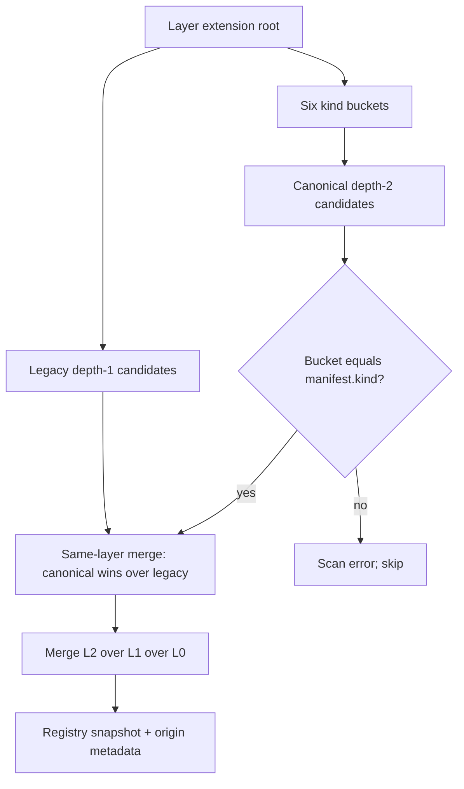

# forgeax-marketplace

L0 extension distribution for ForgeaX Studio. An **extension** (still often called a plugin in prose) is the installable unit:
one directory with a `forgeax-extension.json` that the CLI scanner loads, merges
across layers, and exposes to Studio / Server / agents.

> [!IMPORTANT]
> `forgeax-extension.json#kind` is the only classification authority.
> Prefixes such as `agent-`, `wb-`, and `cli-` are naming conventions, not types.

This repository also keeps non-plugin content next to plugins:

| Area | Role |
|:--|:--|
| `extensions/` | Installable extensions only (six kind buckets) |
| `shared/` | Shared libraries consumed by plugins (not scanned as extensions) |
| `vendor/` | Upstream source trees without an extension manifest (e.g. `node-editor`) |
| `src/` | Legacy marketplace prompt / skill / memory fragments still loaded by some CLI paths |
| `manifest.json` | Marketplace-level metadata (compat / roster), not an extension inventory |

Contributor guardrails: [`AGENTS.md`](./AGENTS.md). Design SSOT lives in the
parent Studio repo at
`docs/superpowers/specs/2026-07-14-marketplace-plugin-kind-layout-design.md`
(path relative to the forgeax-studio checkout; not published on `main` until
that PR merges).

## Six kinds

| `kind` | Typical leaf names | What it ships |
|:--|:--|:--|
| `agent` | `agent-iori`, `agent-nodia`, … | Persona + agent pack |
| `workbench` | `wb-character`, `_template`, `admin`, … | Studio workbench UI / tools |
| `skill` | `skill-author-plugin`, `skill-make-game-design` | Authoring / slash skills |
| `tool` | `tool-balance-resim`, `wb-team-forge` | Headless / shared tools (`wb-team-forge` is `kind: "tool"`) |
| `cli-provider` | `cli-forgeax`, `cli-claude-code`, … | CLI backend drivers |
| `model-binding` | `model-anthropic-text` | Model route bindings |

## Canonical directory tree

```text
packages/marketplace/
├── extensions/
│   ├── agent/<slug>/forgeax-extension.json
│   ├── workbench/<slug>/forgeax-extension.json
│   ├── skill/<slug>/forgeax-extension.json
│   ├── tool/<slug>/forgeax-extension.json
│   ├── cli-provider/<slug>/forgeax-extension.json
│   └── model-binding/<slug>/forgeax-extension.json
├── shared/                         ← not an extension root
│   └── external-asset-meta/
├── vendor/                         ← not an extension root
│   └── node-editor/                ← gitlink; apps linked under extensions/workbench/
├── src/                            ← legacy fragment tree
├── manifest.json
├── README.md
└── AGENTS.md
```

Bucket directory names are the literal `ManifestKind` values. Leaf directory
names and manifest `id` values do not change when a extension moves into a bucket.

## L0 / L1 / L2 and legacy reads

Each layer has one extension root:

| Layer | Root | Priority |
|:--|:--|--:|
| L0 | this repo's `extensions/` | 0 (lowest) |
| L1 | `~/.forgeax/extensions/` | 1 |
| L2 | `{projectRoot}/.forgeax/extensions/` | 2 (highest) |

Resolution is **L2 > L1 > L0**. Same `id` across layers keeps the highest layer;
lower entries remain in `shadowedBy` metadata.

The scanner checks exactly two shapes (no recursive rediscovery):

```text
<root>/<slug>/forgeax-extension.json         # legacy flat (still readable)
<root>/<kind>/<slug>/forgeax-extension.json  # canonical (required for new writes)
```



- Same layer, same `id`, both layouts → canonical wins + compatibility warning.
- Two canonical or two legacy candidates with the same `id` in one layer →
  conflict; neither loads.
- Canonical candidate whose bucket ≠ `manifest.kind` → rejected.

## IDs, paths, and public URLs

These stay path-independent:

| Contract | Stable value |
|:--|:--|
| Manifest / dependency / Bus plugin ID | e.g. `@forgeax-extension/wb-character` |
| HTTP static URL | `/extensions/{id}/` (not the filesystem kind path) |
| `.fxpack` archive body | flat payload; importer places into `<kind>/<slug>/` |

Filesystem origin for new installs is canonical:
`<root>/<kind>/<slug>/`. Runtime consumers use scanner origin metadata (or a
kind-aware helper from `@forgeax/types/plugin-layout` /
`scripts/lib/marketplace-plugins.ts`). Do not reconstruct
`extensions/<id>/` from an ID.

Browser-facing source descriptors expose `layer`, `layout`,
`relativeManifestPath`, and canonical `bucketKind`. They never expose absolute
home or project paths. `/api/extensions/manifests` agents expose `personaFile` +
`source` (not absolute `personaPath`). Browser pack APIs recursively sanitize
POSIX, Windows-drive, and UNC paths from diagnostics and ledger data:
`/api/packs/export` returns `fileName` rather than its host-only output path,
and `/api/packs/install` `renamed` maps original scoped id → new scoped id.

## Add / install / validate

### Author a new plugin (L2)

1. Prefer `/author-plugin` in Studio chat, or copy
   `extensions/workbench/_template/` as a starting point.
2. Set `forgeax-extension.json#kind` correctly, then write under
   `{project}/.forgeax/extensions/<kind>/<slug>/`.
3. Reload extensions (`POST /api/extensions/reload`) and confirm tools / UI appear.
4. Export `.fxpack` when sharing; import always lands in the canonical kind
   bucket derived from the pack's manifest.

Authoring skill:
[`extensions/skill/skill-author-plugin/SKILL.md`](./extensions/skill/skill-author-plugin/SKILL.md).

### Install into L1 or contribute to L0

- L1: same canonical path under `~/.forgeax/extensions/<kind>/<slug>/`.
- L0: place under `extensions/<kind>/<slug>/` in this repo. If the plugin is its
  own git repository, add/update the gitlink path in `.gitmodules` to the kind
  bucket path.

Legacy flat installs already present under L1/L2 remain discoverable and
editable via registered origin metadata. New writes must not recreate flat
paths.

### Validate

From the studio parent checkout:

```bash
(cd packages/contracts/types && bun ./test/validate-manifests.ts)
(cd packages/cli && bun test test/plugins-scanner-merger.test.ts)
bun scripts/build-plugins.ts --force
bun test scripts/check-boundaries.spec.ts
bun fx check
```

The 2026-07-14 migration gate compares the exact sorted bundled `(id, kind)`
set against
`packages/contracts/types/test/fixtures/marketplace-plugin-kind-layout-baseline.json`
(67 unique manifests at migration time). That fixture is an identity lock for
the layout move, not a living census of future plugins.

## `shared/` vs `vendor/` vs plugin front doors

- **`shared/`** — libraries that plugins import. Never put a
  `forgeax-extension.json` here; scanners do not treat `shared/` as a plugin root.
- **`vendor/`** — third-party / multi-app source trees that are not themselves
  plugins. `vendor/node-editor` is the gitlink for the node-editor monorepo.
- **Plugin front doors** — installable Workbench plugins that symlink into
  vendor apps so discovery still sees a canonical
  `extensions/workbench/<slug>/forgeax-extension.json`:

  | Front door | Target |
  |:--|:--|
  | `extensions/workbench/wb-3d-lowpoly` | `vendor/node-editor/apps/wb-3d-lowpoly` |
  | `extensions/workbench/wb-scene-generator` | `vendor/node-editor/apps/wb-scene-generator` |
  | `extensions/workbench/wb-2d-scene-asset-generator` | `vendor/node-editor/apps/wb-2d-scene-asset-generator` |

Lexical `manifestPath` keeps the Marketplace front-door identity; file reads
and containment use the resolved realpath of the symlink target.

## Runtime loading (stable model)

1. Scanner enumerates each layer root at exact legacy + canonical depths.
2. Manifests parse through the shared Zod schema; scan errors skip bad
   candidates without aborting the whole layer.
3. Merger applies L2 > L1 > L0 and records `shadowedBy` / layout warnings.
4. Registry publishes the snapshot; Server serves static assets at
   `/extensions/{id}/`; Studio / Bus / CLI consume IDs and origin metadata.
5. Builds (`scripts/build-plugins.ts`) discover Workbench plugins by
   `kind: "workbench"`, not by a `wb-` prefix.

## See also

- [`AGENTS.md`](./AGENTS.md) — contributor rules and mandatory gates
- [ADR 0009](https://github.com/ForgeaXGame/forgeax-studio/blob/main/docs/decisions/0009-three-layer-plugin-resolution-l0-l1-l2.md)
  (parent Studio) — L0/L1/L2 resolution
- [03-AGENT-SKILL-PLUGIN-TRINITY](https://github.com/ForgeaXGame/forgeax-studio/blob/main/docs/v2-vision/architecture-evolution/03-AGENT-SKILL-PLUGIN-TRINITY.md)
  (parent Studio)
