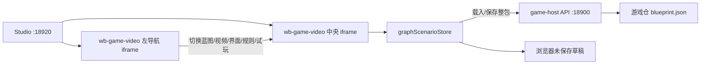
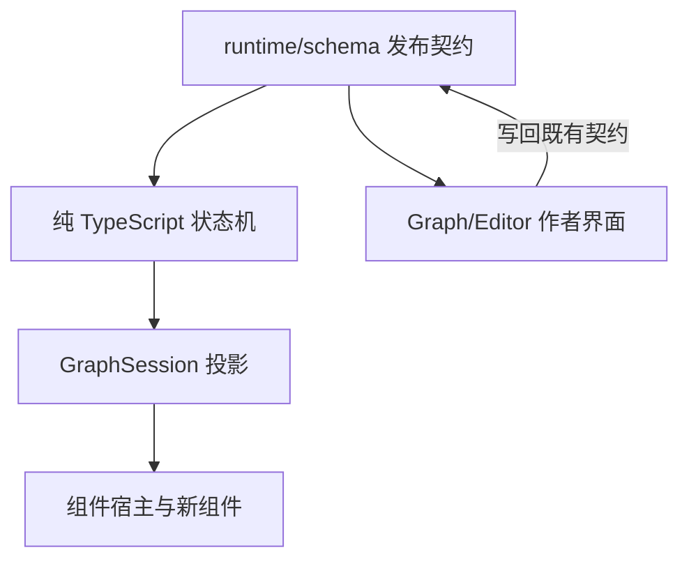

# wb-game-video 8.1 产品反馈架构与诊断报告

> 状态：诊断完成；问题 142、157 及血条配置文案已进入本次修复
>
> 日期：2026-08-02
>
> 范围：企业微信/本地 Excel 中处理人为 `hedonhe`、反馈时间为 8.1 的 20 条问题
>
> 诊断基线：`wb-game-video` `main@02af900`；本次实现基线：`origin/main@24bfca6`
>
> 本轮约束：未修改运行时 schema 或权威 `blueprint.json`

> [!IMPORTANT]
> 本报告中的“已修复”只表示当前基线已具备对应实现，并通过本报告列出的页面复现或自动测试。
> 它不等于产品验收完成；真正关闭问题前仍应按每条建议补回归用例并由测试同学复验。

## 结论摘要

| 分类 | 数量 | 问题编号 |
|:--|--:|:--|
| 当前已修复 | 9 | 142、153、162、163、164、169、188、189、190 |
| 当前仍存在或只完成了一部分 | 9 | 151、157、160、168、171、186、187、191、192 |
| 需要先统一产品/架构语义 | 2 | 145、183 |

最重要的三个结论：

1. 142 的旧修复只补了“默认绑定对象存在、但缺少 hp”时的创建入口，没有处理“组件默认 `ent-player` / `ent-boss` 不存在，而项目实体是 `ent-0`”的情况。当前本地修复已删除新血条 manifest/运行时中的固定实体和属性默认：未绑定时明确提示选择对象，选择后把规则目录中的真实 `bind/attr` 一起写入。
2. 162、163、164、189 是同一根因族：血条曾把“组件作者值”当成静态显示值，未稳定跟随实体运行态的生命变化。当前实现已改为“作者基线 + 实体运行时增量”，绑定模式在绑定 ID 有效时能直接读取实体值；142 的本地修复保证绑定 ID 必须来自规则目录的显式配置。
3. 生命当前值的核心真相应继续是 `entity.attrs.hp`，静态上限/约束继续由 `entity.attrMeta.hp.max` 表达。现有 demo 同时保留 `hpMax` 属性只是编辑器约定，不应在未评审的情况下把它升级为第二份核心真相。
4. 本批问题不要求立刻扩展受保护 schema。只有产品确认“最大生命会在运行时动态变化，并自动约束当前生命”时，才需要评审核心状态/约束模型；其余问题均可在编辑器、组件 manifest 或既有 `NodeAction` 能力内解决。

## 证据范围

本报告交叉使用了四类证据：

| 证据 | 用途 | 限制 |
|:--|:--|:--|
| `AGENTS.md`、`README.md`、架构/输入 SSOT 文档 | 确认契约与模块职责 | 不代表当前行为一定正确 |
| 当前源码与 8 月 1 日提交历史 | 判断根因和修复落点 | 静态阅读不能替代真实交互 |
| `http://localhost:18920/` Studio 与其实际嵌入的 `:15185` 中央面板 | 真实配置和交互复现 | 自动化层无法可靠穿透 Studio iframe 点击，因此在确认宿主链路后，具体配置在同一浏览器会话的实际 iframe URL 完成 |
| 8 个相关测试文件，共 74 个测试 | 验证实体、血条、效果、时间轴等回归 | 尚未覆盖 157、160、168、171、186、191、192 的目标行为 |

临时复现时曾载入内置 demo、创建实体/属性、添加界面和结算。结束前已通过版本选择器确认覆盖草稿并恢复磁盘 `v2`；页面不再显示“未保存草稿”，磁盘游戏仓保持 clean。

## 架构梳理

### 宿主与扩展边界

`wb-game-video` 是 Marketplace 中的独立 Workbench 扩展。Studio `:18920` 负责产品组装，扩展开发服务 `:15185` 由两个 iframe 组成：左 iframe 负责导航，中央 iframe 负责编辑器与运行时页面。两者通过跨 iframe 的视图通信同步当前 tab；真正的蓝图状态由中央面板的 store 启动和持有。



### 蓝图数据与持久化

- 权威文件是 `.forgeax/games/{slug}/blueprint.json`，类型为 `GraphLibraryDocument`。
- `manifest.mainPackId` 指向主蓝图；`manifest.packs` 是蓝图库真相，根 `graph` 是主蓝图的同步投影。
- 启动优先级是浏览器草稿 > 磁盘项目 > 空文档。重置 demo 是显式用户动作，不是默认真相。
- 保存通过 game-host package API 事务性回写；版本是游戏仓 git tag，只读载入后仍需另行保存。
- UI 目录采用原型 + 稀疏挂载差量：共享 `ui.overlays` 是原型，节点 `overlayNodes` 只保存引用、`overrides`、`added`、`removed`。

### 运行时分层



机械边界要求是 `runtime` 不依赖 `graph/editor`，`graph` 不依赖 `editor`；本轮 `bun run lint` 已确认边界通过。状态机不依赖 React/DOM，不使用 `Math.random()`，因此运行时行为可确定性测试。

### 状态、结算与界面

- 实体是开放属性袋：`Entity.attrs` 保存运行值，`attrMeta` 保存 label、initial、min、max。
- `GraphEffect` 负责 attr/var/flag/item；数值操作的发布契约只有 `add`、`mul`、`set`。减法和除法由编辑器编码到既有表达式，不应扩展 schema 枚举。
- `Reaction` 是 `when -> do`；`do` 中已有 `effect`、`advance`、`spawn` 三种 `NodeAction`。
- `spawn` 已能从界面目录模板创建瞬态组件，并支持 `inputs/layout/ttlMs`。问题 151 缺的是普通结算编辑器入口，不是运行时能力。
- 组件配置由 manifest 的 `inputs/events` 驱动。新增禁用条件、可空数值等优先落在新组件的 inputs 与通用表单，不应直接给 `OverlayChild` 增字段。

### 受保护 schema 审计

`AGENTS.md` 将以下文件定义为发布契约，增删字段需特别授权：

- `src/runtime/schema/node-config-schema.ts`
- `src/runtime/schema/react-flow-schema.ts`
- `src/runtime/schema/graph-schema.ts`

8 月 1 日的 `639636c` 修改过 `node-config-schema.ts`，但没有增删字段或改变落盘形状；它只把已经存在的 `state` trigger 纳入 `isSettlementReaction()` 作者界面分类，并更新注释。这是兼容的语义分类扩展，无迁移需求，但由于它改变“哪些 reaction 被视为结算”，仍建议在本轮架构 review 中补一次显式确认。

## 逐项诊断

状态说明：

- ✅ 已修复：当前实现和证据均支持关闭前复验。
- 🟠 仍存在：当前页面或源码明确保留该问题。
- 🟡 部分完成：底层能力已有，但反馈所指入口未闭环。
- 🔵 待决策：先统一产品语义，再决定实现。

| ID | 当前判断 | 原因与证据 | 建议措施 | Schema 影响 |
|--:|:--|:--|:--|:--|
| 142 | ✅ 本地已修复 | 根因是两个新血条 manifest/运行时写死 `ent-player` / `ent-boss` 与 `hp`；项目方案 `inputs` 为空时，原生 `<select>` 又把唯一的 `ent-0` 视觉伪装成已选，作者态和运行时实际仍指向不存在的默认 ID。修复后未绑定对象明确显示“选择对象…”，属性控件显示“请先选择对象…”；对象候选来自规则目录，选择 `ent-0` 会原子写入 `{ bind: 'ent-0', attr: 'hp' }`。运行时测试另用 `ent-0.vitality` 验证任意属性 ID。 | 当前 v3 中两个旧方案尚未写入绑定；在界面中分别选择一次真实对象即可生成显式 inputs。后续保存后运行时将跟随该对象属性。 | 无。只使用既有 `inputs.bind/attr`；受保护 schema 未改。 |
| 145 | 🔵 待决策 | “绑定属性”代表当前值直接跟随实体属性；“分别设置”代表作者显式指定当前值/最大值来源，但当前值仍通过运行时实体增量变化。两种能力有差异，但名称让人误以为一套是动态、一套是静态。 | 建议不再称“两种血量方式”，改成单一配置：`当前生命来源` 必填、`最大生命来源` 可选；把高级“显示基线”折叠到高级项。 | 无；纯编辑器投影可完成。 |
| 151 | 🟡 部分完成 | `NodeAction.spawn` 和选项/QTE `SettlementSpawnEditor` 已存在；但真实页面普通“＋结算”只出现“＋效果/＋沿边推进”，没有“＋生成组件”，已复现。 | 在普通生命周期/条件结算的 `NodeActionsEditor` 开放 spawn，并复用模板、inputs、ttl 编辑器；明确跳转后瞬态组件是否保留。 | 无；既有 `NodeAction.spawn` 足够。 |
| 153 | ✅ 已修复 | 真实页面新建 `ent-2` 后立即出现，新增 `attr0` 立即初始化为 0，输入 123 后不切换实体也即时保持。`ScenarioInspector-entities` 也覆盖首属性、重命名和受控空值。 | 增加“新实体 -> 新属性 -> 公式/绑定下拉立即可选”的跨面板测试。 | 无。 |
| 157 | 🟠 仍存在 | 节点预览左上角当前仍渲染媒体 ref，并在循环时附加“循环”；真实页面看到 `shengli` + `循环`。反馈所说信息尚未删除。 | 删除预览画面内 badge；调试信息只保留在右侧“视频/播放”表单或开发态 tooltip。 | 无。 |
| 160 | 🟠 仍存在 | `DamageFloatTextManifest.value` 仍有 `default: -25`，通用表单只在没有默认值时提供清空入口；真实页面数值下拉没有“未设置/由节点配置”。 | 将“未设置”作为合法作者态；组件渲染可保留预览 fallback，但不要把 fallback 强写进方案 inputs。节点结算/事件再覆盖 value。 | 无；`inputs.value` 本就可省略。 |
| 162 | ✅ 已修复 | 与 189 同根因。当前运行时先修改 `entity.attrs.hp`，血条从 HUD 状态读取；自定义基线使用 `authoredCurrent + (live - initial)`。相关血条测试验证 300→220 时 100 基线显示为 20%。 | 补一个真实“攻击 -> 结算 -> 血条 DOM 宽度变化”的 Play 集成测试。 | 无。 |
| 163 | ✅ 已修复 | `applyEffects` 对小额伤害和致死伤害都生效；只有越界时按 `attrMeta.min/max` clamp。测试覆盖 -100 得 600、-9999 得 0，不存在“只有伤害大于生命才扣”的分支。 | 将“小额、等额、过量伤害”做成参数化回归用例。 | 无。 |
| 164 | ✅ 已修复 | 旧血条显示很可能把 0/1 或错误表达式当作 current/max。当前组件按 `current / max` 计算连续百分比，绑定态与自定义基线均有测试。 | 增加 25%、50%、99% 三个视觉断言，避免只测 0/100 边界。 | 无。 |
| 168 | 🟠 仍存在 | 真实页面切成循环并重新播放后，时间读数连续两次仍是 `0:10 / 0:10`。代码有意让语义时间单调到节点末尾，以防循环视频重复触发结算，因此视频继续循环、轴停在末尾。 | 将“媒体播放头”和“节点语义时间”分离：轴可选择显示循环媒体头，但结算时钟只执行一次；或在 UI 明示轴是节点时钟。建议产品先确认期望。 | 无需改落盘 schema；需要双时钟的内存模型。 |
| 169 | ✅ 已修复 | 在真实页面给底部节点追加第二个界面后，第一次点击其“移除”即从 2 个挂载变为 1 个，没有先居中。当前按钮 `stopPropagation()`，避免触发父标题聚焦/滚动。 | 增加多挂载、滚动到底部、一次移除的回归测试。 | 无。 |
| 171 | 🟠 仍存在 | 节点预览把一份挂载统一投影成可拉伸时间段，所有 material 都显示左右调整手柄；伤害飘字也没有固定宽度特例。 | 先定义语义：若飘字只由结算触发，时间轴应显示固定触发点 + 只读动画时长；若允许作者控制出现窗口，则保留区间。推荐前者。 | 无；可用 material 内存分类与现有 trigger/window 表达。 |
| 183 | 🔵 待决策 | 当前核心模型是 `attrs.hp` + `attrMeta.hp.max`；demo 额外有 `attrs.hpMax`，编辑器还会把 `{attr}Max` 同步回 meta，形成潜在双真相。绑定属性不是行不通，189 已证明问题在旧显示同步逻辑。 | 推荐继续以 `attrs.hp` + `attrMeta.hp.max` 为唯一规范，UI 显示“当前生命/生命上限”；清理 demo 的重复 `hpMax` 约定需另做迁移。如果最大生命必须运行时可变，再评审动态约束方案。 | 仅“动态最大生命 + 自动 clamp”需要核心架构 review。 |
| 186 | 🟠 仍存在 | 固定时刻结算的整条 `gc-life-lane` 仍是 `pointer-events: none`，只有菱形响应。条件结算已经是整块 button，但定时结算未修。 | 让整条结算 lane 可选中对应结算，菱形只负责拖动；多结算同轨时按最近时间或分行消歧。 | 无。 |
| 187 | 🟠 问题仍存在，但两层有语义 | 真实页面同一结算同时显示内部 `+ 效果` 和外部 `＋效果`。前者向一个 effect action 的 `effects[]` 加项；后者向 reaction 的 `do[]` 新建另一个 effect action。分组会影响 `stateChanged`/响应式条件检查的写屏障，不能直接无脑压平。 | 普通作者界面只保留一个“添加数值变化”，默认都放在同一效果组；高级模式再允许新建效果组，并明确组间会触发响应式检查。 | 不建议改 schema；保留 `do[] -> effect.effects[]`。 |
| 188 | ✅ 已修复 | `2562701` 将模式判断改为只看 `current`，绑定态允许单独保存 `max`；切换到绑定只删除 current，不再删除 max。现有测试覆盖绑定→分别设置→绑定，确认 max 全程保留。 | 增加实际方案编辑器的页签往返测试。 | 无。 |
| 189 | ✅ 已修复 | 当前绑定态直接读实体 live 值，自定义态读“作者基线 + live-initial 增量”；`session` 测试验证攻击后 Boss 生命小于 700，绑定血条和基线血条均有组件测试。 | 与 162 合并为一条端到端验收用例，避免未来两种入口再次漂移。 | 无。 |
| 190 | ✅ 已修复 | 当前真实时间轴条显示“界面 · 我方水墨血条”，源码分类标签也已从“覆盖物”统一为“界面”。 | 测试同学按原节点复验文字；保留现有文本断言。 | 无。 |
| 191 | 🟠 仍存在 | `BattleSkillManifest.inputs` 仍为空，四个按钮只因 preview 或已经选择而 disabled；没有读取气力/属性条件。已有 `GraphCondition` 与其它选项组件的锁定逻辑，但技能条未接入。 | 给 `BattleSkill` 增加每个技能的条件 inputs，复用 `GraphCondition` 求值和 disabled/置灰表现；点击时再次校验，避免只靠视觉禁用。 | 无；条件可放组件 inputs。不要给核心 Overlay schema 加专用字段。 |
| 192 | 🟠 仍存在 | 真实页面固定值 0 点击“−”后，数值下拉立即变成“当前内容（保持原值）”，值变成历史表达式 `-(0)`。原因是减法编码把数字包装成表达式，而 `resolveValuePick` 只把裸 number 识别为固定值。 | 让简单 `-(number)` / `1/(number)` 可逆恢复为 const 编辑态，或在数值作者态保留 sidecar；补 UI 回归测试而不只测编码函数。 | 无；保持发布态 `add/mul/set`。 |

## 生命模型的架构建议

### 推荐的单一真相

```text
运行当前生命     = entity.attrs.hp
初始生命         = entity.attrMeta.hp.initial
静态生命上限     = entity.attrMeta.hp.max
显示当前生命     = 默认跟随 attrs.hp；可选高级显示基线
显示生命上限     = 默认跟随 attrMeta.hp.max；可选显式表达式覆盖
```

这样可以把 145/183 的“双模式”收敛成一个连续配置面，而不改持久化协议。`hpMax` 作为普通 attr 仍然合法，但不能同时被当作核心上限和普通属性，否则 `attrs.hpMax` 与 `attrMeta.hp.max` 会漂移。

### 何时必须升级核心设计

> [!WARNING]
> 若产品需要“装备/技能会在运行时增加最大生命，当前生命随之按固定值或比例变化，并且所有伤害/治疗自动按动态上限 clamp”，现有静态 `attrMeta.max` 不够。

此时应先评审以下语义，而不是直接新增一个 `maxHp` 字段：

1. 动态上限是另一个 attr、表达式，还是可叠加 modifier？
2. 上限降低时当前值如何处理：直接截断、保持比例，还是允许超上限？
3. 治疗、复活、存档和版本迁移如何读取同一约束？
4. UI 的 max 来源是否必须与运行时 clamp 来源相同？

只有这组需求被确认后，才值得扩展核心状态/约束 schema；目前不建议为 145/183 直接动受保护文件。

## 建议实施顺序

| 批次 | 问题 | 理由 |
|:--|:--|:--|
| P0：小修复、风险低 | 157、192、186 | 都是明确可复现的编辑器问题，不改协议；能快速减少操作误解。 |
| P1：玩法闭环 | 151、160、191 | 让结算表现、个性化飘字和技能条件形成完整作者链路。 |
| P1：时间语义 | 168、171 | 两项都依赖“媒体时间、节点时间、组件动画时间”的统一产品定义，应一起设计。 |
| P2：配置模型收敛 | 145、183、187 | 涉及作者心智和高级语义；先评审，再做 UI 收敛与数据迁移。 |
| 回归补齐 | 142、153、162、163、164、169、188、189、190 | 当前已修复，但应补真实 Studio 路径的端到端验收。 |

## 验证记录

### PR #141 前的历史验证

以下命令和“8 个文件、74 个测试”是当时提交上的验证记录；其中
`components/new/__tests__/BattleHpBars.test.tsx` 与 `NumericHpBar.test.tsx` 已在 PR #141 的 catalog
隔离重构中删除，因此**不能在当前 main 复跑**：

```bash
bun run test -- \
  src/editor/shell/__tests__/ComponentEventsEditor.test.tsx \
  src/editor/shell/__tests__/ScenarioInspector-entities.test.tsx \
  src/editor/shell/__tests__/GraphStudio-node-panel.test.tsx \
  src/editor/shell/__tests__/valueExprPick.test.ts \
  src/runtime/component-host/components/new/__tests__/BattleHpBars.test.tsx \
  src/runtime/component-host/components/new/__tests__/NumericHpBar.test.tsx \
  src/runtime/__tests__/apply-effects.test.ts \
  src/runtime/__tests__/session.test.ts

bun run lint
```

历史结果：8 个测试文件、74 个测试全部通过；TypeScript、server TypeScript 和模块边界检查全部通过。

### PR #141 后的当前验证

当前架构改用独立 `test.*` fixture catalog 验证跨层管线，并在 component-host 边界测试 manifest 输入解析：

```bash
bun run test -- \
  src/editor/shell/__tests__/ComponentEventsEditor.test.tsx \
  src/editor/shell/__tests__/ScenarioInspector-entities.test.tsx \
  src/editor/shell/__tests__/valueExprPick.test.ts \
  src/runtime/component-host/__tests__/RuntimeComponentHost.test.tsx \
  src/runtime/component-host/__tests__/resolveComponentInputs.test.ts \
  src/runtime/__tests__/hud-mount-render.test.ts \
  src/runtime/__tests__/apply-effects.test.ts \
  src/runtime/__tests__/session.test.ts

bun run lint
```

该命令在当前 main 上验证 8 个测试文件、68 个测试，覆盖 host/input/session 边界；它不等价于已删除的
生产 catalog 视觉测试，也不沿用历史 74 个测试结论。

142 后续修复验证：全量 140 个测试文件，986 个测试通过、18 个既有跳过；`bun run lint` 与完整 `bun run build`（frontend/backend/standalone/release validator）通过。

真实页面关键复现结果：

| 操作 | 结果 |
|:--|:--|
| 规则中创建 `ent-0.hp` -> 战斗节点查看敌方/我方血条 | 修复前会伪装成已选“悟空”并误报 hp；修复后明确显示“选择对象…”和“请先选择对象…”，候选中包含规则实体“悟空” |
| 新建实体 -> 新建属性 -> 输入 123 | 属性立即显示并保持 123，无需切换实体 |
| 节点追加第二个底部界面 -> 第一次点击“移除” | 挂载数从 2 变 1，未先居中 |
| 节点视频切换“循环”并重新播放 | 时间读数持续停在 `0:10 / 0:10` |
| 普通“＋结算” | 只有“＋效果/＋沿边推进”，没有“＋生成组件” |
| 普通结算添加效果 | 同时出现内部 `+ 效果` 和外部 `＋效果` |
| 固定值点击“−” | 变为“当前内容（保持原值）”，显示历史表达式 `-(0)` |
| 节点预览时间轴 | 使用“界面”标签，不再显示“覆盖物” |

## 下一步评审点

建议逐条讨论时先确认三项产品选择：

1. 145/183：接受“单一生命配置 + 可选高级显示基线”，还是确实需要运行时动态最大生命？
2. 168/171：时间轴展示媒体循环头、节点单调时钟，还是组件动画窗口？三者是否需要分轨？
3. 187：普通作者是否只看到一个效果组，高级作者才允许多个写屏障？

这三个结论会决定后续实现边界；其它仍存在的问题可以在不触碰核心 schema 的前提下直接修复。
