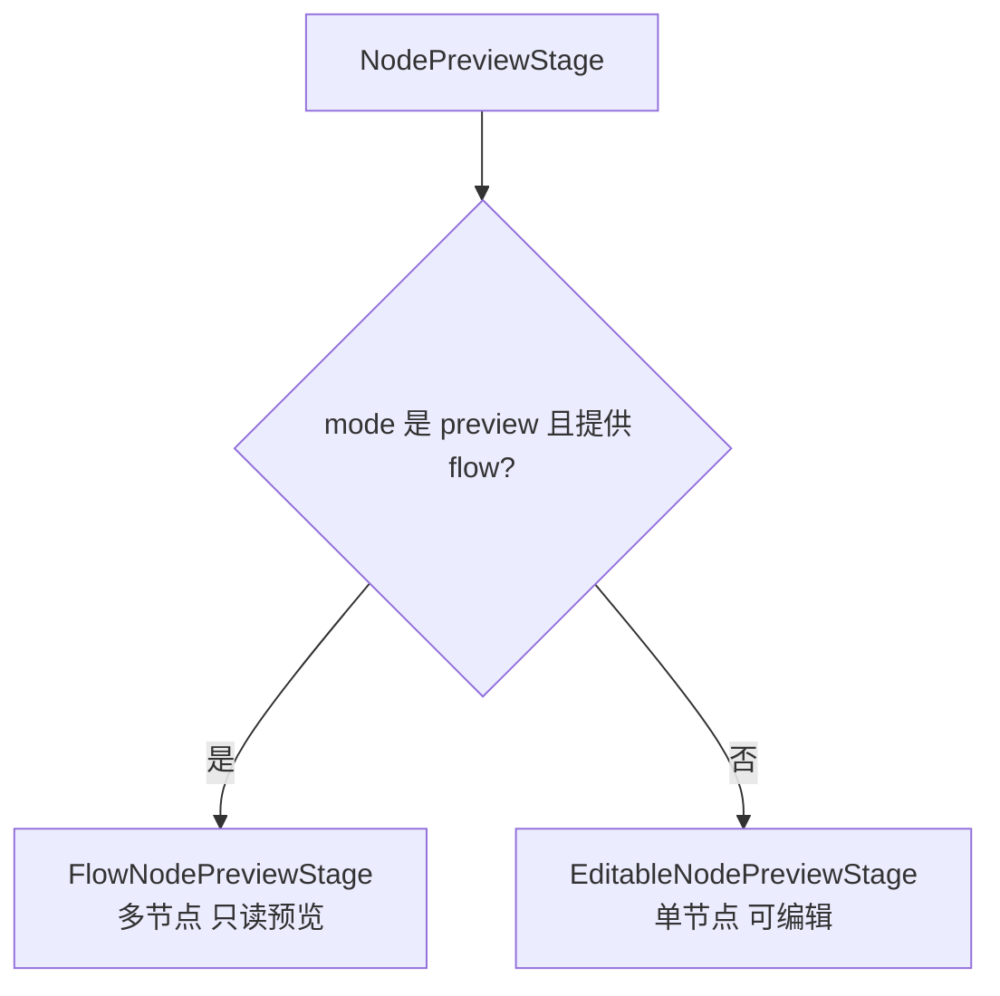
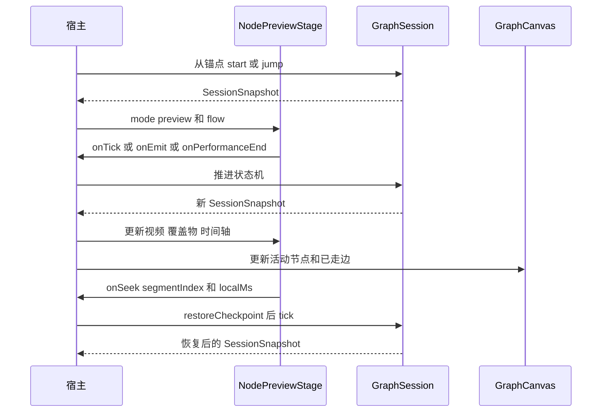

# NodePreviewStage 接入 API

> 状态：当前实现说明 · 2026-08-01  
> 源码入口：[`src/editor/shell/NodePreviewStage.tsx`](../src/editor/shell/NodePreviewStage.tsx)

`NodePreviewStage` 是蓝图节点视频预览与编辑的统一表面：编辑模式面向一个节点，提供视频、
覆盖物和时间轴编辑；预览模式消费宿主持有的 `GraphSession`，播放本次实际经过的多节点流程，
并展示只读的动态拼接时间轴。

> [!IMPORTANT]
> 这是编辑器内部组件 API，不是 `@forgeax-extension/wb-game-video` 包根导出的公开 API。扩展内部可从
> `src/editor/shell/NodePreviewStage.tsx` 接入；若未来要供其他包消费，应先建立稳定 facade，
> 不要让外部包深度依赖 `src/editor`。

> [!NOTE]
> 本组件不新增或修改 `blueprint.json` schema。编辑模式的写入全部经过宿主提供的
> `onEditScenario`；全流程时间轴、checkpoint 和播放状态只存在于编辑器内存。

> [!IMPORTANT]
> 当前 `GraphStudio` 只把 `NodePreviewStage` 用作单节点编辑预览。“从此试玩”仍使用原有的
> 独立试玩浮层，并与节点编辑预览互斥显示。本文的 `preview + flow` API 是已经封装好的通用能力，
> 暂未接入“从此试玩”；未来切换宿主时无需再改运行时 schema。

## 目录

- [模式与职责](#模式与职责)
- [顶层 API](#顶层-api)
- [时间轴展开配置](#时间轴展开配置)
- [全流程预览 API](#全流程预览-api)
- [编辑模式接入](#编辑模式接入)
- [双模式接入](#双模式接入)
- [宿主状态职责](#宿主状态职责)
- [动态流程时间轴](#动态流程时间轴)
- [布局与交互约束](#布局与交互约束)
- [验证清单](#验证清单)

## 模式与职责



| 能力 | `edit` | `preview` |
|---|:---:|:---:|
| 当前节点视频播放、暂停、静音 | ✅ | ✅ |
| 视频原声偏好跨节点保持 | 由宿主持有 | 由宿主持有 |
| 覆盖物展示 | 配置投影 | 运行时快照 |
| 覆盖物选中、拖动位置 | ✅ | ❌ |
| 时间轴素材选择、移动、缩放、删除 | ✅ | ❌ |
| 结算点选择与拖动 | ✅ | ❌ |
| 添加覆盖物 | ✅ | ❌ |
| 多节点动态拼接时间轴 | ❌ | ✅ |
| 跨已走节点拖动播放头 | ❌ | ✅ |
| BGM、倍速、重开 | ❌ | ✅ |
| 蓝图节点与边高亮 | 宿主不启用 | 宿主按 `snapshot` 联动 |

模式按钮不属于组件。宿主决定何时切换 `mode`，也负责提供自己的按钮、菜单或工作流入口。
当前 `GraphStudio` 始终使用默认的 `edit` 模式，不传 `flow`。

默认模式虽然承担编辑能力，也是产品界面中的单节点“视频预览”。播放或拖动播放头时，它会用
正式 `GraphSession` 增量重放当前节点的 `effect`、条件触发以及界面 `spawn/hideOverlay`，因此
条件结算的界面出现/消失会直接反映在视频画布上。投影时只过滤 `advance` 和统一路由结算，确保
预览不会离开当前编辑节点；该链路不创建、复用或切换“从此试玩”浮层。

点击时间轴中的条件结算条时，默认模式会暂停播放，并稳定投影该结算内全部 `spawn` 界面；第一项
自动进入选中态，也可在画布上点选其他项。拖动、方向键微调和层级调整复用覆盖物画布交互，结果
写回对应动作已有的 `spawn.layout`。取消选择后恢复按播放头驱动的正式运行时投影。

> [!WARNING]
> `mode="preview"` 但没有传 `flow` 时，组件会回退到编辑模式。这是防止空白表面的兜底，
> 不是推荐接法；宿主应原子地更新 `mode` 和 `flow`。

## 顶层 API

```ts
import {
  NodePreviewStage,
  type FlowNodePreviewState,
  type NodePreviewStageProps,
  type NodePreviewTimeSelection,
  type NodePreviewTimelineDisclosure,
} from './NodePreviewStage'
```

### `NodePreviewStageProps`

| 配置项 | 类型 | 必填 | 默认值 | 功能 |
|---|---|:---:|---|---|
| `scenario` | `GameScenario` | ✅ | - | 编辑模式的场景投影，应包含当前图、`ui.overlays`、实体和变量。预览模式当前类型仍要求提供，但不会用于运行时舞台。 |
| `node` | `GameNode` | ✅ | - | 当前选中的可编辑节点，必须属于 `scenario.graph`。节点更新后应传入新引用。 |
| `game` | `string` | ✅ | - | 当前游戏 slug，用于把视频、音频等资产 id 解析成可播放 URL。 |
| `muted` | `boolean` | ✅ | - | 单节点预览的视频原声状态。建议由宿主持有，使切换节点后偏好不丢失。 |
| `onEditScenario` | `(update) => void` | ✅ | - | 编辑模式唯一写回通道。组件传出纯更新函数，宿主用最新场景和节点执行并持久化结果。 |
| `onMutedChange` | `(muted) => void` | ✅ | - | 单节点预览切换视频原声时通知宿主。 |
| `focusedMountId` | `string / null` |  | `undefined` | 受控的覆盖物挂载选中项，用于与外部配置面板双向联动。 |
| `focusedLifecycleIndex` | `number / null` |  | `undefined` | 受控的生命周期结算选中序号，用于与外部配置面板双向联动。 |
| `onSelectedTimeChange` | `(ms, selection) => void` |  | - | 单节点播放头选中时刻变化通知；`selection.settlementInsertMs` 按当前时间轴比例提供与指针不重叠的建议结算时刻。 |
| `onFocusMount` | `(mountId) => void` |  | - | 用户在视频舞台或时间轴选中覆盖物挂载时通知宿主。 |
| `onFocusLifecycle` | `(index) => void` |  | - | 用户在时间轴选中生命周期结算点时通知宿主。 |
| `mode` | `'edit' / 'preview'` |  | `'edit'` | 选择单节点编辑表面或全流程预览表面。 |
| `timelineDisclosure` | `NodePreviewTimelineDisclosure` |  | 见下节 | 控制时间轴是否展示、是否显示展开按钮，以及按钮图标。两种模式共用。 |
| `flow` | `FlowNodePreviewState` | 预览时必填 | - | 全流程预览的运行时快照、媒体、时间轴、控制状态和事件入口。 |

当前 props 采用一个统一接口，因此即便是纯预览宿主，TypeScript 仍要求提供编辑侧的必填字段。
这些字段在 `preview + flow` 分支不会被消费。

## 时间轴展开配置

### `NodePreviewTimelineDisclosure`

| 配置项 | 类型 | 默认值 | 功能 |
|---|---|---|---|
| `showToggle` | `boolean` | `false` | 是否在播放控制条显示展开/收起按钮。当前 `GraphStudio` 不开启。 |
| `expanded` | `boolean` | 非受控 | 受控展开状态。传入后宿主必须在 `onExpandedChange` 中更新它。 |
| `defaultExpanded` | `boolean` | `true` | 非受控模式的初始展开状态，只在首次挂载时读取。 |
| `onExpandedChange` | `(expanded) => void` | - | 用户点击展开/收起按钮后的状态通知。即使使用受控模式也会触发。 |
| `renderToggleIcon` | `(expanded) => ReactNode` | 内置箭头 | 替换按钮图标；组件仍负责按钮、无障碍名称和点击行为。 |

常见组合：

```tsx
// 默认：时间轴展开，不显示展开/收起按钮。
<NodePreviewStage {...props} />

// 显示组件内置的展开/收起按钮。
<NodePreviewStage
  {...props}
  timelineDisclosure={{ showToggle: true }}
/>

// 宿主受控，并使用自己的图标。
<NodePreviewStage
  {...props}
  timelineDisclosure={{
    showToggle: true,
    expanded: timelineExpanded,
    onExpandedChange: setTimelineExpanded,
    renderToggleIcon: (expanded) => expanded ? <ChevronUp /> : <ChevronDown />,
  }}
/>
```

`showToggle: false` 只隐藏按钮，不会自动隐藏时间轴。宿主仍可通过 `expanded: false` 固定收起。

## 全流程预览 API

### `FlowNodePreviewState`

| 配置项 | 类型 | 必填 | 默认值 | 功能 |
|---|---|:---:|---|---|
| `snapshot` | `SessionSnapshot` | ✅ | - | 当前运行时快照，驱动节点名、阶段、clip、HUD、覆盖物和 BGM。 |
| `session` | `GraphSession` | ✅ | - | 产生 `snapshot` 的同一个 session；组件读取 skins 和运行时 condition state。 |
| `videoSrc` | `string / undefined` | ✅ | - | 当前 `snapshot.clip` 对应的视频 URL；无视频节点传 `undefined`。 |
| `videoKey` | `string` | ✅ | - | 当前演出实例的稳定 key。节点重入、重开或强制 jump 时必须变化，以重挂视频。 |
| `preloadVideos` | `GameStage` 的预加载数组 | ✅ | - | 后续候选视频，用于无缝切片与提前获取真实时长。 |
| `timeline` | `ProjectedFlowTimeline` | ✅ | - | 本次实际路径投影出的全局时间轴。 |
| `paused` | `boolean` | ✅ | - | 受控暂停状态，同时作用于视频、BGM、覆盖物时钟和无视频节点的合成时钟。 |
| `playbackRate` | `number` | ✅ | - | 受控播放倍速。内置选择项为 `0.5`、`1`、`1.5`、`2`。 |
| `videoAudioEnabled` | `boolean` | ✅ | - | 视频原声开关，不影响 BGM。 |
| `seekDragSensitivity` | `number` |  | `0.8` | 持续拖动全流程播放头的灵敏度；`1` 为指针等比例，按下定位不受影响。负值按 `0` 处理。 |
| `bgmRunKey` | `number` | ✅ | - | BGM 播放器实例 key。新 session 或重开时递增，防止上一局 BGM 泄漏。 |
| `resolveBgm` | `(id) => URL` | ✅ | - | 把 BGM 资产 id 解析为 URL。空 id 返回 `undefined`。 |
| `onPausedChange` | `(paused) => void` | ✅ | - | 播放/暂停按钮和开始 scrub 时通知宿主。 |
| `onPlaybackRateChange` | `(rate) => void` | ✅ | - | 倍速选择变化通知宿主。 |
| `onVideoAudioToggle` | `() => void` | ✅ | - | 视频原声按钮入口。 |
| `onRestart` | `() => void` | ✅ | - | 从宿主钉住的起始节点重建流程预览。 |
| `onEmit` | `(elementId, key) => void` | ✅ | - | 覆盖组件事件入口，通常转发给 `session.emitEvent`。 |
| `onTick` | `(nowMs) => void` | ✅ | - | 当前节点局部播放时刻入口，通常转发给 `session.tick` 并保存新快照。 |
| `onPerformanceEnd` | `() => void` | ✅ | - | 当前演出结束入口，交给宿主推进 session。 |
| `onDurationChange` | `(durationMs) => void` | ✅ | - | 视频 metadata 确认有效时长后通知宿主重排流程时间轴。 |
| `onSeek` | `(segmentIndex, localMs) => boolean` | ✅ | - | 跨节点 seek。宿主恢复目标片段 checkpoint 并推进到局部时刻；成功返回 `true`。 |

> [!IMPORTANT]
> `snapshot` 与 `session` 必须来自同一实例。把旧 snapshot 配给新 session 会造成覆盖物、HUD、
> condition state 和当前视频互相错位。

### `ProjectedFlowTimeline`

| 字段 | 功能 |
|---|---|
| `materials` | 所有已走节点的视频主轨和覆盖物轨道，已转换为全局时刻。 |
| `pointMarkers` | 定时结算、生命周期等菱形时刻点的全局投影。 |
| `conditionMarkers` | 无固定毫秒坐标的条件结算条。 |
| `segments` | 节点片段、起止时刻和当前活动片段标识。 |
| `activeIndex` | 当前运行节点在流程账本中的位置。 |
| `playheadMs` | 全流程播放头时刻。 |
| `maxMs` | 当前已知实际路径总时长。 |

## 编辑模式接入

```tsx
const [muted, setMuted] = useState(true)
const [focusedMountId, setFocusedMountId] = useState<string | null>(null)

const editScenario = useCallback(
  (update: (scenario: GameScenario, node: GameNode) => GameScenario) => {
    const latest = getLatestScenario()
    const latestNode = latest.graph.nodes.find((item) => item.id === selectedNodeId)
    if (!latestNode) return
    saveScenario(update(latest, latestNode))
  },
  [selectedNodeId],
)

<NodePreviewStage
  scenario={projectedScenario}
  node={selectedNode}
  game={gameSlug}
  muted={muted}
  mode="edit"
  focusedMountId={focusedMountId}
  onEditScenario={editScenario}
  onMutedChange={setMuted}
  onFocusMount={setFocusedMountId}
  onSelectedTimeChange={(_ms, selection) => setSettlementInsertMs(selection.settlementInsertMs)}
/>
```

`onEditScenario` 应始终读取宿主的最新场景，而不是闭包里的旧快照。组件可能连续发出拖动更新，
使用旧场景会覆盖同一时段内其他表单或时间轴写入。

## 双模式接入

```tsx
const mode = playOpen ? 'preview' : 'edit'
const flow: FlowNodePreviewState | undefined = playOpen
  ? {
      snapshot,
      session,
      videoSrc,
      videoKey: `${snapshot.clipSeq}-${playEpoch}`,
      preloadVideos,
      timeline: projectedFlowTimeline,
      paused,
      playbackRate,
      videoAudioEnabled: !muted,
      seekDragSensitivity: 0.8,
      bgmRunKey,
      resolveBgm,
      onPausedChange: setPaused,
      onPlaybackRateChange: setPlaybackRate,
      onVideoAudioToggle: () => setMuted((value) => !value),
      onRestart: restartFromAnchor,
      onEmit: (elementId, key) => {
        if (!paused) setSnapshot(session.emitEvent(elementId, key))
      },
      onTick: (ms) => setSnapshot(session.tick(ms)),
      onPerformanceEnd: finishCurrentPerformance,
      onDurationChange: updateActiveSegmentDuration,
      onSeek: restoreSegmentCheckpoint,
    }
  : undefined

<NodePreviewStage
  {...editProps}
  mode={mode}
  flow={flow}
/>
```

切换动作应由宿主显式表达：

```ts
function startPreviewFrom(nodeId: string): void {
  setPlayAnchor(nodeId)
  setPlayOpen(true)
}

function selectNodeForEditing(nodeId: string): void {
  setPlayOpen(false)
  clearFlowPlayhead()
  setSelectedNode(nodeId)
}
```

点击蓝图节点应走 `selectNodeForEditing`：节点选择代表编辑意图，必须退出全流程预览。不要只更新
`selectedNodeId`，否则 `NodePreviewStage` 会继续停留在预览分支。

## 宿主状态职责



| 状态 | 所有者 | 原因 |
|---|---|---|
| `mode`、是否正在流程预览 | 宿主 | 需要与节点选择、面板开关和“从此试玩”入口协同。 |
| `GraphSession` 与 `SessionSnapshot` | 宿主 | 蓝图画布和预览舞台必须消费同一运行结果。 |
| 暂停、倍速、视频原声 | 宿主 | 跨节点、重开和组件 remount 后保持一致。 |
| 流程时间轴账本 | 宿主 | 跟随真实运行路径追加、回用或截断。 |
| 片段入口 checkpoint | 宿主 | seek 时恢复实体、变量、调用栈、HUD 和 reaction 游标。 |
| 单节点视频局部播放头 | 组件 | 仅服务当前编辑预览，不影响运行时。 |
| 非受控时间轴展开状态 | 组件 | 仅在宿主没有传 `expanded` 时生效。 |

## 动态流程时间轴

宿主可复用 [`flowPreviewTimeline.ts`](../src/editor/video/flowPreviewTimeline.ts) 的纯函数：

| API | 功能 |
|---|---|
| `emptyFlowTimeline()` | 创建空的本次预览路径账本。 |
| `flowTimelineIdentity(visit)` | 以蓝图、嵌套路径和节点 id 生成运行片段身份。 |
| `visitFlowTimeline(ledger, visit)` | 首次节点追加片段；循环回到已存在节点时回用片段；改走新分支时截断旧后缀。 |
| `updateFlowTimelineDuration(ledger, key, ms)` | 视频真实时长到达后更新片段，并重排其后的全局偏移。 |
| `projectFlowTimeline(ledger, localMs, resolveNode)` | 把每个节点的局部视频、覆盖物和结算标记投影到全局时间轴。 |

全流程时间轴采用首段定标、后续按相同 `px/ms` 追加的 `append` 模式。循环不会无限追加相同节点；
再次进入已存在节点时，播放头回到已有片段。

跨节点 seek 不能只修改 `<video>.currentTime`。推荐顺序是：

1. 在每个片段入口保存 `session.createCheckpoint()`。
2. 根据 `segmentIndex` 找到目标 checkpoint。
3. 调用 `session.restoreCheckpoint(checkpoint)`。
4. 调用 `session.tick(localMs)` 补跑目标片段内的定时逻辑。
5. 更新宿主的 snapshot、activeIndex 和局部播放头。
6. 返回 `true`，组件再同步目标视频的 `currentTime`。

checkpoint、流程账本和片段 identity 都不得写入蓝图协议。

## 布局与交互约束

宿主容器需要提供可收缩的纵向 flex 空间，否则内部视频或时间轴可能把面板撑出边界：

```tsx
<div style={{ display: 'flex', flexDirection: 'column', minHeight: 0, overflow: 'hidden' }}>
  <NodePreviewStage {...props} />
</div>
```

- 组件自身注入 `CATALOG_CSS`、预览舞台样式和流程预览样式。
- 编辑模式只移动整份 overlay 挂载，写回挂载 `layout.left/top`，不直接修改内部子组件坐标。
- 预览模式不挂载覆盖物选择框，也把时间轴设置为 `editable={false}`、`selectable={false}`。
- 视频原声和 BGM 是两个独立通道；`videoAudioEnabled` 不得用于控制 BGM。
- `videoKey` 必须区分节点重入，否则同一个节点再次播放时浏览器可能保留已结束的视频实例。
- 面板展开/收起属于宿主布局；只有时间轴内部的展开/收起可通过 `timelineDisclosure` 配置。
- 当前组件没有内置编辑/预览切换按钮，也不会替宿主创建“从此试玩”按钮。

## 验证清单

- [ ] `mode` 缺省时进入单节点编辑模式。
- [ ] 点击其他蓝图节点会退出流程预览并进入目标节点编辑模式。
- [ ] 编辑模式可独立选择和移动多个同类型覆盖物，不串改实例。
- [ ] 预览模式无法选中或拖动覆盖物、素材条和结算点。
- [ ] 多节点视频按真实时长比例追加，播放头逐帧移动。
- [ ] 条件分支只在真实推进后加入时间轴。
- [ ] 两节点循环不会无限增长时间轴。
- [ ] 跨节点 seek 后视频、实体、HUD、覆盖物和蓝图高亮一致。
- [ ] 切换节点后视频原声偏好保持，BGM 不受视频原声开关影响。
- [ ] 不传 `timelineDisclosure` 时，时间轴默认展开且不展示展开/收起按钮。
- [ ] 没有新增或修改 runtime schema 字段。

## 实现参考

| 关注点 | 文件 |
|---|---|
| 统一组件与单节点编辑表面 | [`NodePreviewStage.tsx`](../src/editor/shell/NodePreviewStage.tsx) |
| 全流程只读播放表面 | [`FlowNodePreviewStage.tsx`](../src/editor/shell/FlowNodePreviewStage.tsx) |
| 实际路径账本与全局时间轴投影 | [`flowPreviewTimeline.ts`](../src/editor/video/flowPreviewTimeline.ts) |
| 通用材料时间轴 | [`MaterialTimeline.tsx`](../src/editor/video/MaterialTimeline.tsx) |
| 当前单节点编辑宿主与原试玩浮层 | [`GraphStudio.tsx`](../src/editor/shell/GraphStudio.tsx) |
| 运行时 session 与 checkpoint | [`session.ts`](../src/runtime/engine/session.ts) |
