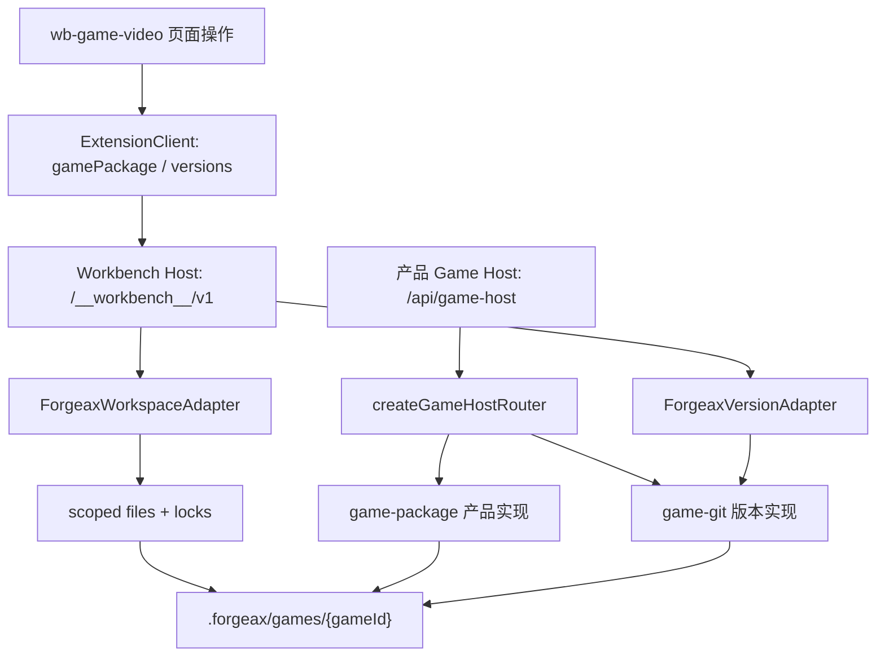
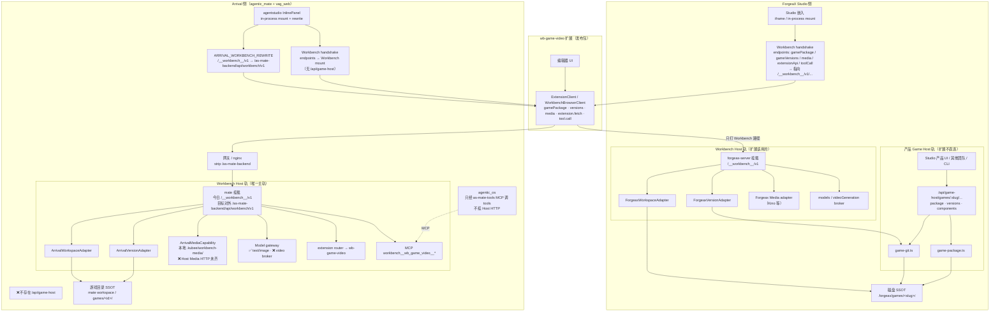

# wb-game-video 对外请求 API 清单

> 状态：当前实现 SSOT · 2026-08-05  
> 范围：`.worktrees/arrival-kino-video-capability/packages/marketplace/extensions/wb-game-video`  
> 相关历史：[请求方法梳理](d904a0e9-328e-498c-96f0-7944df28d2fa) · [CRUD 接口整理](c066a54f-c1af-448f-8817-de686c3844f8)  
> 旧文档 [`kino-resource-crud-api.md`](./kino-resource-crud-api.md) 仍描述 `/api/v1/kino` 与 `/__ce-api__`，**已过时**，以本文为准。

## 结论（先看这张）

扩展**不直连** Kino、LiteLLM、Azure、方舟/Seedance、MiniMax、COS/S3、forgeax-server 业务路由。  
所有对外 I/O 经嵌入宿主（Workbench Host）三条通道：

| 通道 | 浏览器怎么走 | 宿主最终可能打到 |
|:--|:--|:--|
| A. Host Media HTTP | `@forgeax/workbench-host` → `/games/:gameId/media…` | Kino / COS / S3 / local |
| B. Extension router | `extension.fetch` / `pluginFetch` → `{extensionApi}/…` | 扩展进程内逻辑；生成类再调宿主 broker |
| C. Host tool gateway | `tool.call(toolId, args)` → `{toolCall}` | 同 B 的 service 方法 |
| D. Server capability broker | `context.media` / `context.models` / `context.videoGeneration` | LiteLLM / Azure / Seedance / Kino（**宿主实现**） |

`src/editor/assets/kino-api.ts` 只是兼容 DTO 的 **Host media shim**，发布产物禁止出现 `/api/v1/kino`、`__video-upload-proxy`、`arrival-kino` 字符串。

---

## 1. Host Media（素材 CRUD + 可恢复上传）

**Base：** handshake `endpoints.gamePackage` 去掉 `/games/:gameId/package` 后，拼 `/games/:gameId/media`  
**客户端：** `host-media-client.ts` → `createWorkbenchBrowserClient().media`；UI 经 `kino-api.ts` / `video-upload.ts` / `assetLibraryClient.ts`

| Method | Path | 用途 | 调用方 |
|:--|:--|:--|:--|
| `GET` | `/games/:gameId/media?type=` | 列表（image/video/audio） | `media.list` |
| `GET` / `HEAD` | `/games/:gameId/media/:assetId` | 内容流 / 播放 | `contentUrl` / `playbackUrl` |
| `PUT` | `/games/:gameId/media` | 整包直传（小文件） | workbench-host `put`（扩展上传主流走 uploads） |
| `PATCH` | `/games/:gameId/media/:assetId` | 改 filename / metadata | `media.update` |
| `DELETE` | `/games/:gameId/media/:assetId` | 删除 | `media.delete` |
| `POST` | `/games/:gameId/media/uploads` | 创建可恢复上传会话 | `createUpload` / `prepareUpload` |
| `GET` | `/games/:gameId/media/uploads/:uploadId` | 查询上传进度 | `getUpload` |
| `PUT` | `/games/:gameId/media/uploads/:uploadId` | 分片写入（header `upload-offset`） | `writeUploadChunk` / XHR |
| `POST` | `/games/:gameId/media/uploads/:uploadId/complete` | 完成上传 → asset | `completeUpload` / `create` |

**上传流水线（视频库）：**

```text
prepareUpload → PUT uploads/:id（分片）→ completeUpload → PATCH metadata（可选 replace DELETE 旧 id）
```

**鉴权：** handshake 会话（nonce-bound）；扩展不持有 Kino/COS key。

服务端落盘生成物走同一语义：`context.media.list|put|read|delete`（`server/asset-registry.ts`），不另开 HTTP。

---

## 2. Host Package / Versions / Components

浏览器经 `getWorkbenchHost()`（`persist-client.ts`、`GameBootstrap.tsx`），HTTP 形状由 Host 提供：

| 能力 | 典型 Path | Method | 说明 |
|:--|:--|:--|:--|
| `gamePackage.load/save` | `/games/:gameId/package` | GET / PUT | 图数据 SSOT |
| `gamePackage.status` | `/games/:gameId/package/status` | GET | 空包检测 |
| `gamePackage.initialize` | `/games/:gameId/package/initialize?runtimeId=` | POST | 初始化 |
| `versions.*`（需 capability） | `/games/:gameId/versions` 等 | GET / POST | git 版本；`supported()` 为 false 则跳过 |
| `gameComponents` | `/games/:gameId/components/:path` | GET | 运行时组件模块 |

---

## 3. Extension HTTP Router（扩展自有路径）

**声明 SSOT：** `server/host/http-routes.ts`  
**解析：** `{handshake.endpoints.extensionApi}/{path}`，由 Host 转发到扩展 router。

| Method | Path | 是否出站到云 | 下游 |
|:--|:--|:--|:--|
| `GET` | `assets` | 否 | 本地 manifest + media 列表 |
| `GET` | `assets/:id` | 否 | 本地 registry |
| `GET` | `media/bundled/:name` | 否 | 扩展内置 demo 媒体（本地 FS） |
| `GET`/`POST` | `style-axes` | 否 | 风格三轴 manifest |
| `POST` | `references/characters/import` | 间接 | Host `files` 读图 → `media.put` |
| `POST` | `references/scenes/import` | 间接 | 同上 |
| `POST` | `generation/shot-script` | **是（经 Host）** | `context.models.generateText` |
| `POST` | `generation/keyframe` | **是（经 Host）** | `context.models.generateImage` + `media.put` |
| `POST` | `generation/video` | **是（经 Host）** | `videoGeneration.generateVideo` 或 `models.generateVideo` |
| `POST` | `generation/node-video` | **是（经 Host）** | 同上（分段） |

已退役（故意 404）：`media/resources`、`media/assets/:id`。

---

## 4. Host Tool Gateway

**浏览器：** `getWorkbenchHost().tool.call(toolId, args)`  
**HTTP：** `POST {handshake.endpoints.toolCall}`，body `{ caller, gameId, toolId, args }`  
**实现：** `server/tool-handlers.ts` → `wb-service.ts`（与 §3 共用 service）

| Tool ID | 对外依赖 |
|:--|:--|
| `wb-game-video:author-guide` | 无（静态） |
| `wb-game-video:get-graph` | 无（files） |
| `wb-game-video:save-graph` | 无（files） |
| `wb-game-video:list-videos` | 无（内置清单） |
| `wb-game-video:list-assets` | 无 / Host media 列表 |
| `wb-game-video:get-asset` | 无 |
| `wb-game-video:import-character-refs` | Host `media.put` |
| `wb-game-video:import-scene-refs` | Host `media.put` |
| `wb-game-video:generate-shot-script` | Host `models.generateText` |
| `wb-game-video:generate-keyframe` | Host `models.generateImage` + `media.put` |
| `wb-game-video:generate-video` | Host `videoGeneration`（capability `media.video.generate` v1） |
| `wb-game-video:generate-node-video` | 同上 |

---

## 5. 宿主必须提供的 Capability Broker（真正的云 API 落点）

扩展只调用这些接口；**具体 URL / key 在宿主（as-mate / EA）**，不在本包。

| Capability | 扩展调用点 | 典型宿主下游 | 配置提示（扩展侧仅文档） |
|:--|:--|:--|:--|
| `context.models.generateText` | `orchestrate.ts` shot-script | Azure Claude / LiteLLM chat | `.env.example` → `llm_key.json` key `azure-claude`（本地 vite/mock 说明，生产由 Host 注入） |
| `context.models.generateImage` | keyframe / storyboard | Azure OpenAI image / LiteLLM image | `azure-openai-image` |
| `context.videoGeneration.generateVideo`（优先） | video / node-video | `media.video.generate` → Kino → Seedance/方舟（`doubao-seedance-*` / `ep-*`） | Host + Kino 凭证 |
| `context.models.generateVideo` | 无 `videoGeneration` 时 fallback | 同上 | Host |
| `context.media.*` | 生成物落库、引用导入、回收 | Kino / COS / S3 / local | Host media adapter |
| `context.files.*` | graph / manifest / intake 读盘 | 本地游戏目录 | Host files |

**视频模型配置枚举（schema only，扩展不直连）：** `seedance | jimeng | mock`（`server/engine/scenario/types.ts`）。`seedance-local` Flask 已于 2026-06 退役。

**MiniMax Music / BGM 生成：** skill 文案有提及，**本扩展无代码调用**；运行时只播已上传 / Host media 的 audio ref。

---

## 6. 调用链速查

### 上传视频

```text
UI → kino-api (shim) → host-media-client
  → POST  .../media/uploads
  → PUT   .../media/uploads/:id
  → POST  .../media/uploads/:id/complete
  → PATCH .../media/:assetId
Host media adapter → Kino / COS / S3 / local
```

### 生成视频（按钮或 Agent tool）

```text
tool.call('wb-game-video:generate-video')
  或 POST {extensionApi}/generation/video
→ wb-service → orchestrate.ts
→ context.videoGeneration.generateVideo
→ [Host: LiteLLM / Seedance / Kino job]
→ context.media.put + assets/manifest.json
```

### 分镜文案

```text
POST generation/shot-script 或 tool generate-shot-script
→ context.models.generateText
→ [Host: Azure Claude / LiteLLM]
```

---

## 7. 已移除 / 禁止（不要再对接）

| 旧路径 / 机制 | 状态 |
|:--|:--|
| `/api/v1/kino/**`（capabilities / resources / content / image-assets/upload…） | 代码已迁走；release 扫描禁止 |
| `__video-upload-proxy` | 禁止 |
| `/__ce-api__/{chat,gemini-text,generate-image,generate-video,video-status}` | `gateway-client.ts` 已删 |
| `/__gva__/media/:id` | 发布禁止；`refreshPlaybackUrl` 仅保留兼容正则 |
| Extension `media/resources` 生命周期 | 404 by design |
| 直连 Azure / 方舟 / COS / LiteLLM / forgeax `:18900` | 生产代码无 |

---

## 8. 源码入口索引

| 主题 | 文件 |
|:--|:--|
| Media HTTP 契约 | `src/editor/assets/host-media-client.ts` |
| Kino DTO shim | `src/editor/assets/kino-api.ts` |
| 上传编排 | `src/editor/assets/video-upload.ts` |
| Extension 路由声明 | `server/host/http-routes.ts` |
| 生成编排 | `server/generation/orchestrate.ts` |
| Tool 表 | `server/tool-handlers.ts` · `forgeax-extension.json` |
| Package / versions | `src/editor/persist/persist-client.ts` |
| 发布禁词 | `scripts/check-release.mjs` · `server/release-contract.test.ts` |
| 本地 key 说明 | `.env.example` |

---

## 9. 宿主对接检查清单

实现宿主时至少保证：

1. Handshake 提供 `gameId`、`endpoints.gamePackage`、`extensionApi`、`toolCall`
2. Media 完整实现 §1（含 resumable uploads）
3. 注入 `context.media` + `context.models`；视频工具还需 `media.video.generate` 与 `videoGeneration`（或可用的 `models.generateVideo`）
4. 不要再给扩展配 `/api/v1/kino` 或 CE gateway；也不要在扩展内放生产 LLM key

---

## 附录 A · 全部相关路径一览

路径相对 Workbench mount（常见为 `/__workbench__/v1`）；`extensionApi` / `toolCall` 以 handshake 为准。  
`:gameId` / `:assetId` / `:uploadId` / `:runtimeId` / `:tag` / `:path` 为路径参数。

### Arrival Studio Cat 对照说明（2026-08-05）

| 包 | 角色 |
|:--|:--|
| **agentic_mate** | Workbench Host：`registerArrivalWorkbenchRoutes` 挂载 `/__workbench__/v1`，加载 `@forgeax-extension/wb-game-video`，注入 Arrival adapters（workspace / version / media / models），并经 MCP 暴露 `workbench__wb_game_video__*` |
| **agentic_os** | **无** Host HTTP / capability 实现；经 `as-mate-tools` MCP（`mcp__as-mate-tools__…` / mate `/mcp`）消费 mate 暴露的 Workbench tools |

状态：`✅` 已具备 · `🟡` 部分具备 · `❌` 缺失 · `—` 不适用（不由该包实现）

关键源码：`arrival-studio-cat/packages/agentic_mate/src/services/workbench-host/`（`register-routes.ts` / `runtime.ts` / `media-adapter.ts` / `model-gateway-adapter.ts` / `mcp-tools.ts`）

### A.1 Host Workbench（`@forgeax/workbench-host`）

| Method | Path | 功能 | agentic_mate | agentic_os |
|:--|:--|:--|:--|:--|
| `GET` | `/catalog?gameId=` | 返回该游戏的 Workbench 公共目录（能力 / 端点摘要） | ✅ `GET /__workbench__/v1/catalog` → `host.catalog` | — |
| `GET` | `/tools?gameId=` | 列出当前游戏可用的 Agent tools | ✅ `GET /__workbench__/v1/tools` → `host.listTools` | — |
| `POST` | `/tools/call` | 调用指定 tool（body 含 `toolId` + `args`） | ✅ `POST /__workbench__/v1/tools/call`；另 MCP `workbench__wb_game_video__*` | 🟡 经 `as-mate-tools` MCP 间接调用（不直连 HTTP） |
| `GET`/`HEAD` | `/runtime/:runtimeId/...` | 拉取 runtime 静态资源文件 | ✅ `host.runtimeRoot` | — |
| `GET`/`HEAD` | `/games/:gameId/components/:path` | 拉取游戏组件模块文件 | ✅ `host.componentFile`（`workspace-adapter`） | — |
| `GET` | `/games/:gameId/package` | 读取游戏包（含图 / blueprint） | ✅ `GamePackageService.read` | — |
| `PUT` | `/games/:gameId/package` | 保存游戏包 | ✅ `GamePackageService.update` | — |
| `GET` | `/games/:gameId/package/status` | 查询包状态（是否已初始化 / 空包等） | ✅ `GamePackageService.status` | — |
| `POST` | `/games/:gameId/package/initialize?runtimeId=` | 用指定 runtime 初始化空包 | ✅ `GamePackageService.initialize` + 扩展 `createSeed` | — |
| `GET` | `/games/:gameId/versions` | 列出 git 版本标签 | ✅ `VersionService.list`（`version-adapter`） | — |
| `POST` | `/games/:gameId/versions` | 创建新版本（commit/tag） | ✅ `VersionService.create` | — |
| `GET` | `/games/:gameId/versions/current` | 查询当前版本与 dirty 状态 | ✅ `VersionService.current` | — |
| `GET` | `/games/:gameId/versions/:tag/package` | 按版本标签读取历史包 | ✅ `VersionService.readAtTag` | — |
| `GET` | `/games/:gameId/media?type=` | 列出媒体资产（可按 image/video/audio 过滤） | ❌ HTTP 未挂载（media 非 `ResumableMediaCapability`） | — |
| `PUT` | `/games/:gameId/media` | 整包直传小文件并登记为媒体资产 | ❌ 同上 → `media_not_configured` | — |
| `GET`/`HEAD` | `/games/:gameId/media/:assetId` | 读取 / 探测媒体内容流（播放） | ❌ 同上；现返回 URL 指向旧 `extension/.../media/assets/:id` | — |
| `PATCH` | `/games/:gameId/media/:assetId` | 更新媒体元数据（filename / metadata） | ❌ `media-adapter` 无 `update` | — |
| `DELETE` | `/games/:gameId/media/:assetId` | 删除媒体资产 | 🟡 服务端 `context.media.delete` 有；Host Media HTTP 未挂 | — |
| `POST` | `/games/:gameId/media/uploads` | 创建可恢复上传会话 | ❌ 无 `createUpload` | — |
| `GET` | `/games/:gameId/media/uploads/:uploadId` | 查询上传会话进度 | ❌ 无 `getUpload` | — |
| `PUT` | `/games/:gameId/media/uploads/:uploadId` | 写入上传分片（`upload-offset`） | ❌ 无 `writeUploadChunk` | — |
| `POST` | `/games/:gameId/media/uploads/:uploadId/complete` | 完成上传并落成媒体资产 | ❌ 无 `completeUpload` | — |
| `*` | `/extension/:runtimeId/{extensionPath}?gameId=` | 转发到扩展自有 HTTP 路由（见 A.2） | ✅ `host.extension` → wb-game-video `createRouter` | — |

### A.2 Extension router（挂在 A.1 的 `/extension/:runtimeId/…` 下）

相对 path（完整形如 `/extension/:runtimeId/assets`）：

| Method | Path | 功能 | agentic_mate | agentic_os |
|:--|:--|:--|:--|:--|
| `GET` | `assets` | 列出扩展素材层资产（manifest + 过滤） | ✅ 转发 `/__workbench__/v1/extension/:runtimeId/assets` | — |
| `GET` | `assets/:id` | 按 id 取单个素材层资产 | ✅ 同上转发 | — |
| `GET` | `media/bundled/:name` | 读取扩展内置 demo 媒体文件 | ✅ 同上转发 | — |
| `GET` | `style-axes` | 读取风格三轴配置 | ✅ 同上转发 | — |
| `POST` | `style-axes` | 写入 / 覆盖风格三轴配置 | ✅ 同上转发 | — |
| `POST` | `references/characters/import` | 从游戏角色目录导入角色参考图到媒体层 | ✅ 转发；下游用 `context.media.put`（本地 `.kubee/workbench-media/`） | — |
| `POST` | `references/scenes/import` | 从场景纹理目录导入场景参考图到媒体层 | ✅ 同上 | — |
| `POST` | `generation/shot-script` | 生成节点分镜文案（经 Host LLM） | ✅ 转发 → `context.models.generateText`（sidecar LLM） | — |
| `POST` | `generation/keyframe` | 生成关键帧 / 分镜图（经 Host 图像模型） | ✅ 转发 → `context.models.generateImage`（sidecar image） | — |
| `POST` | `generation/video` | 生成单段视频 ≤15s（经 Host 视频生成） | ❌ 转发可达，但缺 `media.video.generate@1` / `videoGeneration` | — |
| `POST` | `generation/node-video` | 生成超长节点视频（自动分段续接） | ❌ 同上 | — |

退役（应 404，勿对接）：

| Method | Path | 功能 | agentic_mate | agentic_os |
|:--|:--|:--|:--|:--|
| `*` | `media/resources` | 旧扩展自有媒体列表（已迁 Host media） | 🟡 勿对接；mate 播放 URL 仍可能拼到旧 `media/assets/:id` | — |
| `*` | `media/resources/:id` | 旧扩展自有媒体详情 | 🟡 同上 | — |
| `*` | `media/resources/:id/content` | 旧扩展自有媒体内容流 | 🟡 同上 | — |
| `*` | `media/assets/:id` | 旧扩展媒体资产路由 | 🟡 mate `media-adapter` 仍用此 URL 作播放 workaround | — |

### A.3 Tool gateway（`POST /tools/call` 的 `toolId`）

| toolId | 功能 | agentic_mate | agentic_os |
|:--|:--|:--|:--|
| `wb-game-video:author-guide` | 返回作者指南 / 编排说明（静态） | ✅ `/tools/call` + MCP `workbench__wb_game_video__author_guide` | 🟡 经 `as-mate-tools` MCP 消费 |
| `wb-game-video:get-graph` | 读取当前游戏图数据 | ✅ + `workbench__wb_game_video__get_graph` | 🟡 同上 |
| `wb-game-video:save-graph` | 保存当前游戏图数据 | ✅ + `…__save_graph` | 🟡 同上 |
| `wb-game-video:list-videos` | 列出内置演出视频库可用 `media.ref` | ✅ + `…__list_videos` | 🟡 同上 |
| `wb-game-video:list-assets` | 列出共享素材层资产 | ✅ + `…__list_assets` | 🟡 同上 |
| `wb-game-video:get-asset` | 按 id 获取单个素材层资产 | ✅ + `…__get_asset` | 🟡 同上 |
| `wb-game-video:import-character-refs` | 导入角色参考图（同 HTTP import） | ✅ + `…__import_character_refs` | 🟡 同上 |
| `wb-game-video:import-scene-refs` | 导入场景参考图（同 HTTP import） | ✅ + `…__import_scene_refs` | 🟡 同上 |
| `wb-game-video:generate-shot-script` | 生成分镜文案（同 `generation/shot-script`） | ✅ 网关 + `generateText` sidecar | 🟡 同上（能力依赖 mate） |
| `wb-game-video:generate-keyframe` | 生成关键帧（同 `generation/keyframe`） | ✅ 网关 + `generateImage` sidecar | 🟡 同上 |
| `wb-game-video:generate-video` | 生成单段视频（同 `generation/video`） | ❌ 网关可调，runtime 抛 `capability_unavailable`（`media.video.generate@1`） | ❌ 同上受限 |
| `wb-game-video:generate-node-video` | 生成超长节点视频（同 `generation/node-video`） | ❌ 同上 | ❌ 同上受限 |

MCP 命名：`toMcpName('wb-game-video:get-graph')` → `workbench__wb_game_video__get_graph`（`mcp-tools.ts`）。

### A.4 宿主 Capability（无固定 HTTP path；由 Host 实现）

| API | 功能 | agentic_mate | agentic_os |
|:--|:--|:--|:--|
| `context.media.list` | 服务端列出媒体资产 | ✅ `createArrivalMediaCapability.list`（本地 `.kubee/workbench-media/`，非 Kino/COS） | — |
| `context.media.put` | 服务端写入媒体字节并登记 | ✅ `media-adapter.put` | — |
| `context.media.read` | 服务端读取媒体内容 | ✅ `media-adapter.read` | — |
| `context.media.update` | 服务端更新媒体元数据 | ❌ 未实现 | — |
| `context.media.delete` | 服务端删除媒体资产 | ✅ `media-adapter.delete` | — |
| `context.media.createUpload` / `getUpload` / `writeUploadChunk` / `completeUpload` | 服务端可恢复上传（与 A.1 uploads 同语义） | ❌ 未实现（阻塞 Host Media HTTP） | — |
| `context.models.generateText` | 文本生成（分镜文案等） | ✅ `createArrivalModelGateway.generateText` → sidecar LLM | — |
| `context.models.generateImage` | 图像生成（关键帧 / 分镜图） | ✅ `generateImage` → sidecar image + `media.put` | — |
| `context.models.generateVideo` | 视频生成 fallback | ❌ `generateVideo` 固定抛 `capability_unavailable` | — |
| `context.videoGeneration.generateVideo` | 视频生成优先入口（`media.video.generate` v1） | ❌ 未挂 `providerExtensions` / `kino-video-provider` | — |
| `context.files.*` | 读写游戏目录文件（graph / manifest / intake） | ✅ `createArrivalWorkspaceAdapter` → `GameFileCapability` | — |

### A.5 已禁止路径（历史对照，勿实现）

| Method | Path | 功能（历史） | agentic_mate | agentic_os |
|:--|:--|:--|:--|:--|
| `*` | `/api/v1/kino/**` | 旧直连 Kino 媒体 CRUD / 播放 | — 不应作为 Workbench Host 路径；遗留 Kino studio 另线 | — |
| `*` | `/__video-upload-proxy/**` | 旧开发态上传代理改写 | — 勿实现 | — |
| `*` | `/__ce-api__/chat` | 旧 CE 文本 chat 网关 | — 勿实现（mate 用 sidecar LLM） | — |
| `*` | `/__ce-api__/gemini-text` | 旧 CE 多模态文本网关 | — 勿实现 | — |
| `*` | `/__ce-api__/generate-image` | 旧 CE 图像生成网关 | — 勿实现 | — |
| `*` | `/__ce-api__/generate-video` | 旧 CE 视频任务提交 | — 勿实现 | — |
| `*` | `/__ce-api__/video-status` | 旧 CE 视频任务轮询 | — 勿实现 | — |
| `*` | `/__gva__/media/:id` | 旧本地 registry 媒体流 | — 勿实现 | — |

### A.6 Arrival 缺口摘要（对照本清单）

1. **Host Media HTTP + 可恢复上传**：需把 `createArrivalMediaCapability` 升为 `ResumableMediaCapability`（补 `update` + uploads 四件套），才能挂上 `/games/:gameId/media*`。
2. **视频生成**：需注册 `media.video.generate@1`（如 `@forgeax-extension/kino-video-provider`）并注入 `context.videoGeneration`；当前 `model-gateway-adapter.generateVideo` 仅抛错。
3. **agentic_os**：不补 Host；对齐能力靠 mate 的 `/__workbench__/v1` + MCP 暴露面即可。

---

## 附录 B · `/api/game-host` 与 Workbench Host 的现行映射

> [!IMPORTANT]
> `/api/game-host` **没有被删除，也不属于 §7 / A.5 的禁止路径**。ForgeaX Studio
> 当前同时挂载 `/api/game-host` 与 `/__workbench__/v1`：前者是产品级 Game Host
> HTTP 表面，后者是扩展消费的共享 Workbench Host HTTP 表面。二者不是 HTTP
> 代理关系：package 侧由两套 adapter 操作同一份游戏目录 SSOT，版本侧共同复用
> `game-git.ts`。

### B.1 两个 HTTP 表面如何汇合



Workbench Host 的 ForgeaX 产品接线位于：

- `forgeax-server/src/workbench/runtime.ts`：注入 `createForgeaxWorkspaceAdapter()` 与
  `createForgeaxVersionAdapter()`；
- `forgeax-platform-io/src/workbench/workspace-adapter.ts`：把 `gameId` 限定到
  `.forgeax/games/{gameId}`，提供文件、锁和版本 capability；
- `forgeax-platform-io/src/workbench/version-adapter.ts`：复用
  `game-git.ts` 的 `createVersion`、`currentVersion`、`listVersions` 与历史文件读取；
- `forgeax-platform-io/src/api/game-host.ts`：提供 `/api/game-host` 的产品 HTTP 路由，
  同样复用 `game-package.ts` 与 `game-git.ts`。

### B.2 Package / version 路径逐项映射

下表中的 Workbench 路径均相对常见 mount `/__workbench__/v1`。页面不得自行硬编码
这个 mount；嵌入态必须使用 nonce-bound handshake 下发的 `endpoints.gamePackage`、
`endpoints.gameVersions` 与 `endpoints.gameComponents`。

| 页面能力 | `ExtensionClient` 调用 | Workbench Host 路径 | Game Host 对应路径 | 共享底层 |
|:--|:--|:--|:--|:--|
| 查询 package 状态 | `gamePackage.status()` | `GET /games/:gameId/package/status` | `GET /api/game-host/games/:slug/package/status` | 同一 package 文件集合；各自校验/投影 |
| 初始化 package | `gamePackage.initialize()` | `POST /games/:gameId/package/initialize?runtimeId=` | `POST /api/game-host/games/:slug/package/initialize` | Workbench runtime seed / 产品 `seedProvider` 写同一布局 |
| 读取 package | `gamePackage.load()` | `GET /games/:gameId/package` | `GET /api/game-host/games/:slug/package` | Workbench scoped files / `game-package.ts` 读同一 SSOT |
| 保存 package | `gamePackage.save(patch)` | `PUT /games/:gameId/package` | `PUT /api/game-host/games/:slug/package` | Workbench package lock / `game-package.ts` 事务写 |
| 创建版本 | `versions.create(message)` | `POST /games/:gameId/versions` | `POST /api/game-host/games/:slug/versions` | `game-git.ts:createVersion` |
| 列出版本 | `versions.list()` | `GET /games/:gameId/versions` | `GET /api/game-host/games/:slug/versions` | `game-git.ts:listVersions` |
| 查询当前版本 | `versions.current()` | `GET /games/:gameId/versions/current` | `GET /api/game-host/games/:slug/versions/current` | `game-git.ts:currentVersion` |
| 读取历史 package | `versions.loadPackage(tag)` | `GET /games/:gameId/versions/:tag/package` | `GET /api/game-host/games/:slug/versions/:tag/package` | git tag 文件读取 |
| 加载游戏组件 | `gameComponents.moduleUrl(path)` | `GET /games/:gameId/components/:path` | `GET /api/game-host/games/:slug/components/:path` | 同一游戏目录组件产物；各自做路径约束 |

> [!NOTE]
> `:gameId` 是 Workbench 契约中的宿主绑定身份，`:slug` 是 ForgeaX 产品路由的路径参数。
> 在 ForgeaX 当前 adapter 中二者指向同一个安全游戏目录，但扩展不得自行把 `gameId`
> 归一化成 slug，也不得在 handshake endpoint 缺失时私自回退到 `/api/game-host`。

> [!NOTE]
> B.2 是**能力语义映射**，不是响应 JSON 必然逐字一致。例如产品 Game Host 的版本列表
> 可能包在 `{ versions: [...] }` 中，而 Workbench `versions.list()` 返回规范化列表。

### B.3 页面行为的硬要求

- 保存操作必须经 `gamePackage.save()` 成功后才清除本地 draft；保存 package 与创建版本是
  两个显式动作，不得把一次普通保存悄悄变成 git commit/tag。
- 创建、刷新、读取历史版本必须经 `versions.*`；`versions.supported() === false` 时页面应
  隐藏相关操作或明确显示“宿主不支持版本能力”，不得静默展示一个永远为空的版本器。
- ForgeaX 生产宿主必须在 handshake 中提供 `gameVersions`；缺失应作为产品接线错误进入
  集成测试，而不是由页面吞掉后返回 `null` / `[]`。
- `/api/game-host` 继续服务需要产品级 Game Host API 的调用方；`wb-game-video` 嵌入页只消费
  Workbench Host endpoint，避免把产品路径、端口或部署拓扑写进扩展发布包。

---

## 附录 C · REQUIRED：恢复 `src/runtime/sdk`

> [!NOTE]
> **已恢复（2026-08-06）**：从 `084662a^` 原样 checkout 下列路径；见
> [`docs/superpowers/specs/2026-08-06-restore-runtime-sdk-design.md`](./superpowers/specs/2026-08-06-restore-runtime-sdk-design.md)
> （Approach A）。`build:standalone` / `start:standalone` 已重新挂进 `package.json`；
> 发布导出增加 `./standalone` → `dist/standalone/wb-game-video.html`。
> URL 映射 / SDK init 拦截仍属附录 D，**未**在本轮实现。

已恢复：

- `src/runtime/sdk/client/__tests__/sdk-client.test.ts`
- `src/runtime/sdk/client/asset-resolver.ts`
- `src/runtime/sdk/client/game-package-client.ts`
- `src/runtime/sdk/react/RuntimeGameApp.tsx`
- `src/runtime/sdk/server/__tests__/game-media-middleware.test.ts`
- `src/runtime/sdk/server/game-media-middleware.ts`
- `src/runtime/sdk/server/vite.config.ts`
- `src/runtime/sdk/standalone/main.tsx`
- `src/runtime/sdk/standalone/styles.css`
- `src/runtime/sdk/standalone/wb-game-video.html`
- `src/runtime/sdk/tsconfig.json`

---

## 附录 D · 待补全的 SDK 接口映射资料

> [!IMPORTANT]
> 本附录记录的是下一步需要继续收集并补写到本文的内容，不是已经完成的结论，也不是
> 代码修改方案。执行本附录时只梳理源码、核对事实并更新本文，不修改业务代码。

### D.1 预期迁移效果

1. `wb-game-video` 将作为一个对外导出 SDK 的包使用。
2. SDK 内已有多处固化的接口调用。SDK 被不同项目使用时，对方不一定提供相同的接口路径，
   因此需要具备接口映射能力：SDK 发出请求时，由接入项目把 SDK 使用的地址转换为该项目
   实际服务的地址。
3. 不同项目初始化 SDK 时，需要传入 SDK 运行所需的参数，以及接口映射或请求拦截配置。
   完成映射后，SDK 的各项功能应能在不同项目中运行，而不要求各项目使用完全相同的路径。
4. EA 当前已经存在对应路径的服务。EA 可以不配置映射；如果显式配置，则映射结果应保持
   原路径不变。

### D.2 下一步必须收集的内容

后续梳理不能只复述本文已经列出的接口，必须以当前源码调用点和宿主路由实现为证据，完成：

1. 找出 `wb-game-video` 当前所有需要做映射的接口，包括请求 Method、完整路径形状、路径参数、
   query、调用位置和业务用途。
2. 对本文前面已经记录过的接口，也按 D.3 的统一格式重新给出，不能只补新增接口。
3. 梳理这些映射接口在哪里做，以及如何能映射拦截到 SDK 的实际调用；必须写明具体映射位置、
   拦截方式和覆盖范围，不能仅凭存在映射代码就判断完成。
4. 给出映射前与映射后的逐项对应关系，并说明不同项目初始化 SDK 时，应从哪里提供对应配置。
5. EA 一列写出当前实际落点；无需转换的接口明确写“原样”，不能省略该列。
6. 单独补全 `/api/game-host`：核对 package、保存、初始化、版本、历史版本、component 等相关
   路径目前如何与 SDK 使用的接口对应，映射发生在哪里，以及实际调用如何被映射拦截。
7. 对没有 `/api/game-host` 对应路径的接口，也必须明确写出当前实际服务落点，不能为了补齐
   表格而推测或虚构接口。
8. 核对 `src/runtime/sdk` 被删除前的原始内容，并把需要原样恢复的范围写清楚；恢复范围以
   附录 C 为起点继续核对，不增加构建、测试或跨仓命令说明。

### D.3 统一输出格式

每个接口至少按下表字段输出；同一路径的不同 Method 或不同业务语义需要分开记录：

| 字段 | 要求 |
|:--|:--|
| 接口 | Method + 映射前完整路径形状 |
| 用途 | 该接口在 SDK 功能中的实际作用 |
| SDK 调用位置 | 发起调用的具体源码文件和入口 |
| 当前服务实现 | 当前由哪个宿主、router、adapter 或 capability 实现 |
| 当前映射位置 | 映射或拦截发生的具体源码文件和入口；没有则明确写“无” |
| 映射拦截方式 | 写明如何拦截 SDK 的实际调用、具体入口及覆盖范围 |
| EA 对应地址 | EA 当前实际地址；无需转换时写“原样”并列出原路径 |
| 其他项目接入点 | 初始化 SDK 时由哪个参数、配置或宿主能力提供目标地址 |
| 映射后对应关系 | 映射前地址 → 目标服务地址；未知目标不得自行假设 |
| 代码证据 | 支撑结论的源码文件与符号 |

最终结果应让后续实现者仅通过本文就能知道：哪些接口必须映射、每个接口做什么、映射在哪里、
现有拦截是否覆盖、EA 为什么可以原样使用，以及其他项目需要在初始化 SDK 时提供什么信息。

### D.4 本轮边界

- 源码恢复（附录 C）已于 2026-08-06 按 Approach A 完成；映射实现仍未开始。
- 补全本附录时只收集和整理事实，并把结果继续补充到 `docs/outbound-apis.md`。
- 不修改 Workbench Host、`/api/game-host`、router、adapter 或页面业务代码（SDK 源码恢复除外）。
- 不在资料缺失时设计新接口、新参数或新映射机制；无法确认的内容标记为待确认并附上缺失证据。
- 不在本附录阶段执行映射代码；映射实现待本表补全后另开实现轮。

---

## 附录 E · ForgeaX vs Arrival 架构对照

> 扩展两侧都消费 **Workbench Host**；`/api/game-host` 仅是 ForgeaX **产品**第二轨。  
> 能力语义（存包 / 打版本）可重叠，扩展发布包不得硬编码 `/api/game-host`。



### E.1 怎么读

| | ForgeaX | Arrival |
|:--|:--|:--|
| **扩展用什么** | 只打 **`/__workbench__/v1/**`**（handshake 下发） | 同样只打 Workbench；浏览器先 **rewrite** 成 `/as-mate-backend/api/workbench/v1/**` |
| **产品另用什么** | 另有 **`/api/game-host`**，给 Studio / 其他调用方 | **没有** game-host；package / versions 只走 mate 的 Workbench |
| **重叠在哪** | 两边都能「存包 / 打版本」，磁盘可同一套语义 | Arrival 用自己的 workspace / version adapter，不挂第二套 product HTTP |
| **Arrival 缺口** | — | Media HTTP + video broker（图中 ❌）；见附录 A.6 |

一句话：**扩展两侧都用 Workbench Host；`/api/game-host` 只是 ForgeaX 产品第二轨，Arrival 不抄这轨。**
