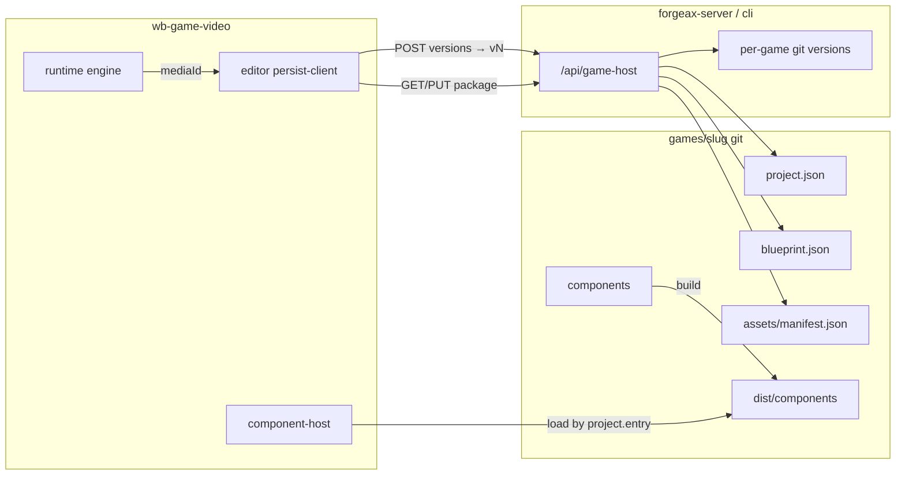

# wb-game-video 游戏包存储与模块划分

> 状态：🟢 SPEC（已定稿，待实现）  
> 日期：2026-07-22  
> 读者：实现本能力的开发 / AI agent  
> 范围：公共框架 vs 每游戏独立 git 仓；目录命名；进 git 清单；组件双轨；资产 id→manifest→url；**与 `/api/game-host` 一体实施**。  
> 暂不做：`play.json` 重编译轨、游戏仓内 `versions/vN/` 目录版管理、产品入口回退版本。  
> 配套合同：[`docs/superpowers/specs/2026-07-22-game-host-api-design.md`](../../../../../../../docs/superpowers/specs/2026-07-22-game-host-api-design.md)（宿主 HTTP；本文管仓内布局，配套文管传输与 git 打版本）。

本文是**游戏包布局 + 扩展侧改造**的 SSOT。落盘/打版本的**写路径不得再由扩展 Vite middleware 承担**；须与配套 API 文档**同一里程碑一起实施**，禁止「只改目录仍走 `/__graph__`」或「只上 API 不改仓根布局」的分叉交付。

---

## 1. 背景与目标

`wb-game-video` 是公共编辑/运行框架。每个游戏应是独立 git 仓（如 `.forgeax/games/game-nodia-fighting`），只存该游戏的数据与专属组件；选中游戏后拉仓内容，再叠上框架即可编辑与运行。

对齐影游（kino）的「一仓内容 + 公共壳 + manifest URL」心智，但：

- **暂不**引入 `play.json` 独立运行协议（玩法数据单文件 SSOT）。
- **需要** per-game TSX 组件（数据 + 可执行代码），AI 生成的组件进游戏仓，不进公共仓库。

### 成功标准

1. 经 `/api/game-host/.../package` 读写仓根新布局，跑通保存/加载/打 `vN` tag（**不做**旧路径迁移）。
2. `blueprint.json` 只挂 media **id**；稳定访问地址在 `assets/manifest.json`（目标态）。
3. 专属组件在游戏仓 `components/` + `dist/components/`；平台用 `component-host` 加载；**删除** `runtime/skins/components`。
4. 现有本地/zhandou 媒体兜底**暂时保留**，待上传与稳定 URL 能力到位后再删除。

---

## 2. 已锁定决策

| # | 决策 | 说明 |
|---|---|---|
| D1 | 一游戏一仓 | `.forgeax/games/<slug>/` = 独立 git；版本 = commit/tag |
| D2 | 框架 + 游戏包 | 平台提供 editor/graph/engine/component-host；游戏仓只含数据与专属组件 |
| D3 | 玩法单真相 | 只维护 `blueprint.json`（`GraphLibraryDocument`）；**不做** `play.json`；runtime 继续直接吃该文档形态 |
| D4 | 元信息文件 | 独立 `project.json`（不用塞进 blueprint 头） |
| D5 | 组件目录名 | 游戏仓用 `components/`（不用 `skins/`） |
| D6 | 组件双轨 | 源码在 `components/`；产物在仓根 `dist/components/` |
| D7 | 组件引用一刀切 | 迁出后全仓改 import；**不做** `runtime/skins/components` 兼容 re-export |
| D8 | 资产模型 | 目标：`blueprint` 只挂 id；`id → assets/manifest.json → url`；壳层 resolve，引擎只传 id |
| D9 | 媒体兜底暂留 | 现阶段保留 zhandou basename / 现有本地 registry 解析（尚无稳定外网 URL）；后续有上传能力后删除兜底，只记访问链接 |
| D10 | 现状 skins | 现有 `runtime/skins/components` 视为**游戏专属**，迁到种子包 + 示例游戏仓；真正公共组件放平台 `component-host/commons/`（见 §4.1） |
| D11 | 宿主写盘 | 走 **`/api/game-host`**（cli + server 挂载）；**禁止** Vite `/__graph__` 产品写盘 |
| D12 | 一体实施 | 本文与 `2026-07-22-game-host-api-design.md` 同一里程碑交付 |
| D13 | 存盘 API = B | `GET/PUT …/package` 一次事务；落盘仍拆 `project.json` / `blueprint.json` / `assets/manifest.json` |
| D14 | 版本 = annotated `vN` | 每次打版本 commit + 新建 tag `v1/v2/…`（对齐影游）；产品只用 latest |
| D15 | 无历史迁移 | 不读不写 `game-video/scenarios.graph.json`；只认仓根新布局 |

---

## 3. 游戏仓目录（SSOT）

```text
.forgeax/games/<slug>/                 # 独立 git
  project.json                         # 项目元信息
  blueprint.json                       # 玩法唯一 SSOT（Tab 配置数据 / 蓝图库）
  assets/
    manifest.json                      # id → url（及 kind 等）
  components/                          # 专属组件源码（AI/人工改这里）
    index.ts                           # 注册入口
    *.tsx
  dist/
    components/                        # 由 components/ 构建出的可加载产物
  .gitignore
```

**不再**使用 `game-video/scenarios.graph.json`。本阶段**不做**旧路径兼容。

### 3.1 `project.json`（最小字段）

```json
{
  "id": "game-nodia-fighting",
  "title": "Nodia Fighting",
  "platform": "wb-game-video",
  "platformVersion": "1",
  "entry": {
    "blueprint": "blueprint.json",
    "components": "dist/components"
  }
}
```

### 3.2 `blueprint.json`

- 形态 = 现有 `GraphLibraryDocument`（原 `GameScenario` 根字段 + `manifest.packs`）。
- 内容 = Studio 各 Tab 配出来的可序列化数据：主/子蓝图、变量、实体、overlays、公式等。
- **不是** editor / graph 工具 / engine 代码。
- 节点媒体：`node.data.media.ref` 语义为**稳定资产 id**（目标态不写完整播放 URL）。

### 3.3 `assets/manifest.json`

- 登记素材 id、kind、稳定 `url`（及既有 registry 字段如 `file` / `status` 等，可按现 `registry-types` 演进）。
- 默认**不**把视频二进制进 git；只存地址。
- 与影游差异说明：影游 manifest **仅资产表**；游戏/项目元信息在 `project.json`，不塞进 manifest。

### 3.4 进 git vs 不进 git

| 进 git | 不进 git（或仅本地） |
|---|---|
| `project.json`、`blueprint.json`、`assets/manifest.json` | 视频/大二进制（只存 url） |
| `components/**` 源码 | 编辑草稿（localStorage / `.draft`） |
| `dist/components/**` 构建产物（便于拉仓即跑） | 宿主临时态；建议 ignore `blueprint.versions/`、`assets/media/` 等本地缓存 |

版本 = 该游戏仓的 **git commit / tag**，不为 blueprint 另开 `versions/vN/` 目录。  
（可选：保存时仍可写本地 `blueprint.versions/` 快照方便撤销，但**不要**当作产品级多版本目录；且宜 gitignore。）

---

## 4. 平台模块划分（`wb-game-video`）

```text
src/
  runtime/                 # schema / engine / session / validate（零 DOM）
    component-host/         # ★ 组件基建（归属 runtime）——已落地
      index.ts             #   registerBuiltins() + loadGameComponents(slug) + register(host) 契约
                           #   + 合并访问器 interactionSkins()/hpBarComponents()/skinPositioning()/skinDefaultAnchor()
      components/          #   组件集（原 runtime/skins/components 整体迁入；index 导出全部：类型+inputs+events+渲染器）
      commons/             #   预留：将来真正跨游戏共享的公共组件放这里（现空，仅 README 占位）
      rendererRegistry.tsx #   overlay 渲染注册表
  graph/                   # 画布 + 图编辑纯函数（源码模块名，≠ 游戏仓 blueprint.json）
  editor/                  # Studio 壳、persist 宿主、预览面、媒体 resolve
```

> **现状（已实现，本期模型）**：
> - `runtime/skins/` → `runtime/component-host/`；所有组件归 **`component-host/components/`**（本质属游戏，
>   本期先留平台供各处编译期引用）。**尚无** `commons/`（真正跨游戏共享组件将来再进）。
> - **游戏仓也存一份一模一样的拷贝**：`.forgeax/games/<slug>/components/` = `component-host/components/` 的全量副本
>   （随游戏 git 版本携带）。seed 与保存同步都用 `scripts/sync-components-to-game.mjs` / dev 端点 `POST /@sync-components`。
> - **保存/打版本时自动同步**：`store.commit()` → save blueprint → `POST /@sync-components`（拷组件到游戏仓）→ `POST versions`（git 提交含 blueprint + components）。
> - 编辑器**值**（交互皮肤/血条下拉、定位）由 `component-host` 合并访问器派生（内建 + 游戏经
>   `register(host)` 的 `registerInteractionSkin`/`registerHpBar` 贡献）；**类型**（`ChoiceOption`/`QteCue`…）仍编译期从
>   `component-host/components` 取（caveat B：TS 类型不能运行时加载）。
> - 未尽：让游戏仓副本成为**运行时真源**（而非平台副本）需先按组件拆 contract/renderer 两层，属独立后续。

### 4.1 组件放哪（本期模型）

| 种类 | 目录 | 进哪个 git | 角色 |
|---|---|---|---|
| **组件集（本期）** | `wb-game-video/src/runtime/component-host/components/` | 平台扩展仓 | 编译/运行**真源**（各处引用它） |
| **游戏仓副本** | `.forgeax/games/<slug>/components/` | 该游戏独立仓 | 与平台**一模一样**的快照，随版本携带；保存时由平台侧同步覆盖 |

- 平台侧：`registerBuiltins()` 注册组件集（运行时用这份）。
- 游戏仓副本：由 **seed/构建步骤** `bun scripts/sync-components-to-game.mjs <gameDir>` 全量拷入（拷贝逻辑 SSOT = `scripts/sync-components-lib.ts`）。
  这**不是 per-save 数据**（平台组件集全游戏相同、很少变），故**不进 vite、不进保存链**；平台组件变更时重跑脚本即可。
- 打版本：`store.commit()` → `await` 存 blueprint（game-host 服务）→ `POST /api/game-host/.../versions`；
  git `add -A` 会把已 seed 的 `components/` 一并纳入该游戏版本。**存储/版本一律走 game-host 服务，vite 不含任何存储逻辑。**
- 将来（独立后续）：拆 contract/renderer 两层后，游戏仓副本可升级为运行时真源、平台只留空壳/commons。

### 边界

- 既有：`runtime ↛ graph/editor`，`graph ↛ editor`
- `component-host` 归属 runtime（`src/runtime/component-host/`），只消费 registry/skins，受 runtime 规则约束；
  被 editor/runtime 消费。
- **存游戏仓**：Tab 配置、manifest、专属组件源码与产物  
- **不存游戏仓**：editor / graph 工具 / engine / 组件加载基建  

### 数据流（目标态）



1. 用户选游戏 → `.forgeax/games/<slug>`（独立 git）
2. `GET …/package` 取 project + blueprint + manifest
3. **component-host** 读 `project.entry.components`（默认 `dist/components`），经宿主 URL 加载并 `register`；**runtime 不内置皮肤实现**
4. 引擎跑 blueprint；播片壳层 resolve（manifest.url 优先；D9 暂留）
5. 保存：`PUT …/package`；打版本：`POST …/versions` → annotated `vN`

### 组件如何进 runtime（实现要点）

```text
打开/切换 slug
  → GET package → project.entry.components = "dist/components"
  → component-host.load(slug) 
       GET /api/game-host/games/:slug/components/…（或等价静态）
  → register 进与今日 createCoreSkinRegistry 同角色的 registry
  → Session/engine 只消费 registry（import 不再指向 runtime/skins/components）
```

- **游戏仓**：`components/` 源码 + `dist/components/` 产物（专属 UI）  
- **平台**：`component-host/`（加载/注册）；**删除** `runtime/skins/components`（及无其它职责时的 `skins/`）  
- **指针**：只在游戏仓 `project.json` 的 `entry`，不在 `runtime/` 下再镜像一份目录  

### 传输层：废弃扩展 Vite 写盘

| 旧（临时） | 新（一体实施） |
|---|---|
| Vite `GET/PUT /__graph__/store` | `GET/PUT /api/game-host/games/:slug/package` |
| 扩展 keep-10 当产品版本 | **否**；产品版本 = 游戏仓 annotated `vN` |
| tool-handlers 直写旧路径 | 与 UI 同一 package 写盘 |
| 旧 `game-video/` 权威 | **不做**；只认仓根新布局 |

`/__gva__/media` 本地流可暂留（D9），上传稳定 URL 后删除。

---

## 5. 媒体解析规则（实现要点）

**目标优先序：**

1. `manifest[id].url`（稳定可播地址）
2. （迁移/过渡）manifest 有本地 `file` → 现有 `/__gva__/media/<id>` 一类 registry 流
3. （**暂留兜底，D9**）内置 zhandou basename、以及当前 demo 仍依赖的本地解析
4. （迁移期兼容）若 ref 已是 `http(s)/blob/data` → 原样（新内容勿再写进 blueprint）

引擎（`engine.ts`）继续只抛 `mediaId = node.data.media.ref`，**不**在引擎内解析 URL。

**后续删除条件（给后人）：** 上传能力就绪、成片均有稳定访问链接后，删除 zhandou / 非 manifest 路径；blueprint 禁止直写 URL。

---

## 6. 组件迁出与一刀切（D7）

### 现状

- 组件实现在 `src/runtime/skins/components/*`
- 多处 `import … from '…/runtime/skins/components…'`

### 目标

- 实现迁到游戏仓 `components/`（示例：`game-nodia-fighting`）
- 平台保留 `component-host`（加载/注册）+ 可选种子包用于 `ensure --seed`
- **删除**旧路径下的组件实现文件；所有引用改为新位置（component-host 公开 API 或游戏包入口）
- **禁止**留下 `runtime/skins/components/index.ts` 之类的永久 shim / re-export

### 加载

- 运行/编辑优先：游戏仓 `dist/components`（可通过宿主 HTTP 端点提供，如 `/__game__/components?game=<slug>`）
- 失败或未构建：开发期可用种子包；产品路径应 fail-loud 或强制 build（实现自定，需在 PR 说明）

---

## 7. 旧数据

**本阶段不做通用迁移。** 只认仓根 `project.json` / `blueprint.json` / `assets/manifest.json`。

`game-nodia-fighting` 已**一次性 seed**到新布局（`scripts/seed-nodia-blueprint.mjs`：读旧
`game-video/scenarios.graph.json` → `normalizeDocument` → 写仓根 `blueprint.json` + `project.json`
+ `assets/manifest.json`），故打开即加载真实内容、保存即回写仓根。旧 `game-video/` 目录保留不动，
可日后人工清理。其它游戏用同法 seed 或首次保存自建。

---

## 8. 建议实现任务清单（给执行方）

按顺序做。**P1 必须宿主 API 与扩展改调同时交付**（同一 PR 或紧耦合 PR 对），禁止只改一边。

### P0 — 文档与约定（两文一起）

- [x] 本文（仓布局）；配套 [`2026-07-22-game-host-api-design.md`](../../../../../../../docs/superpowers/specs/2026-07-22-game-host-api-design.md)
- [ ] 实现时同步更新扩展 `AGENTS.md`：落盘走 game-host、仓根路径、禁止 `/__graph__` 写盘

### P1 — 宿主 API + 仓根布局（一体）✅ 已实现

- [x] **宿主**：`GET/PUT …/package` + `POST/GET …/versions`（annotated `vN`）；只认仓根新布局
      —— 实现在 `packages/platform-io/src/api/game-host.ts`（+ `lib/game-package.ts` / `lib/game-git.ts`），
      由 `packages/cli/src/app.ts` 挂 `/api/game-host`
- [x] package 事务写三文件（临时文件 + rename 逐文件原子）；扩展 `persist-client` 改调之；**拆除** Vite `/__graph__` 写盘
- [x] tool-handlers（`gvid:*`）与 UI 同一 package 语义：`blueprint-store-fs` 改写游戏仓根 `blueprint.json` + `project.json`
- [x] 单测：`platform-io/test/game-host-router.test.ts`（package round-trip + `v1`/`v2` tag，8 pass）；
      `wb-game-video` 内 `blueprint-store-fs.test.ts` 改为新布局（pass）；无旧路径分支
- [x] dev：扩展 `vite.config.ts` 加 `/api` → forgeax server proxy；prod 同源直达

### P2 — 媒体（部分实现；上传轨顺延，D9 gate）

- [x] `MediaAsset` 增加稳定 `url?: string`（`src/editor/assets/registry-types.ts`）
- [x] `editor/shell/media.ts`：新增 `resolveAssetSrc(asset)` = `asset.url` 优先，回落 `/__gva__` 流；
      `resolveMediaSrc(ref)` 兜底（zhandou / registry）**保留**（D9）
- [ ] （后续）`POST /api/game-host/games/:slug/assets` 上传 → 登记 manifest.url；到位后删 D9
- [ ] 单测：id→manifest.url 优先序（待有 url 数据源后补）

> 上传轨顺延理由：D9 明确「尚无稳定外网 URL」。`url` 字段与优先序 helper 已就位，
> 但无数据源前是空操作；`id → manifest → 本地流` 现已由 `/__gva__` 服务端跑通。
> 待 `POST …/assets` 上传能力到位再删 D9 兜底。P0 存盘/打版本不依赖它。

### P3 — component-host + 迁组件（✅ 基本落地；「搬进游戏仓」为独立后续）

- [x] `src/runtime/component-host/`（index：registerBuiltins + loadGameComponents + register(host) 契约；空 `commons/`）
- [x] `runtime/skins/` 整棵迁入 `runtime/component-host/`；**全局一刀切改 import**；删除 `skins/` 树（无 re-export shim）
- [x] 模块边界：component-host 归 runtime，受 `runtime ↛ graph/editor` 约束（实测 OK）
- [x] `bootEditorSkins` 经 `component-host.registerBuiltins()`；`store.ensureBoot` 经 `loadGameComponents(slug)`
- [x] 示例游戏：`game-nodia-fighting/components/index.tsx`（register 契约）→ 构建 `dist/components` → serve 验证
- [ ] （后续）把内建组件集本身也物理搬进游戏仓：需先按组件拆 contract(type+inputs+events)/renderer 两层，
      因编辑器编译期消费其类型/常量。当前保留为平台内建集（built-in / fallback）。

### P4 — ensure / build / 组件访问与端到端（⏸ 顺延，随 P3）

- [ ] `POST .../ensure`（或 `game:ensure` 脚本调同一实现）：建布局、可选 seed
- [ ] `game:build-components`：`components/` → `dist/components/`
- [ ] 组件产物访问：优先宿主路由（如 `GET /api/game-host/games/:slug/components/*`）；**不要**再把写盘绑在 Vite middleware
- [ ] `game-nodia-fighting`：ensure → build → 经 game-host 加载 blueprint → 试玩 resolve → `POST versions` 打最新版

### P5 — 验收

- [ ] 扩展内 lint / boundaries / 相关单测绿；cli/server game-host 单测绿
- [ ] `AGENTS.md` 与本文 + API 文一致
- [ ] PR 说明写明：D9 兜底仍在、删除条件；已拆除 `/__graph__` 写盘

---

## 9. 明确不做（本阶段）

- `play.json` / 独立 Play schema / 为编译而改 engine 输入契约  
- 游戏仓内 `versions/vN/` 目录版管理  
- 产品入口回退 / checkout 版本（底层 git operations 可留，不挂对外入口）  
- 把用户自定义组件合入 `wb-game-video` 公共仓库  
- 删除 zhandou/本地媒体兜底（留给上传 URL 能力就绪后）  
- 继续用扩展 Vite `/__graph__` 作为产品写盘权威  
- 旧路径迁移 / CanonFile 兼容读  

---

## 10. 关键现状锚点（便于搜代码）

| 主题 | 当前位置（实现前） | 目标 |
|---|---|---|
| 落盘传输 | Vite `/__graph__`；`persist-client` | `GET/PUT /api/game-host/.../package` |
| 版本 | 扩展 keep-10 | 游戏仓 annotated `vN` |
| 组件 | `runtime/skins/components` | 游戏仓 `components` + `dist/components`；平台 `component-host`；删 skins 实现 |
| 媒体 | 多路径 resolve | manifest.url 优先；D9 暂留 |
| 模块边界 | `check-module-boundaries.mjs` | 纳入 `component-host ↛ editor/graph` |

---

## 11. 参考

- **配套宿主 API（一体实施）**：[`docs/superpowers/specs/2026-07-22-game-host-api-design.md`](../../../../../../../docs/superpowers/specs/2026-07-22-game-host-api-design.md)
- 影游存储设计（对照，非照搬）：arrival-studio / kino `project-storage-design.md`（`graph.json` + `assets/manifest` + 编译 `play.json`；我们裁掉 play 轨、加上 per-game TSX）
- 蓝图库现行单文件形态：`docs/superpowers/specs/2026-07-21-blueprint-library-folder-management.md`
