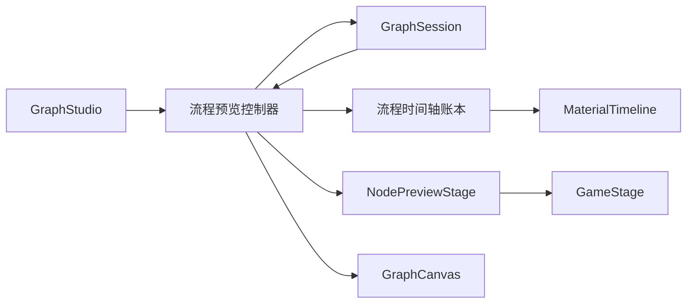
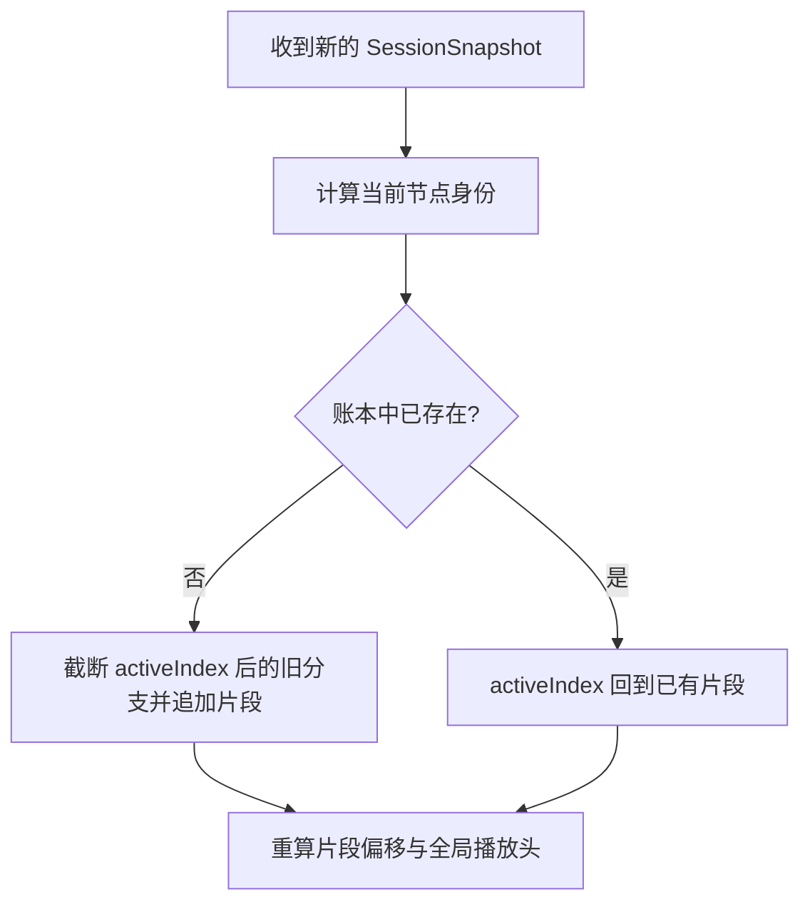
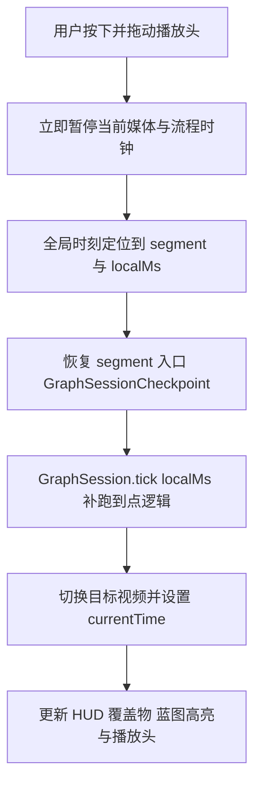
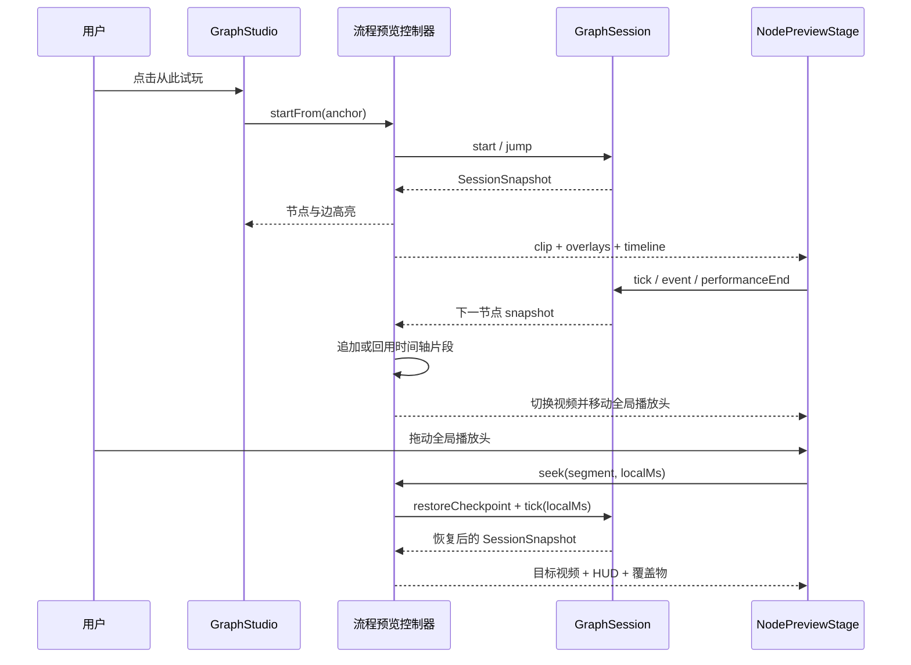

# 节点预览升级为全流程预览 · 架构设计

> 状态：🟡 COMPONENT READY · HOST INTEGRATION DEFERRED · 日期：2026-08-01  
> 范围：封装「单节点编辑 + 全流程预览」双模式通用组件；暂不取代 `GraphStudio` 现有“从此试玩”视频浮层。  
> 不做：修改蓝图持久化协议；预先猜测或跳转到尚未实际执行的未来分支。

一句话：**编辑模式仍以当前节点为素材源，预览模式改以同一个 `GraphSession` 为执行源；时间轴只记录本次实际走过的流程，并把全局播放头映射到当前节点的局部时刻。**

> [!IMPORTANT]
> 组件能力、动态时间轴和 checkpoint 已实现；产品宿主接入已延期。当前 `GraphStudio` 仅使用
> `NodePreviewStage` 的编辑模式，“从此试玩”继续打开独立浮层，并与节点预览互斥显示。

---

## 1. 问题与目标

当前 `NodePreviewStage` 已有视频、覆盖物、结算点、素材时间轴和画布拖动能力，但它只消费编辑器当前选中的单个节点。现有「从此试玩」则使用 `GraphSession` 跨节点执行，却在另一块浮动播放器中渲染，缺少完整时间轴，也形成了两套播放器交互。

本次升级的成功标准：

1. 节点预览面板提供「编辑 / 预览」模式切换。
2. 编辑模式保留当前单节点素材编辑能力。
3. 预览模式从指定节点启动 `GraphSession`，跨节点、跨子流程和跨子蓝图连续播放。
4. 蓝图节点高亮、沿边推进和调用栈跟随继续读取同一个 `SessionSnapshot`。
5. 流程时间轴按实际执行路径动态展开；分支发生后才出现下一节点。
6. 回到已存在的循环节点时，播放头回到已有片段，不无限追加同一循环。
7. 预览模式不能选择或拖动视频覆盖物、素材条和结算点。
8. 未来宿主决定切换时，可由此面板取代「从此试玩」浮动视频播放器；当前不接入。

> [!IMPORTANT]
> 本方案不增加、删除或改变 `node-config-schema.ts`、`react-flow-schema.ts`、`graph-schema.ts` 的持久化字段。新增内容只存在于编辑器内存模型和可选组件 props 中；`blueprint.json` 与运行时配置协议保持原样。

---

## 2. 业界参照与取舍

[Unity Timeline](https://docs.unity3d.com/cn/2018.3/Manual/TimelineOverview.html) 将 Timeline Asset 与场景中的 Timeline 实例分开，并以 Track / Clip 组织可编辑内容；[Nested Timeline](https://docs.unity3d.com/ja/Packages/com.unity.timeline%401.5/manual/wf_nested.html) 用主时间轴承载子时间轴实例。[Adobe Premiere Pro](https://helpx.adobe.com/uk/premiere/desktop/render-and-export/render-sequences-for-playback/play-active-sequence-in-program-monitor.html) 则区分源素材预览与当前 Sequence 的 Program Monitor，时间轴播放头代表当前序列时刻。

本项目采用相同的两层心智，但保留蓝图运行时的差异：

| 业界概念 | 本项目映射 | 关键差异 |
|---|---|---|
| Source / 单个 Clip | 编辑模式中的当前蓝图节点 | 允许改覆盖物、素材窗口与结算点 |
| Sequence / Master Timeline | 预览模式中的本次执行路径 | 路径不是静态剪辑，而由条件和交互实时决定 |
| Playhead | 全局流程时刻 | 映射到当前节点片段的局部播放时刻 |
| Nested Sequence | 子流程 / 子蓝图调用 | 仍由 `GraphSession` call stack 执行，不复制协议数据 |

因此，不能像传统视频编辑器一样在开播前把所有后续节点铺平：存在多个出边时，只有运行时条件结算后才知道实际分支。

---

## 3. 总体架构



职责边界：

| 模块 | 负责 | 不负责 |
|---|---|---|
| `GraphSession` | 节点执行、条件、边推进、子蓝图、运行时状态 | 编辑器时间轴排版 |
| 流程预览控制器 | session 生命周期、播放控制、快照、BGM、当前媒体 | 修改蓝图配置 |
| 流程时间轴账本 | 记录本次实际路径、循环回用、全局/局部时间映射 | 决定下一条边 |
| `NodePreviewStage` | 双模式播放器外壳与工具栏 | 自己实现第二套路由引擎 |
| `MaterialTimeline` | 展示节点分段、素材与结算标记 | 在预览模式写回配置 |
| `GraphCanvas` | 按 session snapshot 高亮节点和已走边 | 拥有试玩状态 |

### 3.1 单一会话源

现有「从此试玩」已经具备跨蓝图执行、`activeBlueprintId`、`activeGraphPath`、`traversedEdgeIds` 和 BGM。实现继续由 `GraphStudio` 归口这段会话生命周期，预览面板和蓝图画布只消费它的同一份结果；播放表面拆到 `FlowNodePreviewStage`，路径算法拆到无 React 的纯函数模块。

```ts
interface FlowPreviewController {
  mode: 'edit' | 'preview'
  snapshot: SessionSnapshot | null
  startFrom(anchor: PlayAnchor): void
  restart(): void
  stop(): void
  setPaused(paused: boolean): void
  setPlaybackRate(rate: number): void
  timeline: FlowTimelineModel
}
```

切到预览模式时，从当前节点或「从此试玩」指定节点创建 session；切回编辑模式时停止 session 和 BGM，但不改变编辑器当前选中的蓝图与节点。

---

## 4. 双模式交互

| 能力 | 编辑模式 | 预览模式 |
|---|---|---|
| 视频来源 | 当前选中节点的本地视频 | `SessionSnapshot.clip` |
| 覆盖物来源 | 节点配置投影 | `SessionSnapshot.overlayMounts` / `hud` |
| 覆盖物选中、拖动、层级调整 | 允许 | 禁止，不挂载交互层 |
| 素材条拖动、缩放、删除 | 允许 | 禁止 |
| 结算菱形拖动、选中 | 允许 | 禁止 |
| 蓝图节点/边高亮 | 无运行时高亮 | 跟随 session |
| 时间轴范围 | 当前节点 | 本次实际执行路径 |

模式切换控件由宿主提供，不属于通用组件。当前 `GraphStudio` 不展示模式切换，也不把试玩视频
接入此面板；原有试玩浮层及其与节点预览的互斥交互保持不变。

> [!IMPORTANT]
> 全流程 seek 必须同时恢复游戏状态与媒体时刻。每次进入视频片段时，编辑器为该片段保存仅内存的 `GraphSessionCheckpoint`；拖到历史片段时先恢复 checkpoint，再把运行时推进到片段局部时刻，最后同步 `<video>.currentTime`。禁止只移动视频，因为那会让实体、变量、HUD、调用栈和 reaction 游标停在错误节点。

---

## 5. 动态流程时间轴

### 5.1 编辑器内存模型

```ts
interface FlowTimelineSegment {
  instanceKey: string
  blueprintId: string
  graphPath: string[]
  nodeId: string
  nodeTitle: string
  startMs: number
  durationMs: number
}

interface FlowTimelineModel {
  segments: FlowTimelineSegment[]
  activeIndex: number
  playheadMs: number
  durationMs: number
}
```

节点身份使用 `blueprintId + graphPath + nodeId`，避免不同蓝图中的节点 id 碰撞。`instanceKey` 只属于本次编辑器预览会话，不落盘。

片段时长优先遵守节点配置的有效 `durationMs` cap，否则取视频 metadata；metadata 未就绪时使用稳定兜底，加载后重算后续片段的起止位置。预加载视频的 metadata 也按 playback key 暂存在 `GameStage` 内，成为前台视频时立即回填，不能依赖 metadata 事件再次触发。为此给 `GameStage` 增加可选的 `onDurationChange` 回调，这属于组件 API 扩展，不是配置协议扩展。

### 5.2 分支与循环算法



规则：

1. 首节点建立第一个片段。
2. 首次进入新节点时，在当前片段之后追加。
3. 若用户重开或在中间节点重新选择另一分支，先删除当前片段之后的旧后缀，再追加新路径。
4. 若进入账本中已存在的节点，移动 `activeIndex` 到既有片段，不追加副本。
5. 循环后的播放头因此回跳到已有片段区间，时间轴总长度有界。

例如 `战斗 → 失败 → 战斗` 的时间轴始终只有两个片段；第二次回到战斗时播放头回到第一个片段。如果之后从战斗改走胜利，旧的失败后缀被截断，形成 `战斗 → 胜利`。

### 5.3 时间轴投影

每个片段先投影一条与片段起止位置完全一致的视频主轨，再把节点内素材和结算标记加上 `segment.startMs`，投影到同一个全局坐标系。即使节点没有覆盖物，时间轴也仍显示视频主轨，不出现“实际流程无内容”的误导空态。所有投影 id 都带 `instanceKey` 前缀，避免两个节点挂载相同基础覆盖物时互相选中或写回。

预览模式的时间轴增加节点边界和标题条；活动片段使用克制的高亮。未知的未来节点不显示占位，因为这会错误暗示某个分支已经确定。

流程时间轴使用“首段定标、后续追加”的宽度模型：首段视频在 `zoom=1` 时铺满当前时间轴视口，并由它建立稳定的 `px/ms`；后续节点保持同一个 `px/ms` 向右追加，内层 canvas 随实际路径增长，外层 viewport 横向滚动。例如首段 15 秒宽 559px，下一段 7 秒就追加 $559 \times 7 / 15 \approx 261\text{px}$，而不是把两段重新压缩回 559px。单节点编辑时间轴仍使用原有 fit 模式，互不影响。

运行时状态推进仍消费 `GameStage.onTick`，不把整个蓝图画布提升到 60fps。仅预览播放头通过 `requestAnimationFrame` 从当前前台 `<video>.currentTime` 读取位置并直接更新 DOM；无视频节点使用同一帧循环推进合成时钟。播放头超过视口 70% 后，viewport 平滑跟随内层 canvas，循环回到既有片段时同步回滚。

### 5.4 全流程拖动与 checkpoint



checkpoint 捕获运行时全量可变态：实体与变量、随机数步进、once 标记、当前图与调用栈、已走节点和边、节点内触发游标、待结算边、瞬态覆盖物、BGM 作用域栈，以及对应的 `SessionSnapshot`。它只存在于当前编辑器预览会话，重开或重新“从此试玩”时清空，不进入配置协议。首段 checkpoint 必须在 `jump/start` 返回时同步建立；不能只等下一次 React effect，因为真实视频可能先上报非 0 播放时刻，使入口状态永久丢失。后续节点仍在每次片段入口建立 checkpoint。

拖动范围只覆盖时间轴中已经实际走过的片段；尚未选择的未来分支不会凭空生成。拖动开始后保持暂停，用户点击播放按钮才从目标时刻继续执行。若从上游恢复后走出不同分支，沿用 §5.2 的规则截断旧后缀并追加新路径。

---

## 6. 播放与状态时序



视频播放结束、结算推进、组件事件和手动蓝图交互都继续走 `GraphSession` 既有入口。预览组件只转发事件，不直接选择边，也不复制 runtime 判断。

---

## 7. 预计改动面

| 区域 | 变化 |
|---|---|
| `src/editor/shell/GraphStudio.tsx` | 当前保持原试玩浮层；未来接入统一流程预览时的宿主改造位置 |
| `src/editor/shell/NodePreviewStage.tsx` | 增加 `edit / preview` 模式和 runtime 渲染分支 |
| `src/editor/shell/FlowNodePreviewStage.tsx` | 新增 runtime 播放表面、BGM、播放控制、只读时间轴和全局 scrub 映射 |
| `src/editor/video/flowPreviewTimeline.ts` | 新增纯函数流程账本与时间映射 |
| `src/editor/video/MaterialTimeline.tsx` | 增加只读选择门控、节点片段/边界展示与只读 scrub |
| `src/runtime/play/GameStage.tsx` | 只增加可选的视频有效时长通知 |
| `src/runtime/engine/engine.ts` / `session.ts` | 增加仅内存的 checkpoint / restore API，不改变运行时 schema |
| 对应测试 | 纯算法、双模式只读、循环/改支、控制器联动和现有试玩回归 |

> [!WARNING]
> 若实现过程中发现必须新增持久化字段或改变 runtime schema，本功能应立即停在当前分支并单独提请架构 review；不能顺手把编辑器流程账本写入 `blueprint.json`。

---

## 8. 验收与验证

1. 通用组件在宿主传入 `mode="preview" + flow` 时进入全流程预览；当前“从此试玩”仍打开原浮层。
2. 结算沿边推进时，画布边和目标节点高亮与视频切换同步。
3. 时间轴在真实进入下一节点后追加其完整节点时间轴；未选择分支不提前出现。
4. 两节点循环时总时间轴长度不持续增加，播放头回到已有片段。
5. 循环后走另一分支时，旧后缀被新分支替换。
6. 预览模式不能选择或拖动覆盖物、素材条、结算菱形；编辑模式行为不回归。
7. 进入和退出子蓝图时，播放、时间轴身份和蓝图高亮均指向正确执行图。
8. 声音、暂停、倍速、重开和面板收起/展开保持可用。
9. 后续节点保持首段建立的 `px/ms` 等比例追加，内层画布增长并横向跟随，不压缩既有片段。
10. 播放或暂停时都可把播放头拖到任意已走片段；拖动后视频、HUD、覆盖物与蓝图高亮同步恢复并保持暂停。
11. `bun run test`、`bun run lint`、`bun run build` 全部通过，并在 Studio `:18920` 真实页面完成交互验证。

---

## 9. 修订记录

| 日期 | 说明 |
|---|---|
| 2026-08-01 | 初稿：双模式、单一 GraphSession、运行路径账本、循环回用、无持久化 schema 改动 |
| 2026-08-01 | 实现：会话仍由 GraphStudio 归口；播放表面与纯时间轴算法分别拆分 |
| 2026-08-01 | 修正：视频主轨、预加载时长缓存、首段定标后等比例追加、逐帧播放头与横向跟随 |
| 2026-08-01 | 扩展：仅内存 checkpoint / restore，支持已走流程片段间双向 scrub |
| 2026-08-01 | 修正：首段 checkpoint 与 `jump/start` 同步创建，消除真实视频首帧推进造成的拖动失效窗口 |
| 2026-08-01 | 决策：保留通用组件能力，撤回 `GraphStudio` 的“从此试玩”接入，恢复原独立浮层 |
