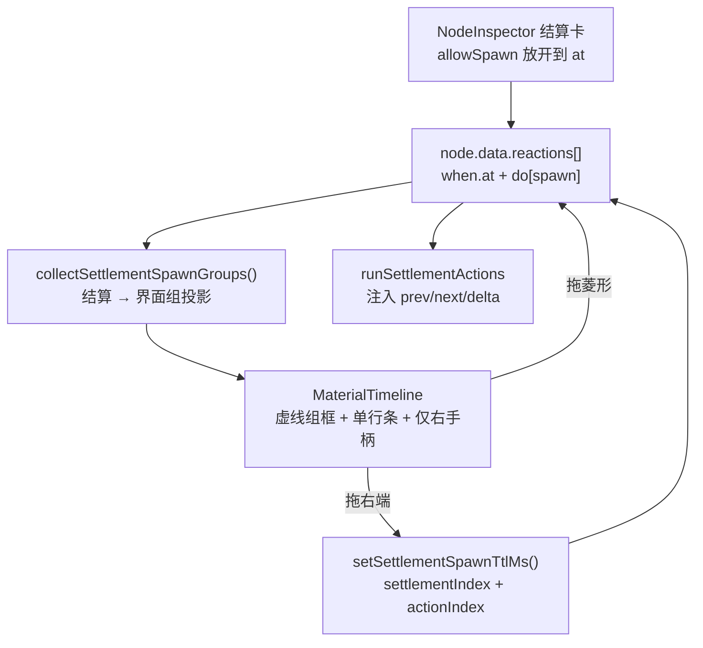

# 结算绑定界面 · 架构设计

> 状态：🟢 IMPLEMENTED · 日期：2026-08-04
> 范围：让「播到 X ms」结算可以绑定一个或多个界面，并在时间轴上以从属于菱形结算点的界面组表达。
> 不做：改动 `node-config-schema.ts` / `react-flow-schema.ts` / `graph-schema.ts` 的任何持久化字段。

> [!NOTE]
> 落地与本设计一致，三处补充见 [§11 实现记录](#11-实现记录)：新增 `removeSettlementSpawn`、
> spawn ttl 夹取函数迁到 graph 层、时间轴选中态改读作者点击而非画布回落值。

一句话：**结算绑定界面不是新能力，而是把已有的 `NodeAction.spawn` 从「只有条件结算能用」放开到定时结算，并给它一个以 `when.ms` 为唯一时间真相的时间轴投影。**

> [!IMPORTANT]
> 本方案不增删任何发布数据契约字段。新增内容只存在于编辑器内存投影、编辑器纯函数与运行时
> 局部量注入中；`blueprint.json` 与运行时配置协议保持原样。唯一触及 `src/runtime` 的改动是
> 给定时结算的 spawn 注入 `prev` / `next` / `delta` 局部量，见 §6。

---

## 1. 问题与目标

当前「添加界面」与「添加结算」是两条完全独立的作者面。界面挂在 `node.data.overlayNodes[]`，在时间轴上控制自己的出现时机；结算是 `node.data.reactions[]` 里的一条 `Reaction`，在某个时刻做事（改属性、改变量、沿边推进）。但实际配置中，结算效果与界面出现常常是同一件事的两面：3000ms 给 `ent_0` 气力 +10，同时要有一个飘字喊 `+10`。两者独立意味着运营要在两个地方各配一次，调时间点也要各拖一次，且两次拖动无法保证对齐。

成功标准：

1. 「播到 X ms」结算的动作区可以添加界面，一个结算点可绑定多个界面。
2. 绑定界面的起始时刻恒等于菱形结算点时刻，不存第二份时间数据。
3. 拖动菱形结算点，其下所有绑定界面整体跟随，无需任何联动代码。
4. 绑定界面在时间轴上每个占一行，同属一个结算点的界面用一个虚线组框包起，位于该菱形正上方。
5. 绑定界面只能拖动结束时间；起始时间无法单独调整。
6. 飘字类界面显示的数字由结算效果实际造成的变化派生，而不是让作者手写第二份。
7. 不同结算点的界面组在水平不重叠时共用行，避免纵向爆炸。

---

## 2. 契约结论：为什么不需要扩展 schema

`NodeAction` 中早已存在 `spawn` 原语，且「结算」就是 `when: { type: 'at', ms }` 的 `Reaction`，其 `do` 是一个 `NodeAction[]`。需求逐条落在已有字段上：

| 需求 | 落盘形态 | 新字段 |
|---|---|---|
| 3000ms 结算，`ent_0` 气力 +10 | `when:{type:'at',ms:3000}`，`do[0]` 为 `effect` | 无 |
| 该结算绑定飘字界面 | `do[1]` 为 `spawn` | 无 |
| 一个结算绑多个界面 | `do` 内多个 `spawn` | 无 |
| 组起始时刻 = 菱形时刻 | 派生自 `when.ms` | 无 |
| 菱形拖到 4000ms，整组跟随 | 只改 `when.ms` | 无 |
| 界面只能拖结束时间 | 结束 = `when.ms + ttlMs`，拖右端写 `ttlMs` | 无 |
| 界面起始不能单独调 | `spawn` 结构上没有起始字段 | 无 |

最后一条是本设计的核心依据：「起始时间不能单独调整」不是需要 UI 去禁用左手柄来防守的约束，而是数据形状让它无法表达——一个 `spawn` 动作没有自己的时间坐标，它的时间就是宿主 reaction 的时间。菱形拖动时整组跟随因此是零成本的。这正是 Derive 原则要的形态；反过来，若为绑定界面新增独立的 `startMs`，就制造了会与 `when.ms` 漂移的第二份真相。

**结论：现有 schema 已是本需求的正确形状，不扩展。**

---

## 3. 总体架构



四处改动，三处在编辑器，一处在运行时：

| 层 | 位置 | 性质 |
|---|---|---|
| 表单门控 | `src/editor/shell/NodeInspector.tsx` | 放开一个布尔 |
| 时间轴投影 | `src/editor/video/` 新增纯函数 + `MaterialTimeline` 渲染层 | 新增编辑器内存类型 |
| 回写 | `src/graph/edit/graph-edit.ts` | 新增一个纯函数 |
| 局部量注入 | `src/runtime/engine/engine.ts` | 扩大既有 locals 的注入范围 |

---

## 4. 表单门控

`spawn` 与 `hideOverlay` 目前被显式限制为只有条件结算可用：

```ts
// NodeInspector.tsx 现状
allowSpawn={triggerType === 'condition'}
allowHideOverlay={triggerType === 'condition'}
```

改为 `allowSpawn={triggerType === 'condition' || triggerType === 'at'}`。`allowHideOverlay` **保持原样**：`doHideOverlay` 只扫 `nodeOverlayChildren`，命中不了 spawn 出来的界面，在定时结算里放开它只会给作者一个不生效的开关。

`NodeActionsEditor` 里 spawn 的编辑面（界面模板选择、消失方式常驻/按时长、显示时长 ms、组件属性）已完整，不需要改结构。两处文案按 §8 命名。

---

## 5. 时间轴投影

### 5.1 为什么不复用 `MaterialItem`

`MaterialItem` 的语义是「材料段」：可自由拖 start / end / 换轨、可删、可选入组件检视器。结算界面组的约束完全不同——起始派生、只能拖 end、归属于某个结算点。塞进 `MaterialItem` 会被迫为它伪造 `zIndex` / `locked` / `fixedWidthPx`，而这个反模式在 `materialTimelineShared.ts` 里 `TimelinePointMarker` 的注释中已被明确记录过一次（「混进材料流会被迫伪造这些属性」）。因此新增第三类投影，与 `MaterialItem`、`TimelinePointMarker` 并列。

### 5.2 新增编辑器内存类型

```ts
/** 一条绑定界面（= 某结算 do 内的一个 spawn）在时间轴上的投影；不落盘。 */
export interface TimelineSpawnBar {
  /**
   * 稳定 id：`settlement-spawn:${settlementIndex}:${actionIndex}`，与 `patchSettlementSpawnLayout`
   * 同一寻址，也与 §5.4 预览画布的投影 id 完全同串——时间轴点选与画布高亮因此共用一个标识。
   */
  id: string
  label: string
  /** 恒等于宿主结算的 when.ms；不可单独编辑。 */
  startMs: number
  /** ttlMs 存在时 = startMs + ttlMs；常驻时 = 节点末端。 */
  endMs: number
  /** 常驻（无 ttlMs）：右端画开口，拖动即就地转成按时长隐藏。 */
  openEnded: boolean
  /** 组内行号，0 = 最靠近菱形轨的一行。 */
  rowInGroup: number
}

/** 同一结算点下的界面组；虚线框覆盖组内全部行 × [startMs, endMs]。 */
export interface TimelineSpawnGroup {
  /** = 宿主菱形标记 id（`life:${settlementIndex}`），点选时复用既有 focus 联动。 */
  markerId: string
  settlementIndex: number
  startMs: number
  endMs: number
  /** 自菱形轨向上数的起始行，从 1 开始；绝对轨号由渲染层换算，见 §5.3。 */
  uBase: number
  bars: TimelineSpawnBar[]
}
```

投影函数只产出「自菱形轨向上数」的相对行 `uBase`，不产出绝对轨号——绝对轨号依赖 `dataMaxLayer`，那是渲染层才知道的量。

投影纯函数放在 `nodeTimelineMarkers.ts` 旁（同一"从节点配置派生时间轴"职责），签名与既有 `collectNodeTimelineMarkers` 对齐：

```ts
export function collectSettlementSpawnGroups(
  scenario: GameScenario,
  node: GameNode,
  maxMs: number,
): TimelineSpawnGroup[]
```

只处理 `isSettlementReaction` 子集中 `when.type === 'at' | 'enter'` 且 `do` 内含 `spawn` 的项；`settlementIndex` 与 `collectNodeTimelineMarkers` 完全一致，因此组与菱形天然同 id 配对。

### 5.3 轨道装箱

菱形轨现在紧跟材料轨（`lifecycleTrack = dataMaxLayer + 1`）。界面组要落在菱形正上方，因此先在相对坐标系里装箱，再把菱形轨整体下移让出空间。两步无循环依赖：装箱只在「自菱形轨向上数」的 u 空间进行，不需要知道 `dataMaxLayer`。

```
# 1. 投影层：u 空间装箱，得到每组 uBase 与全局 maxU
maxU = max(uBase + bars.length - 1)   # 无界面组时为 0
# 2. 渲染层：换算绝对轨号
lifecycleTrack = dataMaxLayer + 1 + maxU
组内第 rowInGroup 行的轨号 = lifecycleTrack - (uBase + rowInGroup)
```

装箱算法：按 `startMs` 升序处理各组，对每组取最小的 `uBase ≥ 1`，使 `uBase .. uBase + N - 1` 这 N 行在 `[startMs, endMs)` 区间上均未被已放置的组占用。水平不重叠的组因此共用行；常驻组占到节点末端，会把其后所有重叠组顶到更上一层——这是正确且可预期的。

换算的正确性：`uBase = 1`、`rowInGroup = 0` 的条落在 `lifecycleTrack - 1`，即菱形正上方一行；占用最高的那条落在 `dataMaxLayer + 1`，恰好不与材料轨（`0 .. dataMaxLayer`）相撞。

`TIMELINE_MAX_LAYER = 15` 的存储硬上限只约束落盘的 `layout.zIndex`，不约束这里的派生行；但 `trackCount` 仍按现有方式派生，超出 `TIMELINE_MIN_TRACKS = 6` 的部分由既有纵向滚动承载。

### 5.4 渲染与交互

组框是一个虚线矩形，左边界对齐 `startMs`，覆盖组内全部行；组内每条界面各占一行，条上只渲染**右手柄**，不渲染左手柄，也不响应纵向拖动换轨（行号是派生的）。

| 交互 | 行为 |
|---|---|
| 拖界面条右端 | 写 `ttlMs = clamp(endMs - when.ms)`；常驻条被拖即从常驻转为按时长 |
| 拖界面条本体 | 不响应（起始不可单独调整） |
| 拖菱形 | 走既有 `setSettlementReactionMs`；组因派生而整体跟随 |
| 点选界面条 | 先调既有 `onSelectPointMarker(group.markerId)` 高亮宿主结算卡，再经新增回调上抛 `{ settlementIndex, actionIndex }`，供预览画布定位该 spawn |
| 删除界面条 | 经新增回调路由到「从宿主 `do` 中移除下标为 `actionIndex` 的动作」，与表单里的「移除界面」同一效果；不复用 `onDeleteMaterial`（那条只认 `MaterialItem`） |

预览画布侧：`nodePreviewState.ts` 的 `projectSelectedConditionSpawns` 目前在 `when.type` 非 `watch` / `state` 时直接返回空，导致定时结算的界面无法在画布上拖位置。放开到 `at`，并把函数名与它产出的投影 id 前缀一并从 `condition-spawn` 改为 `settlement-spawn`（都是编辑器内部标识，不落盘），使结算界面与挂载界面在摆位体验上对等。既有的 `patchSettlementSpawnLayout` 无需改动。

该前缀已确认只出现在编辑器源码与 `NodePreviewStage-layout.test.tsx` 的 DOM 属性断言里（`data-preview-condition-spawn-id` / `data-canvas-item`），改名需同步这些断言与属性名；无任何落盘数据引用它。

---

## 6. 运行时：给定时结算的 spawn 注入局部量

### 6.1 为什么必须做

飘字要显示 `+10`，而这个 `10` 已经写在同一结算的 `effect` 里。若让作者在 spawn 的 `inputs` 里再手写一次，就是两份可漂移的真相：改结算数值时飘字不会跟随，且不报错。这恰是本需求要消灭的「两者独立、运营配置麻烦」的另一个化身。

引擎目前只在 `watch` 反应执行期注入 `prev` / `next` / `delta`（`EvalCtx.locals` 的注释已如此定义）；定时结算走 `runSettlementActions`，不带 locals，因此 `{expr:'delta'}` 会被 `safeEval` 静默兜成 0。

### 6.2 规则

`runSettlementActions` 维护一个滚动的「最近一次写入」观测值。每执行完一条 `effect` 动作后，按该动作**最后一个 effect 条目**的目标路径采样施加前后的值，得到 `{ prev, next, delta }`；其后遇到的 `spawn` 带着这份 locals 调用既有的 `doSpawn(action, locals)`。语义：**紧邻我上面那条效果实际造成的变化。**

目标路径由 effect 的 kind 派生：`attr` → `entity.<entityId>.attr.<attr>`，`var` → `var.<varId>`；`flag` 与 `item` 无数值路径，遇到时把滚动值清空（后续 spawn 读不到 delta，静态校验会提示）。

**必须读观测值而不是作者写的 `value`。** `applyEffects` 会被 `varMeta` / `attrMeta` 的 min/max 夹住，也会被 `once` 整条跳过，所以「气力 +10」实际生效可能是 +3 或 +0。读 `value` 会造成血条纹丝不动而飘字仍喊 +10。

选这条规则的理由：

- **零新概念**：`prev` / `next` / `delta` 是作者在条件结算里已经学过的同一套符号，只是注入范围从 watch 扩到定时结算。
- **零新字段**：`doSpawn` 的签名本就是 `doSpawn(action, locals?)`，调用点从不传变成传；`applyEffects` 完全不改。
- **顺序即语义**：契合 `do` 数组按序执行的既有心智。效果写在界面上面，界面读得到；写在下面读不到。

确定性不受影响：采样是纯读，不涉及 DOM 与随机源。

### 6.3 退化与边界

一条 `effect` 动作里写了多个 effect 条目时，`delta` 只描述最后一个。编辑器必须在该 spawn 的属性面板上明写「delta 当前来自 `ent_0.气力`」，不让作者猜。插入 spawn 时若其前方恰好只有一条 effect 条目，把飘字文案预填成 delta 表达式——这才真正消掉重复配置。

**事件反应（`runEventActions`）本次不改。** 一并改则超出本需求范围；不改则同一个 `delta` 符号在结算面与事件面行为不一致。记为后续项，由人类决定何时对齐。

---

## 7. 校验与夹取

`validate.ts` 第 6 步已在遍历 `spawn.inputs` 的引用，加一条静态检查基本免费：**某 spawn 的 `inputs` 用到 `delta` / `prev` / `next`，但同一 `do` 内它之前没有可采样的 effect** → 报错。这把 §6.2 的 fail 模式从静默 0 变成落盘前可见。

`spawn.ttlMs` 目前不受任何校验约束。时间轴拖动会频繁写 `ttlMs`，因此回写时用既有的 `clampSettlementSpawnTtlMs(ttlMs, nodePlayDurationMs(node))` 夹住，避免拖出超过节点时长的值。注意该函数把 `undefined` / `0` 视为「撑到节点结束」并返回上限，所以**不能**用它来判断是否常驻——常驻与否只看 `ttlMs` 字段是否存在。

---

## 8. 命名

挂载界面（`overlayNodes`）与结算界面（`spawn`）当前两个入口都叫「添加界面」，这是概念数上升点，必须区分：

| 位置 | 现文案 | 新文案 |
|---|---|---|
| `NodeInspector` 界面挂载下拉 | ＋ 添加界面 | ＋ 添加界面（不变） |
| `NodeActionsEditor` 动作工具条 | + 添加界面 | + 绑定界面 |
| `NodeActionsEditor` 动作卡标题 | 显示界面 | 绑定界面 |
| `NodeActionsEditor` 移除按钮 | 移除界面 | 解除绑定 |
| 时间轴组框 | — | 绑定界面 · N |
| 菱形标记摘要（`nodeTimelineMarkers`） | 显示 N 个界面 | 绑定 N 个界面 |
| 蓝图节点结算摘要（`GraphCanvas`） | 显示 &lt;界面名&gt; | 绑定 &lt;界面名&gt; |

---

## 9. 测试计划

| 层 | 用例 |
|---|---|
| 投影纯函数 | 单结算多 spawn 的组行号；常驻组 `endMs` 落到节点末端；水平不重叠的两组共用行；重叠组被顶到上层 |
| 回写纯函数 | `setSettlementSpawnTtlMs` 按 `settlementIndex` + `actionIndex` 命中；结算子集序号不受非结算 reaction 干扰；夹取到节点时长 |
| 派生跟随 | 改 `when.ms` 后重投影，组 `startMs` 与全部条同步位移，`ttlMs` 不变 |
| 时间轴交互 | 界面条无左手柄；本体拖动不产生 patch；常驻条拖右端后 `ttlMs` 出现 |
| 运行时 | 定时结算 `effect` → `spawn` 且 `{expr:'delta'}` 得到观测变化；撞 max 时 delta 为夹取后的实际值；`once` 已消耗时 delta 为 0；spawn 在 effect 之前时 delta 为 0 |
| 校验 | 用 delta 但前方无 effect → 报错 |

---

## 10. 不做的事与已知限制

- 不新增、不删除、不改变任何持久化 schema 字段。
- 不放开定时结算的「隐藏界面」（`hideOverlay` 命中不了 spawn 实例）。
- 不改事件反应的 locals 注入（见 §6.3）。
- spawn 出来的界面不进 `nodeOverlayChildren`，因此不触发 `shown` / `hidden` 生命周期，也无法被 `hideOverlay` 命中。这意味着「界面出现 → 触发另一个结算」的链挂不到结算绑定界面上。这是既有限制，本次不解决。
- 结算绑定界面的消失只有两条路径：`ttlMs` 到点，或节点退出。时间轴上的右端因此是它唯一的结束语义。

---

## 11. 实现记录

落地时相对本设计有三处补充，都不触及持久化契约：

**新增 `removeSettlementSpawn`。** §5.4 只说时间轴要能解除绑定，没定回写函数。落地时在 `graph-edit.ts`
加了 `removeSettlementSpawn(graph, nodeId, settlementIndex, actionIndex)`，与 `setSettlementSpawnTtlMs`
同一寻址范式，从宿主 `do` 里移除该 spawn 而保留结算本身。

**spawn ttl 夹取函数迁到 graph 层。** §7 要求回写时复用 `clampSettlementSpawnTtlMs`，但它原本住在
`editor/video/graphMaterialOps.ts`，而 `graph-edit.ts` 在 graph 层 —— 直接 import 会形成
`graph → editor` 的反向依赖（`check-module-boundaries` 明确拦截）。因此把它和 `nodePlayDurationMs`
一起移到 `graph/canvas/timeline-geometry.ts`（本就是 graph 层的时间几何家），`graphMaterialOps`
改为转出给既有消费方。

**时间轴选中态读作者点击，不读画布回落值。** 预览画布的 `activeSettlementSpawnId` 在未命中时会回落到
组内首条；把它接给时间轴会在焦点传播完成前点亮错误的界面。时间轴因此直接读
`selectedSettlementSpawnId`（作者真正点中的那条），画布保留自己的回落逻辑。

**另外新增两个辅助纯函数**：`settlementSpawnId` / `settlementSpawnAddress`（id 的拼与解，避免格式
散落在投影、画布和宿主三处），以及 `spawnGroupsMaxRow` / `spawnBarTrack`（§5.3 的 u 空间 ↔ 绝对轨号换算）。

### 验证

`bun run lint`（tsc + 模块边界）、`bun run test`、`bun run build`（含 release validator）全部通过。
新增 45 条测试覆盖投影装箱、回写寻址、时间轴交互、宿主接线、运行时局部量与校验规则。

仓库在改动前已有 5 条失败测试（`NumericFloatText`、`GraphConfigView-overlay-usage`、
`NodePreviewStage-layout` 两条、以及负载下会超时的 `public mirror vocabulary guard`）；
本次改动未新增任何失败。前四条的共同症状指向 `DamageFloatText` 渲染，与本设计无关，未处理。

---

## 12. 首轮体验修订（2026-08-05）

真机走查后改了三处，均不触及持久化契约。

**显示时长改为从模板 `window` 派生。** 首版绑定界面时写死 1200ms，是凭空造的第二份真相。现在
`spawnTemplateTtlMs`（`graph/canvas/timeline-geometry.ts`）读模板 `window`：声明了 `endMs` 就用
`endMs - start` 作初始显示时长；没声明 `endMs` 时该函数返回 undefined（忠实反映「模板没说」），
由调用方决定怎么兜底 —— 见 §13 的定论：兜底到一个确定时长，而不是常驻。

**绑定界面条复用材料条视觉基座，并与挂载界面条同色。** 首版自己写了一套 `.gc-spawn-bar` 样式，
与挂载界面条不一致。现在条的 class 是 `gc-mclip is-spawn`，圆角 / 高度 / 内距 / 底色 / 左侧色条 /
选中描边全部走共享规则；配色也**并入 `.is-mount` 的同一条规则**——作者眼里挂载界面和绑定界面都是
「界面」，共用界面那条橙色视觉线，`is-spawn` 只保留层级与指针样式。实测两种条的高度、圆角、边宽、
内距、字号、阴影、色条宽度与 border / background / color / 色条色值全部一致。

归属关系不靠改色表达：虚线组框与标签保持结算青绿，与它正下方的菱形同色，这样「这几行属于那个
结算点」一眼可读，也不会让组框和条糊成一片橙。

**虚线组框四边留白，并修掉被裁剪的解除绑定按钮。** 组框原本紧贴条边（左右留白 0），现在按
`SPAWN_GROUP_PAD_X = 7` / `SPAWN_GROUP_PAD_Y = 5` 向外扩，宽度按组内实际最宽一条量（短条不会
截断组框）。首版 `.gc-spawn-bar` 带 `overflow: hidden`，把定位在条外（`top/right: -8px`）的解除
绑定按钮裁掉了，`elementFromPoint` 打在按钮中心命中的是画布而非按钮——即按钮完全点不到。复用
`.gc-mclip.is-selected { overflow: visible }` 后按钮正常外露且可点；常驻条的右端渐隐遮罩在选中态
关闭，否则同样会吃掉按钮。

---

## 13. 第二轮体验修订（2026-08-05）

**绑定界面默认给确定时长，不再默认常驻。** §12 曾把「模板没写 `endMs`」读成常驻。真机走查发现
这条在作者视角站不住：常驻的结束固定在节点末端，于是拖动结算点时 `startMs` 跟着走、`endMs` 不动，
界面被拉长或压短；而作者的心智是「这个界面有个时长，整体跟着结算点平移」。因为内置预设一律只写
`window: { startMs: 0 }`，这个别扭感会出现在几乎每次绑定上。

现在的规则：模板声明了 `endMs` → 用 `endMs - start`；没声明 → 用 `DEFAULT_SPAWN_TTL_MS`
（`graph/canvas/timeline-geometry.ts`，**2500ms**）。「常驻」保留为显式选项，在「消失方式」里选，
时间轴上以右端开口的条表达。

默认值只在 `DEFAULT_SPAWN_TTL_MS` 一处定义。原先它散在三处（`NodeInspector` 传的
`defaultSpawnTtlMs={1200}` + `NodeActionsEditor` 里两个 `?? 1200`），改默认要动三个地方且容易
让不同入口给出不同的"默认"；现在 `defaultSpawnTtlMs` 这个 prop 已删除，各入口一律读常量。
内置预设都不写 `window.endMs`，所以实际绑定基本都走这个默认值。

由此得到作者可依赖的不变量：**定时绑定界面的 `endMs - startMs` 不随结算点移动而变**。已加断言
覆盖（投影层 + 真机实测：两条定时界面在结算点移动后宽度分别稳定在 859px / 503px，只有位置变）。
常驻界面仍然贴着节点末端，长度会变——这是它的定义，且开口样式已把这件事说清。

**菱形选中时整组同步高亮。** 组框接 `selectedPointMarkerId === group.markerId`，选中宿主结算时
组框描边与底色提亮、标签转白，与菱形选中态同步；单条界面的选中态仍由 `selectedSpawnBarId` 独立
表达，两者不冲突。

### 顺带发现（未修，属既有问题）

节点 `data.durationMs` 不落盘，因此刷新后时间轴 `maxMs` 会回落到 1000ms，即使视频已加载且
`video.duration = 4.086s`。表现为：超过 1000ms 的结算点与其界面组渲染到画布外，常驻条被夹成
最小宽度。这不是本设计引入的，但会让绑定界面看起来"坏了"，值得单独处理。

---

## 14. 行分配改为每界面独占一行（2026-08-05）

推翻 §5.3 的贪心装箱。原方案让时间上不重叠的两组共用行以省纵向空间，实际用起来同一行上会并排
出现分属不同结算的界面，归属关系读不出来。现在**每个绑定界面独占一行，跨结算点也不共用**，
总行数 = 全部绑定界面数 + 组间空行。按 `startMs` 升序自下而上叠：早的贴菱形轨，晚的往上。

行是**连续**分配的：N 个绑定界面恰好占 N 行，不为分组额外消耗行。装箱逻辑随之删掉
（`Span` / `overlaps` / `allocateRows` 三个内部件），换成一个累加计数器。

两处几何随之被逼定，都不是审美选择：

**`SPAWN_GROUP_PAD_Y` 只能是 1。** 轨距 34、条高 32，相邻两行之间只有 2px 空隙，紧邻两组的框
各分 1px 才刚好平铺不压线。曾试过 `PAD_Y = 5` 并给组间留一行空行，但那让 3 个界面占到 4 行，
作者不接受这个代价。横向留白不受此限，仍是 `SPAWN_GROUP_PAD_X = 7`。

**组标签移到框的右外侧、纵向居中。** 原先在框顶 `top: -8px`，框上下平铺后它会盖住上一组的框线。
右侧那片区域一定是空的——每行只有一条界面且行从不共用，所以标签放那儿永不碰撞。

真机实测（4 个界面一组 + 1 个界面一组，共 5 个）：5 条界面落在 5 个不同轨且正好跨 5 行
（top 102 / 136 / 170 / 204 / 238）；两个虚线框 101–237 与 237–271 边界相接、间距 0px 不重叠；
两个标签都在各自框右外侧，与任何框都无交集。

> [!NOTE]
> 代价是纵向占用随绑定界面总数线性增长，超过默认可见 6 轨后由既有纵向滚动承载
> （上例已用到 9 条轨线）。这是作者明确选择的取舍：宁可滚动，也要每个界面归属一目了然。

---

## 15. 预览画布选中态修正（2026-08-05）

**Bug**：一个结算绑了多个界面时，在时间轴上点选其中一条，预览画布上**所有**同结算界面的选框
都会亮，分不出选中的是哪个。

根因不在选中逻辑，而在两个状态同款：`OverlayCanvasInteraction` 的 CSS 里
`.oci-frame.is-selected` 与 `.oci-frame.is-highlighted` 是同一条规则（同样的实线 accent 描边 +
同样的外发光）。而 `NodePreviewStage` 当时把**被选中结算的全部 spawn**都塞进了 `highlightedIds`，
于是它们和真正选中的那个看起来完全一样。

修法是去掉这个调用点的 `highlightedIds`：只有 `selectedId` 对应的界面带选框。同结算的其它界面
**内容照常画在画布上**（`projectSelectedSettlementSpawns` 不变），只是不带选框——作者仍然看得见
这一刻会出现哪些界面，但"我正在编辑哪个"是唯一的。

`OverlayCanvasInteraction.highlightedIds` 这个能力本身保留（它有自己的组件测试覆盖），只是节点
预览不再使用。

真机实测（同一结算 4 个绑定界面）：画布上 4 个界面全部渲染；点第 1 条 → `is-selected` 只有
`settlement-spawn:0:1`，点第 2 条 → 只有 `settlement-spawn:0:2`，两次 `is-highlighted` 均为空。

> [!NOTE]
> 顺带澄清一条既有失败测试。`NodePreviewStage-layout` 的这条用例原名
> 「highlights every condition settlement interface…」，断言两个界面都带 `is-highlighted`，
> 已按新行为改名与改断言。它现在失败在更靠后的 `getAllByText('+42')`，与
> `NumericFloatText` 那条同源（`DamageFloatText` 渲染），确认是与本设计无关的既有问题。

---

## 16. 画布上挑选绑定界面（2026-08-05）

作者反馈「画布上选不中绑定界面」。实测结论与描述有差别：**画布上本来就能选中**（点一下会选中并
同步点亮时间轴上对应的条），真正的问题是**点不准**。量到三个成因：

1. 没聚焦结算时绑定界面根本不在画布上（实测 `spawnFrames: 0` / 渲染 0）。播放头经过时刻后会由
   运行时投影把内容画出来，但那些是 `pointer-events: none`、且只带 `spawn:N` 序号，没有作者坐标
   （`settlementIndex` / `actionIndex`），因此既点不到也回溯不了。
2. §15 去掉 sibling 的陪衬框后，未选中的界面完全不画框——看不见就没法瞄。这是 §15 的过度修正。
3. 平级命中栈按数组序倒取，最后绑定的那个永远赢。

本轮修了 2 和 3：

- **陪衬态与选中态分家。** `.oci-frame.is-highlighted` 不再与 `.is-selected` 共用规则：陪衬是
  虚线 + 半透明描边、无发光；选中才是实线 + 发光。于是 §14 那个"两个都亮分不出哪个"的问题和本轮
  "看不见没法瞄"的需求同时成立——正确解法本来就是让两态可分，而不是删掉一个。
- **命中栈加面积 tie-break。** 层级相同时取包含该点的**更小**框（小控件常压在大框上，"点到最
  具体的那个"才符合直觉）；完全同尺寸才回落到后来者优先。

### 未解决：几乎完全重合的界面仍无法按位置区分

实测该结算下 4 个绑定界面的命中框分别是 12×11、12×11、43×8、18×55，全部挤在同一小片区域，
**任何一个合理的点击点都同时落在四个框内**（验证点 (751,228) 被 4 个框全部包含）。这种情况下
无论什么 tie-break 都无法按位置区分——面积规则只在框有实质位置差异时有效。

另外观察到同点重复点击会让选中在栈内轮转（`:0:3 → :0:4 → :0:2 → :0:1`），但这**不是我实现的**，
也无法从 `onPointerDown` 的取舍逻辑（选中项在栈内即粘住）推出来；框本身实测是稳定的（不随时间漂）。
因此不把它当成可依赖的能力记录。

可行的下一步（未做，待定）：
- 给 spawn 交互项使用**模板 layout 的作者空间框**而不是测量出的内容框，让框有稳定且互不重合的位置；
- 或加一个显式的轮转手势（Alt+点击在命中栈内切换），避免与"按下即拖"冲突。

当前可用的绕法：陪衬虚框已经让四个界面的位置可见，把其中一个拖开它们就分离，之后按位置点选即确定；
时间轴始终是精确挑选的入口。

---

## 17. 选中挂载界面不再拖动播放头（2026-08-05）

本需求之外的顺带修正，但同源：**挂载界面与结算绑定界面的选中模型统一**。

原行为：在时间轴上选中一条挂载界面，会 `seekTo(窗口中段)` 把播放头拖过去。结算绑定界面不会
（`projectSelectedSettlementSpawns` 压根不看播放头），作者认为后者才对。

那个 seek 不是装饰，它在兜**可见性**：画布内容由 `previewSkinChildrenInWindow` 按播放头严格窗口
过滤，界面窗口不含当前播放头就不渲染，也就没法在画布上摆位。代码里原本已有一处**只针对飘字**的
补偿（选中且暂停时把该挂载的飘字子件补回渲染列表），所以飘字早就不依赖 seek，其它类型依赖。

改法是把那处补偿从「只补飘字」放宽到「补该挂载全部子件」，于是 seek 可以直接去掉：

- `onSelectMaterial` 只 `pauseForScrub()`，不再动播放头；
- 选中且暂停时该挂载的子件一律强制渲染，无论播放头是否在其窗口内；
- 定帧从飘字专属的 `focusedFloatPreviewTimeMs` 推广成通用的 `focusedPreviewTimeMs`：播放头在窗口
  内就用播放头，否则取窗口的 `FOCUSED_PREVIEW_FRAME_RATIO`（40%）处——自计时组件的第 0 帧通常是
  「还没出现」，按播放头定帧会给作者一个空白框。
- `childVisibleSpan` 因此从 `graphMaterialOps` 导出（原为模块私有）。

40% 这个比例是**沿用飘字原值**，不是新选的。一度改成窗口中点（50%），被
`keeps a focused short damage float visible in the paused node canvas` 抓到（`--preview-t` 从
2.8ms 变 3.5ms）——那会让所有飘字的预览定帧整体后移，属于没人要求的行为改变，已回退并加常量注释锁住。

播放中的行为不变：补偿与代表帧都在 `!isVideoPlaying` 之下，`playheadMs` 仍严格决定显隐
（有既有用例覆盖：播到 0.5s 出现、0.7s 消失）。

真机实测：播放头停在 0ms，选中一条窗口不含 0 的挂载界面 → 播放头仍是 0，条被选中，界面照常渲染
在画布上可拖。

---

## 18. 拖时间手柄不进选中态（2026-08-05）

`MaterialTimeline.onPointerDown` 原先对**所有**拖动模式都调 `onSelectMaterial`，于是抓住左右手柄
调「什么时候出现/消失」也会把该界面选中，并连带在预览画布上点亮、强制渲染。作者的心智是：调时间
≠ 我要编辑这个界面。

改成 `dragMode === 'start' | 'end'` 时不选中。结算绑定界面的右手柄本来就不选中（只启动拖动），
所以这同样是**把挂载界面对齐到绑定界面已有的行为**。

顺带补齐一个反向的不一致：挂载条的暂停原本挂在 `onSelectMaterial` 上（宿主 `pauseForScrub`），
不选中就等于不暂停了，播放头会在拖动中继续走。两种手柄现在都在按下时显式 `onScrubStart?.()`，
拖时间一律暂停。绑定界面的手柄此前根本没暂停过，这次一并补上。

`marker`（QTE 判定点）保持原样仍会选中——它是某条材料**内部**的锚点，选中宿主材料是合理的；
本轮只按作者说的改起止时间两个手柄。

真机实测：先点空白清掉所有选中，再抓住挂载条右手柄 → 时间轴无选中条、画布无选中框。
