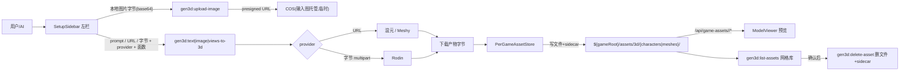

# 开发计划：Rodin + 本地上传/COS + per-game 存储重构 + UI 升级

> Status: 🟢 READY FOR EXECUTION（2026-06-11 定稿，待交接给执行 agent）
> Branch: `laurenceelu/feat-20260609-hunyuan3d-meshy-pipeline-card`（studio + marketplace 子模块同名）
> 来源: 2026-06-11 grill-with-docs 需求澄清；所有关键决策已与用户逐条确认。
> 本文件是这次新增工作的 SSOT 计划。原路线 `docs/MIGRATION_PLAN.md` 的 M0–M8 历史保留不删；本计划新增 M9–M12 并承接旧未完成项。

## 一句话现状

`wb-gen3d` 已完成 M0–M8 核心：混元 workflow + Meshy + 混元 REST(`pose-standardization`)，全局内容寻址资产库(`.forgeax/assets/gen3d/<assetId>/`)，three.js 预览，token 对齐的 staged sidebar UI。所有工具走 `POST /api/tools/call`(仅 JSON)。

## 已确认的关键决策（逐条与用户确认，执行时不要再改）

- 本地上传图片：插件内加腾讯 COS 适配器，从插件 `.env` 读 `COS_SECRET_ID/KEY/BUCKET/REGION`；上传工具回 24h 预签名 URL 给混元/Meshy，Rodin 直接用字节。
- Rodin：text/image/views 全接，`tier=Regular`、`quality_override` 控面数；进 UI 供应商选择器(mock 回退)，拿到 key 后实测转正。
- 生成参数：统一连续滑块 + 每家预设(Meshy 8k/30k/100k、混元 10k/40k/120k、Rodin 8k/18k/50k)，Rodin 映射 `quality_override`。
- **存储改为 per-game v2 文件契约（取代 ADR-0001 全局库）**：生成物以具名文件写到 `${gameRoot}/assets/3d/{characters|meshes}/<name>.glb` + `.meta.json` sidecar；新 manifest 身份字段为 `assetPath`（值是 game 内相对路径），丢弃随机 UUID + 内容寻址 blob；`cache→assetPath`；`list` 扫目录；`delete` 删文件+sidecar(无需引用计数)。
- 普通生成不自动覆盖同名文件：同一规范化请求命中 cache 时复用已有路径；不同请求撞名时自动加后缀（如 `name-2.glb`）；“同 prompt 再抽一版”后续作为显式变体生成/绕过 cache 动作，不混入普通生成。
- slug 来自 host 注入的 iframe URL query（`?slug=<gameSlug>`，当前代码已这样做）；host bridge/ctx 只作兼容增强。无 active game 时生成按钮置灰 + 空态提示。
- 资产槽位选择器：`assetSlot=characters`→`assets/3d/characters/`（UI 显示“角色”），`assetSlot=meshes`→`assets/3d/meshes/`（UI 显示“道具 / 物件”），默认 `characters`。
- 姿态标准化置顶：顺序 供应商 → 姿态标准化 → 输入方式 → 生成参数；保持可选；源图支持本地上传。
- 结果区：grid 开关 + 面数/顶点数/包围盒尺寸常显；「显示骨骼」仅当 GLB 含 SkinnedMesh 时可用，否则置灰。
- 提示文案指向「角色编辑器」(wb-character)。

## 架构数据流（目标态）

## 文档处理（保留原路线 + 新增）

- `docs/MIGRATION_PLAN.md`：**不重写**。在末尾追加 M9–M12；M7(Rodin)/M8(handoff) 状态更新；顶部 Status 行加一句"per-game 重构进行中(详见 ADR-0002)"。
- 新建 `docs/adr/0002-per-game-file-asset-storage.md`：记录"per-game 文件契约取代 ADR-0001 全局库"这一难以反转的反转决策(为何、代价、迁移)。
- `CONTEXT.md`：更新术语——Asset 由"随机 UUID + manifest"改为"`assetPath=assets/3d/...` + `.meta.json` sidecar"；存储模型节改写为 per-game；加 Rodin/上传术语。
- `docs/CAPABILITY_MATRIX.md`：Rodin 行从 hidden 升为 mock-first/planned，补 Hyper3D 端点与档位。
- `HANDOFF.md`：更新 Current State / Pending Work（本次已更新指向本计划）。

## 里程碑（承接旧 M0–M8）

### M9 — per-game 文件存储重构（基础，先做）

最关键、其它都依赖它。

- 新 `server/per-game-store.ts` 实现 `AssetStorage`(替代 `LocalBlobStore`)：把所有路径逻辑(写文件、sidecar、list、delete)封进适配器，便于以后改路径只动一处。
  - 写：`${projectRoot}/.forgeax/games/<slug>/assets/3d/{characters|meshes}/<name>.<ext>` + 同名 `.meta.json`(v2 sidecar：`producer/createdAt/contentHash/size/type/custom`，把现有 `Gen3DAssetManifest` 字段塞进 `custom`：provider/providerMode/mode/sourceJobId/faceCount/readiness 等)。
  - 命名：工具接受可选 `assetName`；未填时从 prompt/输入生成安全文件名。cache 命中返回既有路径；非 cache 撞名不覆盖，自动后缀化。
  - `localUrl` = `/api/game-assets/<slug>/3d/.../<name>.glb`。
- 改 `shared/manifest.ts`：资产标识从旧 `assetId`(UUID) 改为新 `assetPath`；`selectFile` 按文件后缀/角色解析(角色文件即主 GLB，预览即同名 `.png`)。下游 wb-3d-pipeline 尚未建，契约现在改最便宜(CONTEXT 已注明)。旧 `assetId` 只可作为读取旧全局库时的兼容字段，不作为新 manifest 必填。
- 改 `server/cache.ts` + `generate.ts`：`cacheKey → assetPath`(命中后读该路径的 sidecar 返回)。`sourceInputAssetIds` 同步改名为 `sourceInputAssetPaths`。
- 改 `server/tool-handlers.ts`：所有 mode 工具接受 `slug` + `assetSlot`(`characters`/`meshes`) + 可选 `assetName` 参数；`list-assets` 接受 `slug` + `assetSlot` 过滤；`list` 扫 per-game 目录读 sidecar。
- 新工具 `gen3d:delete-asset`(args: slug, path)：删 `.glb` + `.meta.json` + 预览；schema 标 `requireConfirm: "destructive"`(参照 `wb-3d-lowpoly` 的 `lowpoly:projects.remove`)。
- slug 注入：前端启动时先读 iframe URL query 的 `slug`（当前 host 已在 `StandalonePluginIframe` 拼入）；可兼容监听 host bridge/ctx 的 slug 更新，但不要把 `STUDIO_INIT` 作为唯一来源。`App.tsx` 持有 slug 并下传所有工具调用；无 slug → 生成置灰 + 空态。
- **服务端(插件外，需授权)**：`packages/server/src/main.ts` 加 per-game 静态路由 `/api/game-assets/:slug/*` → `.forgeax/games/<slug>/assets/3d/`。该路由只读、只允许安全 slug、只服务 `assets/3d/**` 下的展示文件（GLB/GLTF/bin/图片/JSON 等），不得成为 `.forgeax/games/<slug>/` 的通用文件服务；删除仍只走 `gen3d:delete-asset` 工具确认。旧 `/api/gen3d-blobs` 暂留兼容旧全局资产。
- 验证：mock 路径下生成→落到 `assets/3d/characters/`、sidecar 正确、cache 命中复用路径、list 扫出、delete 删净；typecheck + build。

### M10 — 本地图片上传 + COS（需求 #2）

- 新增依赖 `cos-nodejs-sdk-v5`。新 `server/cos-uploader.ts`：`COS_SECRET_ID/KEY/BUCKET/REGION` 来自 `server/env.ts`(扩展)；`upload(bytes, ext) → 24h presigned URL`。
- 新工具 `gen3d:upload-image`(args: base64 + mimetype)：后端解码→上 COS→回 `{ url, bytes }`(图 ≤8MB，base64 走现有 JSON tools 路由，不额外加 server route)。
- 前端输入改造(`SetupSidebar.tsx`)：image/views/pose 源图都从"贴 URL"改为"本地选图(file picker)→ 调 `upload-image` → 自动回填 URL"，保留可选手填 URL。Rodin 走字节直传(在 provider 层用 COS URL 下载回字节或直接缓存原字节)。
- prompt 文本框更显著：加大 textarea/自动增高 + 清晰标签 + 字数；位置不动。
- 提示文案：image/views 输入区显眼处加"可在『角色编辑器』生成三视图/立绘后导入"。
- 验证：选本地图→COS URL→混元/Meshy 能抓；Rodin 用字节；mock 回退不联网。

### M11 — Rodin provider（需求 #1，承接旧 M7）

- 新 `server/providers/rodin.ts`：`POST https://api.hyper3d.com/api/v2/rodin`(multipart, Bearer)；poll `/api/v2/status`(task uuid)；下载 `/api/v2/download`。text(prompt)/image(单图)/views(多图 `condition_mode=concat`)；`tier=Regular`、`material=PBR`、`quality_override`、`geometry_file_format=glb`。注入式 `fetchImpl/downloadImpl`(quota-safe 冒烟)。
- `server/env.ts` 加 `getRodinEnv()`：`RODIN_API_KEY`(+ `RODIN_BASE_URL` 默认 `https://api.hyper3d.com`)，受 `GEN3D_ENABLE_REAL_PROVIDERS` 总闸控制。
- provider enum 扩展：`shared/manifest.ts`/`catalog.ts`(CAPABILITIES 加 Rodin 行)、`src/types.ts`(`GenProvider` 加 `rodin`)、`src/ui-meta.ts`(label「Rodin」+ 图标)、`tool-handlers.ts`(`resolveProvider`/`runGeneration` 分支)。
- `forgeax-plugin.json`：tool 描述补 Rodin；不新增 tool(provider 是参数)。
- 验证：注入 fetch 冒烟(一次 submit、正确 multipart、poll→download)；拿 key 后实测一条转正(更新 CAPABILITY_MATRIX)。

### M12 — UI 升级（需求 #3/#4/#5/#6）

- 姿态标准化置顶(#3)：`SetupSidebar.tsx` 步骤重排 供应商 → 姿态标准化(可选) → 输入方式 → 生成参数；pose 源图支持本地上传(复用 M10)。
- 生成参数滑块(#4)：目标面数 number input 换连续 `range` 滑块 + 三档预设按钮(低/中/高)，预设值随 provider 变；Rodin 值映射到 `quality_override`。
- 结果区(#5)：`ModelViewer.tsx` 加 `GridHelper` 开关、模型信息(遍历 geometry 累加面数/顶点数 + `Box3` 包围盒尺寸)、`SkeletonHelper`「显示骨骼」开关(仅 `SkinnedMesh` 存在时可用)。`Workspace.tsx` 结果卡精简，去冗余。
- 资产库(#6)：`AssetLibrary.tsx` 从大按钮列表改为密集缩略图网格(CSS grid，缩略图=预览 PNG，附 provider/类型/面数等简介)，每项加删除按钮 → 弹确认 → 调 `gen3d:delete-asset`(删本地文件+sidecar)→ 刷新。

## 保留的未完成项（来自旧路线，继续挂着）

- M5 `motion_retarget` v1：deferred(需 wb-3d-pipeline 产出的已绑骨 humanoid FBX)。
- M8 质量评分 UI(五维 rubric 运行时评分器)：reserved 占位，未实装。
- M8 gen3d→game handoff：**本次 M9 per-game 文件模型已原生承接**(生成直接落 `assets/3d/`)，旧 handoff 项可在文档标记"由 M9 取代"。
- 下游绑骨/动画 handoff 元数据：reserved。
- `auto_rigging` / `motion_retarget_v2`：blocked，保持不暴露。
- GLB/OBJ 同 `source_mesh` 去重：旧决策待定——per-game 文件模型下改为"角色优先存 GLB，OBJ 可选"，在 M9 顺带敲定。

## 触及插件外 / 需注意

- `packages/server/src/main.ts`：新增 `/api/game-assets/:slug/*` 静态路由(有先例：现有 `/api/gen3d-blobs` 与 `/plugins/wb-gen3d` 两块都在此处，曾获授权)。这是唯一插件外改动，开工前请确认授权；实现必须是只读预览 route，限定在 `.forgeax/games/<slug>/assets/3d/**`，不能暴露整个 game 目录。
- 新依赖：`cos-nodejs-sdk-v5`(COS)；`three` 已有(grid/skeleton/info 无需新依赖)；Rodin multipart 用 Bun 内置 `FormData/Blob`，无需依赖。
- 密钥：`COS_*` 与 `RODIN_API_KEY` 只进插件本地 `.env`(gitignored)，不进源码/schema/文档；`.env.example` 只加变量名。
- 契约反转：M9 改 `Gen3DAssetManifest`/资产标识属于难反转决策 → 写 ADR-0002；因下游 wb-3d-pipeline 未建，现在改成本最低。

## 验证策略（每个里程碑）

- 每步 `npm run typecheck && npm run build`(插件目录)。
- M9：mock 全链路(生成→per-game 文件→list→delete)；slug 缺失置灰；cache 命中复用路径；不同请求同名自动后缀且不覆盖。
- M10/M11：注入 fetch 的 quota-safe 冒烟(不联网)；拿 key 后操作员授权下实测各一条。
- 视觉：standalone(`npm run dev` :15175) + 嵌入 Studio 左/中栏三处核对。

## 执行任务清单（交接给执行 agent）

- [ ] **M9-store**：新建 `server/per-game-store.ts`(AssetStorage 文件+sidecar 实现)，改 `shared/manifest.ts` 新身份字段为 `assetPath`、`cache.ts`/`generate.ts` 改 cacheKey→assetPath；加 `assetName` 安全命名、cache 复用、撞名后缀不覆盖规则
- [ ] **M9-tools-slug**：`tool-handlers` 接受 slug+assetSlot；新增 `gen3d:delete-asset`(requireConfirm destructive)；前端从 iframe URL query 读取 slug（bridge/ctx 兼容增强）+ 无 game 置灰空态
- [ ] **M9-server-route**：`packages/server/src/main.ts` 加 `/api/game-assets/:slug/*` 静态路由(需授权)
- [ ] **M10-cos**：加 `cos-nodejs-sdk-v5` + `server/cos-uploader.ts` + env 扩展；新工具 `gen3d:upload-image`(base64→COS presigned URL)
- [ ] **M10-input-ui**：`SetupSidebar` image/views/pose 源图改本地上传(file picker→upload→回填)；prompt 文本框加大显著；加『角色编辑器』提示
- [ ] **M11-rodin**：`server/providers/rodin.ts`(multipart submit/status/download) + `env.getRodinEnv` + provider enum 扩展(types/ui-meta/catalog/tool-handlers) + UI 选择器
- [ ] **M12-pose-params**：`SetupSidebar` 步骤重排(供应商→姿态→输入→参数)；目标面数换滑块+每家预设(Rodin→quality_override)
- [ ] **M12-result-lib**：`ModelViewer` 加 grid/骨骼/面数顶点尺寸；`AssetLibrary` 改密集缩略图网格 + 删除(确认弹窗→gen3d:delete-asset)
- [ ] **docs**：追加 `MIGRATION_PLAN` M9–M12(保留旧 M0–M8)；新建 ADR-0002(per-game 取代 ADR-0001)；更新 CONTEXT/CAPABILITY_MATRIX/HANDOFF
