# PLAN 2026-06-23 — 2D 角色 → 3D 角色：turnaround 联动 gen3d · CLI 自主端到端

> **状态**: PLAN · 2026-06-23 Asia/Hong_Kong · **已过 grill review，决策落 [ADR-0008](./adr/0008-cli-agentic-character-pipeline.md)；T1/T2/T3 已编码+提交（见下方进度更新），剩 T0/T4**
> **Owner**: laurenceelu
> **分支**: `laurenceelu/feat-20260622-character-gen3d-link`（studio + marketplace + server **三仓同名**，均未合 main）
> **关联**:
> - [ADR-0008](./adr/0008-cli-agentic-character-pipeline.md)（**本计划的决策记录**：Forge 直接编排 · views-to-3d 内部转存 · 按来源分流 · 动作 opt-in + 余额护栏）
> - [PLAN-2026-06-22](./PLAN-2026-06-22-gen3d-character-agent.md)（agent-gen3d 静态优先收敛 —— 本文是它的**上游接入**）
> - [ADR-0005](./adr/0005-agentification-spine-v2-parallel.md)（agent 化 + host-tools 桥）· [ADR-0006](./adr/0006-meshy-public-api-rig-anim-for-beta.md)（Meshy 绑骨/动画 + `getBalance` 原语）
> - Forge 派单表：`packages/marketplace/src/system-prompt/80-workbench-agents.md`
>
> **进度更新 2026-06-23（编码会话）**：**T3 余额护栏 `f96137c` · T1 views-to-3d 内部转存 `ed20070` · T2 派单表 2D→3D 配方 `3fb5a34`** 均已实现 + 提交本分支（marketplace 仓；ADR-0008/本 PLAN = `5419d7b`）。**T0 HTTP 探针 PASS**（`scripts/t0-host-tools-probe.mjs`：Forge whitelist 含 `gen3d:list-assets`/`character:list`/`generate-turnaround`/`views-to-3d`，零配额 call 回结果）。验证：wb-gen3d 全量 **67/67**、`tsc --noEmit` 干净、manifest **57/57**（均零网络）。**剩 T4**（UI handoff 目视 + 真 key 静态 2D→3D + opt-in motion 护栏真机；mock 链路单测已覆盖）。**工作区未提交**：T1 lazy transfer（仅在 real-provider cache miss 时转存，mock/缓存 hit 零 fetch）——见 `tool-handlers.ts` diff。下方 §2/§5 标「未做/未接」的 T1/T2/T3 行以本条为准。

---

## 0 · 给 reviewer 的一句话

把「2D 角色 → 3D 角色」打通成两条路径：

1. **UI handoff（人工驱动）**：wb-character 出角色四视图 → 切到 wb-gen3d 预填 → 出 3D。**胶水层已提交并 pin**（wb-character `8f99d6a`+`a32763d`，marketplace pointer `df47ca3`）；缺的是**端到端跑通留证**。
2. **CLI 自主（agent 驱动）**：**Forge 一条链**直接 `character:generate-turnaround` → `gen3d:views-to-3d` 出 3D（不经两 agent 交接，见 ADR-0008 D-A）。**编排尚缺。**

本文承接 grill review 的结论（ADR-0008 D-A~D-E），列现状证据（反失真）、修订任务清单（T0–T5）、验证清单。

**review 最该盯三件事**：(1) T0 探针闸是否先于编码（ADR-0008 D-C）；(2) 烧钱敞口在 T3 落地前仍开（§6）；(3) §2 证据按 file:line / commit 抽查——**别信旧文档**。

---

## 1 · 已确认决策（详见 ADR-0008，勿 re-litigate）

| # | 决策 | 内容 | 来源 |
|---|---|---|---|
| **D1 路线** | 两步走 | 先验证 UI handoff（地基已提交）→ 再上 CLI 自主端到端。 | owner |
| **D-A CLI 架构** | **Forge 直接编排**（修订原 D2） | Forge 已双持 `character:*`+`gen3d:*`（`marketplace/manifest.json:50`），自己顺序调两工具；**不**用 `delegate_to_subagent` 在专员间穿线四视图。D2 重释：专员守单域、编排者可双持跨域。 | ADR-0008 D-A |
| **D-B 转存** | views-to-3d 内部转存 | `gen3d:views-to-3d` handler 收到 studio-local URL 时服务器端 fetch→COS→喂 provider；无需改 schema；`upload-image` 保持 UI-only。 | ADR-0008 D-B |
| **D-C de-risk** | T0 探针硬闸 | 编码前先验 Forge 在 claude-code 下经 `forgeax-tools` MCP 真能调 `gen3d:list-assets`/`character:list`。 | ADR-0008 D-C |
| **D-D 分流** | 按来源 | 有 2D 图/参考/「这个角色」→ 两步；纯文字 → `gen3d:text-to-3d`。 | ADR-0008 D-D |
| **D-E 动作** | opt-in + 余额护栏 | 保留 rig/motion `exposedToAI:true`；默认静态、动作仅用户显式触发；付费前 handler 级 `getBalance` 预检。 | ADR-0008 D-E |

---

## 2 · 现状与完成度（带证据 · 反失真）

> 失真提醒：① 旧 `HANDOFF.md`/`PLAN-2026-06-22` 顶部分支/「待执行」标注已过时。② 计划早期写的「胶水层未提交/389 行待提交」**已失真——胶水层已提交并 pin**。③ **Grep/Glob 不下钻 `wb-gen3d`/`wb-character` 嵌套子模块**，子模块内检索须用 `git -C`/shell `rg`/直接 Read。**以本节代码证据为准。**

| 环节 | 状态 | 证据（file:line / commit） |
|---|---|---|
| 后端出图 `forge.generateTurnaround` | DONE（server 已 commit） | server `fa1b555`；`wb-character/server/tool-handlers.ts:51` 跨仓 import，`:172` 调用 |
| turnaround handler 接通 | **DONE（已提交）** | wb-character `8f99d6a feat(character): wire generate-turnaround for wb-gen3d views-to-3d` |
| turnaround schema 3D-ready | **DONE（已提交）** | `schemas/generate-turnaround.{args,returns}.json`（per-view `{path,url}` + costEstimate），随 `8f99d6a` |
| client 联动 API | **DONE（已提交）** | `src/lib/api-client.ts:181` `generateTurnaround3D` · `:196` `uploadImageForGen3D` · `:221` `navigateToGen3D`，随 `8f99d6a` |
| wb-character UI 入口 + dist | **DONE（已提交）** | `src/shared/CharacterDesign.ts` 生成/转 COS/导航；dist 重建 `a32763d`；URL 交接（非 base64 进 localStorage）`62b4f1b` |
| wb-gen3d 接收 handoff + key 映射 | DONE（已 commit） | `wb-gen3d/src/components/SetupSidebar.tsx:74` `applyHandoff`，`:163` `front`→`front_image_url`；marketplace `5ea0b09` |
| marketplace pin wb-character | **DONE** | marketplace `df47ca3 chore(wb-character): bump pin — turnaround tool feeds wb-gen3d views-to-3d` |
| **UI handoff 端到端验证** | **未做** | 无 Studio 跑通留证（= T1） |
| **CLI Forge 直接编排** | **未做** | 派单表 `80-workbench-agents.md:28/32` 仅单点路由，无 Forge 两步配方（= T2） |
| **views-to-3d 内部转存** | **未做** | `views-to-3d` 现只收 public URL，未处理 studio-local URL 转存（= T1 代码项） |
| `gen3d:upload-image` | **保持 UI-only** | `forgeax-plugin.json` `exposedToAI:false`（设计如此，D-B 不动） |
| **rig/motion 余额护栏** | **未接** | `meshy.getBalance()` 存在（`server/providers/meshy.ts:282`）但**未接进** auto-rig/apply-motion handler；`confirm`/`requireConfirm` 全仓无消费（= T3） |
| agent persona 交接描述 | 技术债 | `agent-character-designer-2d` 缺 `provides.agent.tools` + persona 漂移（"三视图/不碰 3D"）；方案 A 下不阻塞（= T5） |

契约对接（UI 路径已核实无 GAP）：turnaround 产出 `front/back/left/right`；`views-to-3d` 要 `front_image_url/...`。**CLI 路径** Forge 直接把 turnaround 的 `url` 传进 `views-to-3d`，由其内部转存（D-B）。

---

## 3 · 数据流（目标）

```mermaid
flowchart TD
  subgraph uiPath [UI handoff - 人工驱动 - 胶水已提交,待验证]
    u1[wb-character 用户] --> u2["character:generate-turnaround 出四视图"]
    u2 --> u3["存盘 + uploadImageForGen3D 转 COS URL"]
    u3 --> u4["navigateToGen3D postMessage → host 写 localStorage"]
    u4 --> u5["wb-gen3d SetupSidebar applyHandoff 读 localStorage 预填四视图"]
    u5 --> u6["用户点生成 → views-to-3d"]
    u6 --> u7[3D 角色资产]
  end
  subgraph cliPath [CLI 自主 - Forge 一条链直接编排 - D-A]
    c1["用户对 Forge: 把这个 2D 角色做成 3D"] --> c2["Forge 调 character:generate-turnaround 出四视图 (path/url)"]
    c2 --> c3["Forge 调 gen3d:views-to-3d 传四视图 url"]
    c3 --> c4["views-to-3d handler: studio-local url 服务器端 fetch→COS→喂 provider (D-B)"]
    c4 --> c5[3D 角色资产]
    c5 -. "用户显式要会动 (D-E)" .-> c6["auto-rig → list-motions → apply-motion (getBalance 预检)"]
  end
```

---

## 4 · 第一步：验证 UI handoff（地基已提交）

| # | 任务 | 闸门 / 说明 | 文件 |
|---|---|---|---|
| **T1.1** | 只读复核完整度 | `SetupSidebar.applyHandoff` 把 back/left/right 也填进 state（非只 front）；`CharacterDesign` 联动段生成→转 COS→导航闭环；`!isNpc` 边界。 | 上述相关文件 |
| **T1.2** | Studio 端到端跑通留证 | `bash start.sh` → 生成四视图 →「送去生成 3D 模型」→ wb-gen3d 预填 → 出 3D（无 key 走 mock 验链路；有 key 验质量）。 | — |
| **T1.3** | 如有缺口最小补 + rebuild dist | 改了 `src/**` 按铁律 `bun run build`；提交 + bump pointer。**胶水主体已提交，预期只补边角。** | wb-character（必要时 wb-gen3d） |

---

## 5 · 修订任务清单（按依赖排序 · 替换原 T2.x）

| # | 任务 | 落点 / 授权 | 闸门 |
|---|---|---|---|
| **T0** | **探针硬闸**：起 Studio + claude-code，让 Forge 调零配额 `gen3d:list-assets` / `character:list`，确认两套 host 工具经 `forgeax-tools` MCP 可见+能回结果。不通→先修 MCP 注入。 | 无代码（验证） | **D-A/D-B 的前置；不过不开工** |
| **T1** | `views-to-3d` handler：输入 `*_image_url` 若是 studio-local（相对路径或本机 host），服务器端 fetch→COS 转存→再喂 provider（= D-B 最小落地，**无需改 schema**）。注入式 mock 测试（零网络）。 | wb-gen3d（插件内，已授权） | 单测绿 + mock 链路通 |
| **T2** | 教 Forge 配方：识别「把（已有/这个）2D 角色做成 3D」→ 自跑 `generate-turnaround`→`views-to-3d`；纯文字→`text-to-3d`；要会动→再 `auto-rig`→`list-motions`→`apply-motion`（烧钱先确认）。 | `marketplace/src/system-prompt/80-workbench-agents.md`（**非插件目录 → 需 owner 授权**） | 派单表更新 + 校验 |
| **T3** | **余额护栏**：auto-rig/apply-motion handler 付费前调 `meshy.getBalance()`，不足则拒绝+报价。（`confirm`/`requireConfirm` 全仓无消费，不依赖。）描述已修正一致。 | wb-gen3d（插件内） | 单测覆盖余额不足拒绝 |
| **T4** | 端到端验证：mock 验链路 → 真 key 验一次静态 2D→3D → 一次 opt-in motion（验护栏 getBalance + 拒绝路径）。 | 验证 | 留证 |
| **T5** | 技术债（不阻塞本线）：`agent-character-designer-2d` 缺 `provides.agent.tools` + persona 漂移。方案 A 下不在链路；按需修 persona 文案。 | agent 插件 | 记录即可 |

> **顺序**：T0 →（T1 ∥ T3）→ T2 → T4。**T3 必须先于真实 provider 对外暴露**（见 §6 烧钱敞口）。

---

## 6 · Land 准备 + 改动边界 + 烧钱敞口

- **改动边界（reviewer 把关）**：本线落在 wb-gen3d（`forgeax-plugin.json` + `views-to-3d`/rig/motion handler）+ **`marketplace/src/system-prompt/80-workbench-agents.md`（公共派单表，非插件目录 → 需 owner 授权）** + wb-character（仅 T1.3 边角，主体已提交）。server `character-forge` 已 commit，本线不改。
- **Land 拓扑**：studio →（server, interface, marketplace），且 **marketplace → wb-character / wb-gen3d 为嵌套子模块**。多数已提交/pin；剩 wb-gen3d（T1/T3）+ 派单表（T2）+ pointer bump。
- **🔴 烧钱敞口（唯一"现在就在漏"的坑）**：`auto-rig`/`apply-motion` 已 `exposedToAI:true` 且 **T3 余额护栏未接** → Forge 误调即可能扣 Meshy credits。**T3 落地前若需对外/真 key，临时把这两个工具 `exposedToAI:false` 止血**（list-motions 零配额可留）。描述已修正去除 `exposedToAI=false` 假声明。
- **LuZhouheng claude 启动超时 8000ms 本地补丁**（server `327a5b2`）按 workspace 规则**不 push 上游**，land 时拣出。

---

## 7 · 开放问题（已拍板，存档）

| # | 问题 | 结论 |
|---|---|---|
| **Q1** | 所有「3D 角色」都两步吗？ | **D-D 按来源分流**：有图/参考→两步；纯文字→`text-to-3d`。 |
| **Q2** | CLI 怎么把 studio-local 四视图转 public？ | **D-B**：`views-to-3d` 内部转存，`upload-image` 保持 UI-only。 |
| **Q3** | 四视图怎么从 2D 段交到 3D 段？ | **D-A**：Forge 一条链自持两工具，无 agent 间穿线。 |
| **Q4** | rig/motion 烧钱怎么管？ | **D-E**：opt-in + handler `getBalance` 预检（T3）；`confirm` 字段无消费，不依赖。 |

---

## 8 · 怎么验证 / review 清单

**自动校验**：`cd packages/types && bun test/validate-manifests.ts`（改 manifest 后应全绿）。

**reviewer 核对清单**：
- [x] **T0 探针先过**（ADR-0008 D-C）— `node scripts/t0-host-tools-probe.mjs` PASS 2026-06-23（HTTP 层 = forgeax-tools MCP 同源 dispatch）。
- [ ] §2 证据与代码一致（抽查 wb-character `8f99d6a`/`a32763d`、marketplace `df47ca3`、`meshy.ts:282`、`80-workbench-agents.md`）。
- [ ] §6 烧钱敞口：T3 落地前的暴露策略（临时回滚 flag vs 加速 T3）。
- [ ] §6 改动边界：`80-workbench-agents.md`（非插件目录）改动是否授权。
- [ ] T1（views-to-3d 内部转存）单测覆盖 studio-local→COS 路径，零真实网络。

---

## 9 · 明确不在本范围（以后单独立项）

- 引擎端到端加载 gen3d 角色并 ▶Play（跨插件边界，ADR-0005 A5）。
- wb-character 其它待开发管线（`video-char` 等）。
- 混元 `motion_retarget_v2` 48 动作库（B 线）。
- 把 `confirm`/`requireConfirm` 接成真实消费（v2-vision `07-INTERFACE-EXPOSURE`）。
- P4 AI 视觉评分（需 server 多模态授权）。
