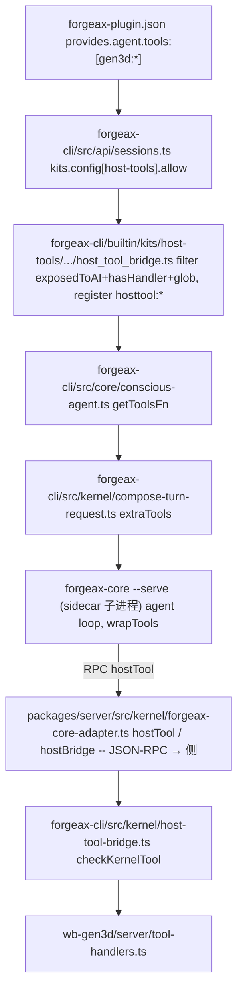

# PLAN 2026-06-25 — 迁移 2D→3D CLI 线到 forgeax-core 新架构

> **状态**: PLAN · 2026-06-25 Asia/Hong_Kong · **分析完成,迁移未执行(本轮只落档)**
> **修订记录**:2026-06-25 v2 — 经 reviewer 审计,纠正两处架构事实:
>   - ~~`packages/core` = `@forgeax/forgeax-core` vendored 包~~ → forgeax-core 是 sidecar 子进程(见 §2)
>   - ~~`packages/agent-host` vendored 包~~ → workspace 依赖,由 cli 子模块解析
>   PLAN 中所有文件引用和流程图已同步修正。
> **Owner**: laurenceelu
> **分支**: `laurenceelu/feat-20260622-character-gen3d-link`（studio + marketplace + server 三仓同名,**均未合 main**）
> **关联**:
> - [ADR-0008](./adr/0008-cli-agentic-character-pipeline.md)（Forge 直接编排 · views-to-3d 内部转存 · 动作 opt-in + 余额护栏）
> - [PLAN-2026-06-23](./PLAN-2026-06-23-character-to-gen3d-cli.md)（T0–T3 编码 SSOT,**本文是它的迁移续篇**）

---

## 0 · 给 reviewer 的一句话

`evolve/extract-orchestration` 已合三仓 main,server 瘦成产品壳、编排能力迁进 `forgeax-cli`(`packages/cli`) + sidecar `forgeax-core` 子进程 + `agent-host` IPC 层。本线 T0–T3 代码全在 feature 分支、**从未合 main**,且分支落后 main 很多。本文记录:**新架构下工具注入链怎么走(A)、本线 20 个提交怎么迁(B)、真正的阻塞是什么、分批 roadmap**。

**最该记住三件事**:(1) host-tools 桥**没被删**,迁到了 forgeax-cli,注入机制存活;(2) 真正的硬阻塞是 wb-character 那条跨仓 `character-forge` import 在新 server 上断了;(3) server 侧 7 个提交里 6 个目标文件已删,必须重写。

## 1 · 现状:分叉与未合

- 远端自 2026-06-23 起**无新提交**(三仓 main tip 未变)。
- feature 分支落后 `origin/main`:studio **183** / marketplace **28** / server **43**;领先 9 / 13 / 7。
- 三仓改动**均未合 main**;T0–T3 编码 + 测试在分支上完整,**T4 端到端从未签字**。

## 2 · 架构变动(已在 main · `evolve/extract-orchestration` 已合)

**核心模型**:forgeax-core 不是一个被 import 的 npm 包，而是一个**sidecar 子进程**(`forgeax-core --serve`)，经 agent-host IPC 层 spawn 并双向 JSON-RPC 通信。旧三件套「server + cli-provider + session」变为四层：

| 层 | 路径(相对 studio 根) | 形态 | 职责 |
|---|---|---|---|
| 产品壳 | `packages/server/src/main.ts` | HTTP 薄壳 | env 加载、fault boundary、路由代理、`forgeax-core-adapter.ts` 注册 |
| 编排层 | `packages/cli`(submodule) | workspace dep `forgeax-cli` | session 管理、kits(含 host-tools)、commands、sidecar 生命周期(`forgeax-cli/kernel/sidecar-singleton`) |
| sidecar 内核 | forgeax-core 二进制 | 独立进程(per-session 复用) | agent loop / events / history / capability / provider / compaction / AgentKernel 契约 |
| IPC 层 | (通过 `forgeax-cli` 依赖: `@forgeax/agent-host` | workspace dep | JSON-RPC 连接、子进程 spawn/reap、Sandbox、cred-vault |

存在目录的 workspace 包:
- `packages/agent-runtime` ✅ —— 运行时契约/类型
- `packages/host-sdk` ✅ —— iframe postMessage RPC SDK

**不在磁盘但声明为 deps 的 workspace 包**:`@forgeax/forgeax-core` 和 `@forgeax/agent-host` —— 由 `forgeax-cli` 子模块内部 workspace 解析或构建时提供。迁移分支首次启动需确认 bun install 能顺利 resolve。

- server 瘦壳:`src/` 只剩 `kernel/`(两个 adapter: `forgeax-core-adapter.ts` + `telemetry-file-sink.ts`)+ `main.ts`(HTTP 薄壳);`builtin/**`、`src/cli-providers/**`、`src/agents/**`、`src/lib/**`、`src/tools/**` 全删。
- `forgeax-cli`(`packages/cli` submodule)接手 agent 运行时 + kits(含 host-tools kit:`builtin/kits/host-tools/plugins/host_tool_bridge.ts`)。

## 3 · 纠正 6/23 的一处误判

6/23 分析曾判"host-tools 桥被删 → 分支注入失效"。**错。** 桥迁进了 forgeax-cli:`packages/cli/builtin/kits/host-tools/plugins/host_tool_bridge.ts`(~210 行,逻辑近乎原样)+ `packages/cli/src/kernel/host-tool-bridge.ts`(`makeInProcessExecuteTool` + 新增 `checkKernelTool` 信任闸)。**注入机制存活**,`agent-gen3d` 的 `gen3d:*` 在新架构仍走得通。

## A · 新架构工具注入链(old → new,带 file:line)

已核实锚点(origin/main):
- `packages/cli/builtin/kits/host-tools/plugins/host_tool_bridge.ts`(存在;`kits.config['host-tools'].allow` 是注入开关;`delegate_to_subagent.ts:135` 也按 `persona.tools` 写 allow)。
- forgeax-core 作为 sidecar 子进程(`forgeax-cli/kernel/sidecar-singleton.ts` spawn),adapter 经 agent-host IPC 发送 `runTurn` 和 `hostTool` 请求。
- `packages/server/src/kernel/forgeax-core-adapter.ts` 文档注明 hostTool 复跑 `checkKernelTool` 后在宿主执行。

旧 `host_tool_bridge.ts`(server,218 行,已删)→ 后继 = forgeax-cli 同名 kit。四环节(工具发现 / `exposedToAI` 过滤 / `allow` glob 匹配 / 注册为 agent 可见)逻辑相同,新增 serve RPC 往返 + trust-gate。**结论**:旧分支"靠 server/builtin host-tools 桥"的认知改成"靠 forgeax-cli host-tools kit"即可,行为等价。

## 关键阻塞(2 真 + 1 GAP + 文档矛盾)

- **阻塞1(硬)**:`wb-character/server/tool-handlers.ts:51` 仍 `import * as forge from '../../../../server/src/lib/character-forge/index'`,而 server origin/main 的 `src/` 只剩 `kernel/` + `main.ts`(`src/lib/character-forge/` **已删**)。该 import 在新架构**必炸**,而 `character:generate-turnaround` 正是整条 2D→3D 的入口。真解:把 `character-forge` 业务 lib **内聚进 wb-character 插件自身**,消除这条跨子模块 reach-around。
- **阻塞2(GAP)**:`agent-character-designer-2d` 未声明 `provides.agent.tools:["character:*"]` → AI 对话拿不到 character 工具。但 ADR-0008 D-A 选的是 **Forge 一条链直接编排**(Forge 双持 `character:*`+`gen3d:*`),CLI 路径可绕过此 GAP;仅"专员 agent 独立出图"受影响。
- **文档矛盾(已在本轮 HANDOFF 修)**:HANDOFF 顶部曾写 `cli_arch=两 agent 交接`,与 ADR-0008 D-A(Forge 直接编排)矛盾;"工作区未提交 lazy transfer"也已失真(`08c029a` 已提交)。

## B · 20 个提交迁移分类(基于真实 git log · origin/main=server `29532df`)

**口径**:`CHERRY-PICK`=插件本地、可直接捡;`REWRITE`=目标文件已删/重构、需重写到新落点;`DOC`=纯文档;`PIN`=子模块指针 bump,**须在阻塞1修完后重 pin**;`DROP`=本地分叉补丁,不带回 main。

### B-1 · marketplace(13)= 7 CHERRY-PICK + 4 DOC + 2 PIN —— 几乎全插件本地,易迁

| commit | 摘要 | 类 | 依据 / 风险 |
|---|---|---|---|
| `06d6780` | agent-gen3d persona + 评分/命名 exposedToAI | CHERRY-PICK | persona+manifest 插件本地,无 server 依赖 |
| `5ea0b09` | Forge tools 白名单 + gen3d rig/motion exposedToAI + 跨工作台交接 | CHERRY-PICK ⚠ | manifest/dispatch md 本地;**核** 白名单未触 server/builtin |
| `45d27ed` | Forge 派单表 + 消歧补 gen3d | CHERRY-PICK | `80-workbench-agents.md` 本地 |
| `f96137c` | T3 Meshy 余额预检护栏 | CHERRY-PICK | `wb-gen3d/server/tool-handlers.ts` 本地 |
| `ed20070` | T1 views-to-3d 内部 COS 转存 | CHERRY-PICK | wb-gen3d 本地;**依赖阻塞1**(消费 turnaround 视图) |
| `3fb5a34` | Forge 2D→3D 跨域配方写进派单表 | CHERRY-PICK | dispatch md 本地 |
| `08c029a` | T1 lazy transfer + T0 probe 脚本 | CHERRY-PICK | wb-gen3d 本地 + scripts |
| `6deb131` | agent-gen3d AGENT.md | DOC | 纯文档 |
| `59580e8` | character→gen3d plan + HANDOFF | DOC | 已被 `5419d7b`/本 PLAN 取代 |
| `5419d7b` | ADR-0008 + PLAN-06-23 | DOC | 规范源头,保留 |
| `4cd895a` | 标记 T1/T2/T3 landed | DOC | 文档 |
| `df47ca3` | wb-character pin → turnaround 喂 views-to-3d | PIN | **阻塞1修完后重 pin**(当前 pin 含坏 import) |
| `2580383` | wb-character pin → CLI projectRoot + iframe slug | PIN | 同上,重 pin |

### B-2 · server(7)= 5 REWRITE + 2 DROP —— 目标多已删,须重写或弃

| commit | 摘要 | 类 | 依据 / 落点 |
|---|---|---|---|
| `fa1b555` | host-tools 桥接 legacy agent tools + Forge MCP allow-list + character turnaround pipeline | **REWRITE ★** | 原目标 server/builtin host-tools **已删**→ 重写进 `packages/cli` host-tools kit + character 处理;**全线最大块** |
| `5204921` | `/api/gen3d-scratch` 路由 | REWRITE(小) | 姊妹路由 `gen3d-blobs`/`game-assets` 已在 main(`main.ts` 701 行壳),**唯独 gen3d-scratch 缺**→ 把路由块重贴进新 main.ts(import 已改走 `forgeax-cli/api`) |
| `ba11e1c` | ToolRegistry 注 projectRoot + anthropic chat fallback | REWRITE/部分DROP | ToolRegistry 迁进 forgeax-cli;projectRoot 注入改由 adapter/cli;anthropic fallback 多半作废 |
| `ac647d2` | 关 ToolSearch(proxy 兼容) | REWRITE-upstream | cli 关注点;**先核** forgeax-cli main 是否已修,否则补在 cli 子模块 |
| `f06ea27` | 延长 forgeax-tools MCP 超时 | REWRITE-upstream | 同上,cli 子模块 |
| `e3b30c8` | (06-01) cli-bridge 合并 thinking 流 | DROP | 既存本地分叉;server cli-bridge 已删,上游 forgeax-cli 另有实现 |
| `327a5b2` | (06-01) claude.exe 启动超时 8000ms + kimi 模型 | DROP(留本地) | **工作区铁律**:本地补丁不 push 上游;永不并 main |

**一句话**:marketplace 侧 9 个 feat/pin 几乎零成本迁;真正的工程量在 **server 的 `fa1b555` 重写**(host-tools→forgeax-cli kit)+ **阻塞1**(wb-character 内聚 character-forge)。

<!--NEXT-->

