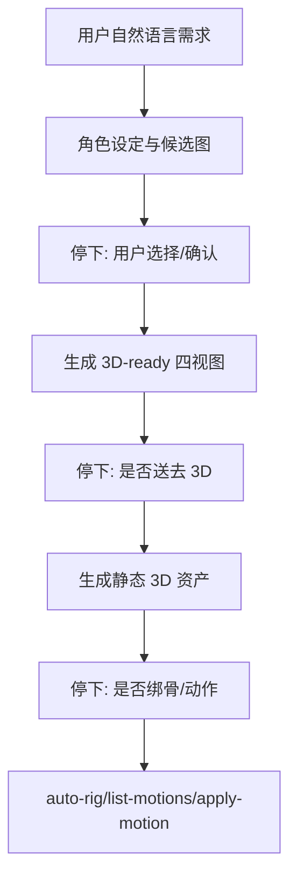

# PLAN 2026-06-25 — 2D→3D 角色生成分阶段体验修复

> **状态**: REVIEW PLAN · 2026-06-25 Asia/Hong_Kong · 未实现 — v3 已审计  
> **v3 修订（2026-06-25 · reviewer）**: 实现前代码审计完成，见 §7。原文被推翻处已就地标 ⚠ v3；**Batch 2 → Go，Batch 1 → 在 B1/B2 验证前 No-Go**。  
> **Owner**: laurenceelu  
> **分支**: `laurenceelu/feat-20260625-migrate-gen3d-to-forgeax-core`（studio / marketplace / wb-character / wb-gen3d 同名）  
> **Review handoff**: [`HANDOFF-2026-06-25-staged-character-gen3d-review.md`](./HANDOFF-2026-06-25-staged-character-gen3d-review.md)  
> **关联**: [`PLAN-2026-06-23-character-to-gen3d-cli.md`](./PLAN-2026-06-23-character-to-gen3d-cli.md), [`PLAN-2026-06-25-migrate-to-forgeax-core.md`](./PLAN-2026-06-25-migrate-to-forgeax-core.md)

---

## 0 · Reviewer 一句话

当前 2D→3D CLI 链路已经能调 `character:generate-turnaround` → `gen3d:views-to-3d` → `auto-rig/apply-motion`，但体验错误：它绕过 `wb-character` 的候选图/选择流程，且会一口气跑到绑骨和动画。本文计划把流程改为 **2D 设定/选择 → 四视图 → 静态 3D → 可选动作** 四个阶段，每个跨阶段动作都必须停下让用户确认；同时补齐 `wb-character` 里缺失的“生成 3D 四视图 / 送去 3D”按钮。

## 1 · 当前问题

用户实测 CLI 自然语言触发 2D→3D 时出现三类问题：

1. **没有先走角色设定/候选选择**  
   CLI 拿到的是后端 tool，而不是 `wb-character` 前端“生成 4 张概念图 → 用户选择 → 生成完整设定图”的状态机。

2. **`wb-character` UI 没有 3D 四视图入口**  
   当前 `wb-gen3d` 已有 handoff 接收逻辑，但 `wb-character/src` 没有 `generateTurnaround3D` / `navigateToGen3D` 这类发送入口；final phase 只提供回概念图、重生成、局部编辑、生成动画。

3. **没有真实阶段确认**  
   system prompt 写了“默认静态、动作 opt-in”，但模型仍可连续调用 `views-to-3d`、`auto-rig`、`apply-motion`。`requireConfirm` 机制存在，但 `ConfirmDialog` 前端仍用 `confirmId`，后端使用 `token`，导致弹窗链路断开。

   > ⚠ **v3 修正**：实际有**两个**确认 UI——TopBar 的 toast（`useConfirmToast` / `ConfirmToastList`，读/发 `token`）**今天已能弹**；断的只是 modal `ConfirmDialog`。所以"链路断开"不成立。只修 modal 而不退役 toast 会**双弹**；`confirmMessage`（"约 5 credits"）也只有 modal 渲染、toast 不显示。详见 §7-B1。

## 2 · 目标体验



成功标准：

- CLI “生成一个角色”只到 2D 角色设定阶段并停下，不自动进 3D。
- CLI “把这个角色做成 3D”先生成或确认 2D 角色，再生成四视图并停下。
- `gen3d:views-to-3d` 完成后默认只交付静态 3D 资产。
- 只有用户明确要求“会动 / 走 / 跑 / 挥手”等动作时，才进入 rig/motion。
- `auto-rig` / `apply-motion` 触发真实 `ConfirmDialog`，用户拒绝或超时则不执行。
- `wb-character` final phase 有用户可见的“生成 3D 四视图”和“送去 3D 生成”入口。

## 3 · 改动范围

### A. `wb-character` UI: 补四视图按钮和 handoff

落点：

- `packages/marketplace/plugins/wb-character/src/shared/CharacterDesign.ts`
- `packages/marketplace/plugins/wb-character/src/lib/api-client.ts`
- `packages/marketplace/plugins/wb-character/schemas/generate-turnaround.returns.json`

当前 final phase 只有动画入口：

```1696:1736:packages/marketplace/plugins/wb-character/src/shared/CharacterDesign.ts
  private renderFinalCenter(): void {
    if (!this.centerEl) return
    // ...
          <div class="cd-preview-actions" data-cd="actions" style="display:none">
            <button class="cd-btn" data-action="back-concepts">← 返回概念图</button>
            <button class="cd-btn" data-action="regen-final">重新生成设定图</button>
            ${detailBtnHtml}
            <button class="cd-btn cd-btn-accent cd-btn-xl" data-action="go-pixel">${confirmText}</button>
          </div>
```

计划：

- 在 final phase actions 中新增：
  - `生成 3D 四视图`
  - `送去 3D 生成`
- `生成 3D 四视图` 调用新 helper，生成后在当前 preview 区展示 front/back/left/right 缩略图。
- `送去 3D 生成` 只在四视图存在时启用，点击后写 handoff payload 并 `postMessage` 到 `@forgeax-plugin/wb-gen3d`。
- 不自动调用 `gen3d:views-to-3d`，只预填 `wb-gen3d` 的 views mode，让用户在 3D 工坊确认生成。

接收方已存在，可复用：

```67:105:packages/marketplace/plugins/wb-gen3d/src/components/SetupSidebar.tsx
  // Cross-workbench handoff from wb-character「送去生成 3D 模型」: the Studio host
  // writes the view URLs to a shared same-origin localStorage key ...
  useEffect(() => {
    const HANDOFF_KEY = 'forgeax:anim-handoff';
    const SELF_PLUGIN_ID = '@forgeax-plugin/wb-gen3d';
    // ...
      setMode('views');
      setAssetSlot('characters');
      setFrontUrl(views.front);
      setBackUrl(views.back ?? '');
      setLeftUrl(views.left ?? '');
      setRightUrl(views.right ?? '');
```

### B. `wb-character` API 契约: 新增 3D turnaround 客户端形状

`api-client.ts` 当前 `characterTurnaround()` 是旧接口形状，返回 base64 view，不适合 2D→3D handoff。新增 3D 专用函数，避免复用旧函数造成类型混乱。

计划：

- 新增 `generateTurnaroundFor3D(args)`，调用 `character:generate-turnaround`。
- 返回类型对齐 handler 实际输出：
  - `charId`
  - `slug`
  - `views.front/back/left/right.{path,url}`
  - `manifestPath`
  - `model`
  - `costEstimate`
- 更新 `generate-turnaround.returns.json`，修复 schema 与 handler 实际返回不一致。
- 如果 final image 尚未落盘，先走 `globalState.ensurePortraitOnDisk()` / `globalState.writeManifest()`，确保后端能从已有 front portrait 取 reference。

### C. CLI prompt: 把“一条链”改为分阶段停顿

落点：

- `packages/marketplace/src/system-prompt/80-workbench-agents.md`
- 可能同步 `packages/marketplace/plugins/agent-gen3d/persona/zh.md`

计划把当前“Forge 顺序调两个 host tools”的描述收紧为强制阶段流程：

> ⚠ **v3 修正**：prompt 已有“默认静态 / 动作 opt-in / 触发前确认配额”（`80-workbench-agents.md:43-45`）；真正缺的是 **turnaround → views-to-3d 之间的停顿**（现文 `:39-41` 明确叫 Forge“顺序调两个”）。本节应聚焦插入该停顿，而非重述已存在的 opt-in。详见 §7-DR3。

- 用户只说“生成角色”时，先 2D 设定/立绘，不许直接 `character:generate-turnaround` 或 `gen3d:*`。
- 用户明确“做成 3D”但没有已有 2D 图/角色时，先生成/确认 2D 角色，再问是否继续四视图。
- `character:generate-turnaround` 完成后必须总结四视图并停下，询问是否送去 3D。
- `gen3d:views-to-3d` 完成后只交付静态资产并停下，询问是否需要绑骨/动作。
- `auto-rig` / `apply-motion` 只在用户明确确认后调用。

注意：prompt 只能降低误操作概率，不能作为付费调用的唯一安全边界。

### D. `requireConfirm`: 修 token 字段并给 rig/motion 加硬门控

> ⚠ **v3 前置**：本节是 Batch 1 的安全核心，但 (1) 确认 UI 现状与原文不符（§7-B1）；(2) requireConfirm 是否对 gen3d **host 工具**触发**未经证实**，且 manifest 自注“无消费”（§7-B2）。**实现前必须先按 §7-B2 实测**；若不触发，硬门控要落到 handler/bridge 层（`packages/cli`，超出本计划落点）。

落点：

- `packages/interface/src/components/Confirm/ConfirmDialog.tsx`
- `packages/marketplace/plugins/wb-gen3d/forgeax-plugin.json`

当前前端使用 `confirmId`：

```28:42:packages/interface/src/components/Confirm/ConfirmDialog.tsx
interface ConfirmRequiredEnv {
  topic: 'tool.confirm-required';
  payload: {
    confirmId: string;
    toolId: string;
    args?: unknown;
    caller?: { kind?: string };
    message?: string | null;
    expiresAt?: number;
  };
}
```

计划：

- `ConfirmDialog.tsx` 内部统一改为 `token`。
- POST `/api/tools/confirm` body 改为 `{ token, decision, reason }`。
- `gen3d:auto-rig` 增加 `requireConfirm: "always"` 和中文/英文 `confirmMessage`，说明 Meshy 约 5 credits。
- `gen3d:apply-motion` 增加 `requireConfirm: "always"` 和中文/英文 `confirmMessage`，说明 Meshy 约 3 credits。
- `gen3d:set-credentials` / `gen3d:delete-asset` 将无效 `confirm: true` 改为 `requireConfirm: "destructive"`。⚠ **v3**：二者 `exposedToAI:false`（`forgeax-plugin.json:60,209`），requireConfirm 只 gate AI caller、UI 用户绕过——此改仅清理非法字段，**不构成确认门**。
- 更新 manifest 描述，删掉“requireConfirm 当前无消费”的过时说明。

## 4 · 分批执行建议

### Batch 1: 先止血体验和配额风险

> ⚠ **v3**：本批在 §7-B1（确认 UI 二选一）+ §7-B2（实测 requireConfirm 是否真触发）解决前 **No-Go**。

1. 修 `ConfirmDialog` token 字段。
2. 给 `auto-rig` / `apply-motion` 加 `requireConfirm`。
3. 更新 `80-workbench-agents.md`，强制 CLI 分阶段停顿。

验收：

- AI 调 `gen3d:auto-rig` 会弹确认。
- Deny / timeout 不执行 handler。
- CLI 3D 静态生成后不会直接动作化。

### Batch 2: 补 `wb-character` UI 四视图入口

1. 新增 3D turnaround API client 类型。
2. 在 final phase 增加“生成 3D 四视图”按钮。
3. 展示四视图缩略图。
4. 增加“送去 3D 生成”按钮和 handoff。
5. 修 returns schema。

验收：

- 在 `wb-character` 完整设定图页面能生成 front/back/left/right 四视图。
- 点击“送去 3D 生成”切到 `wb-gen3d`，views mode 自动填入四个 URL。
- 不自动生成 3D，用户仍需点击 3D 工坊里的生成按钮。

### Batch 3: CLI 角色候选体验补强

当前 `character:generate-portrait` 不等同于 UI 的“4 张候选概念图 → 用户选择”。如果要让 CLI 与工作台一致，后续新增 AI-facing tool：

- `character:generate-concept-candidates`
- 输出 2-4 张候选图 `{candidateId, url, path}`
- 用户选择候选后再落 manifest / 生成完整设定图 / 四视图

该批不阻塞 Batch 1 / 2。

## 5 · 验证清单

- `packages/interface`: `ConfirmDialog` token payload 单测或组件测试。
- `packages/marketplace/plugins/wb-gen3d`: manifest validator。
- `packages/marketplace/plugins/wb-character`: UI 单测覆盖 final phase 3D 按钮、handoff payload、无 slug / 无 image 的提示。
- `wb-character`: 改 `src/**` 后必须 `bun run build` 重建 `dist`，否则 Studio 内嵌仍加载旧 bundle。
- 手测：
  - CLI “生成一个角色”只到 2D 阶段。
  - CLI “把这个角色做成 3D”先四视图并停下。
  - 静态 3D 完成后不自动 rig/motion。
  - 明确要求动作时弹确认，拒绝则不执行。
  - `wb-character` final phase 可生成四视图并 handoff 到 `wb-gen3d`。

## 6 · 已知风险

- `FORGEAX_NAVIGATE` handoff key 目前名为 `forgeax:anim-handoff`，`wb-gen3d` 已复用该 key。Batch 2 不建议先改 key，避免扩大影响；后续可单独改成中性 `forgeax:workbench-handoff`。
- prompt 分阶段不是硬安全边界；rig/motion 必须依赖 `requireConfirm`。
- `character:generate-turnaround` 真实依赖 front portrait 或 `refImageBase64`，UI helper 必须先确保 portrait 落盘。
- 真 provider 路径下 studio-local 图片转 COS 依赖 COS 配置；若 server 在写入 `.env` 前已启动，可能出现旧进程 env 缓存问题，重启 server 可解。

## 7 · Review 发现（v3 · 2026-06-25，实现前代码审计）

> 逐条对照真实代码核对本文断言。**§1–§4 中被推翻处已就地标 `⚠ v3` 并指回本节。**
> 结论：**Batch 2 可做；Batch 1 在 B1/B2 解决前 No-Go。**

### 7.0 · 已核实为真（计划说对的）

- final phase 只有动画入口，无 3D 四视图按钮（`wb-character/src/shared/CharacterDesign.ts:1732-1735`，`go-pixel`→`navigateToAnim`）。
- wb-gen3d 接收端已存在（`wb-gen3d/src/components/SetupSidebar.tsx:74-119`，guard `targetPluginId`）。
- 宿主路由 `doNavigate` 通用、写任意 payload 到 handoff key（`interface/src/components/MainArea/StandalonePluginIframe.tsx:109-122`）→ 送 wb-gen3d 不需改宿主。
- `characterTurnaround()` 返回 base64、不适合 handoff（`wb-character/src/lib/api-client.ts:94-101`）。
- 计划提议的 `generateTurnaroundFor3D` 形状与真实 handler 返回**完全一致**（`wb-character/server/character-forge/types.ts:227-235`、`handlers.ts:390-397`）。

### 7.1 · Blockers

#### B1 · 确认弹窗：toast 已工作，坏的是 modal；“链路断开”前提不成立

实际有**两个确认 UI 且都挂载**：
- modal `ConfirmDialog`（`interface/src/App.tsx:189`）读 `payload.confirmId`、POST `{confirmId}`（`ConfirmDialog.tsx:86,119`）。
- toast `ConfirmToastList` / `useConfirmToast`（`interface/src/components/TopBar/TopBar.tsx:308,491`）读 `payload.token`、POST `{token}`（`useConfirmToast.ts:55,128`）。

后端事件发 `token`（`cli/src/tools/registry.ts:153`）；`/api/tools/confirm` 只认 `token`、传 `confirmId` 直接 400（`cli/src/api/tools.ts:17-19`；回归测试 `cli/test/tools-confirm-api.test.ts:142`）。

推论：
1. **今天确认能弹**——走 toast；modal 读 `confirmId` 永不入队、从未显示。原文"弹窗链路断开 → requireConfirm 无法端到端弹窗"不成立。
2. 只修 modal、不退役 toast → 同一事件 **toast + modal 双弹**。原文未处理去重。
3. §3.D 要加的 `confirmMessage` **只有 modal 渲染**（`ConfirmDialog.tsx:152-154`）；toast 的 `ConfirmPayload` 无 message 字段（`useConfirmToast.ts:21-26`），而事件里其实带了 `message`（`registry.ts:157`）。

**决策（必须）**：确认 UI **二选一**。建议保留 toast、退役 modal；若要在 toast 显示 `confirmMessage`，需给 `useConfirmToast` 的 `ConfirmPayload` + `ConfirmToastList` 补 message 字段。→ 落点扩到 `TopBar.tsx` / `useConfirmToast.ts`，不止 `ConfirmDialog.tsx`。

#### B2 · requireConfirm 对 gen3d host 工具可能根本不触发

`requireConfirm` 闸只在 `registry.callTool`、且只对 `caller.kind==='ai'`（`cli/src/tools/registry.ts:249`）。gen3d 工具走 sidecar → `forgeax-core-adapter.hostBridge` → `makeInProcessExecuteTool`（`cli/src/kernel/host-tool-bridge.ts:29-84`）→ `checkKernelTool` → `executeTool`，而 `executeTool` **不查 requireConfirm**（`cli/src/kits/tool/tool-executor.ts:54-55`）。

gen3d manifest 自己（2026-06-23）写明：“confirm/requireConfirm 字段当前在 server/interface/cli 均无消费，不能当作实际护栏”（`wb-gen3d/forgeax-plugin.json:143`）。

是否触发取决于 AI 调用是否落到 host_tool_bridge KIT 的桥接包装（其 `.execute` 再进 `callTool(caller:'ai')` → 闸触发，`cli/builtin/kits/host-tools/plugins/host_tool_bridge.ts:99-103`），还是直接走 `executeTool`/handler（绕过）。**仓库内矛盾、未解决。** 并存第二套审批：`makeInProcessExecuteTool` 先跑 `checkKernelTool` + `requestToolApproval`（权限卡，`host-tool-bridge.ts:54-66`），计划未提，有"权限卡 + 确认弹窗"双弹风险。

**实现前必须实测**：分支上给一个 gen3d 工具加 `requireConfirm:always`，让 Forge 调，观察弹不弹 / 哪个 UI / 几次。
- 若不弹 → 硬门控只能落 **handler 级**（gen3d handler 内 per-call 确认）或 bridge 层 = `packages/cli` 子模块改动，**超出本计划落点**。
- 现存真实护栏是 handler 余额预检（`provider_insufficient_credits`，manifest:143 / prompt:45），但只在**余额不足**时拦、不拦"付得起但没要"的消费——Batch 1 仍有价值，但不能靠 requireConfirm 兜底，且应显式保留余额预检。

### 7.2 · Design Risks

- **DR1 · handoff views 需形状转换**：`SetupSidebar` 期望 `views.front/back/left/right` 是**字符串 URL**（`SetupSidebar.tsx:87,100-103`，`!views.front` 直接 return），handler 返回 `{path,url}` 对象（`types.ts:231`、`handlers.ts:393`）。§3.A 必须 `{path,url}→url` 再写 handoff，且保证 front 存在。
- **DR2 · returns.json 是错的不是"不一致"**：现 schema `required:["charId","slug","manifest"]`（`wb-character/schemas/generate-turnaround.returns.json:4`）要求 handler **从不返回**的 `manifest` 字段。修法 = 严格对齐 `GenerateTurnaroundResult`（`charId/slug/views.{path,url}/manifestPath/model/costEstimate`），删除假的 `manifest`。
- **DR3 · §3.C prompt 定位偏了**：opt-in/默认静态/确认配额已存在（`80-workbench-agents.md:43-45`）；真正缺的是 turnaround→views-to-3d 之间的停顿（现文 `:39-41` 叫 Forge"顺序调两个"）。
- **DR4 · set-credentials/delete-asset 改 requireConfirm 仅清理、无护栏收益**：二者 `exposedToAI:false`（`forgeax-plugin.json:60,209`），UI 用户 caller 绕过门控。

### 7.3 · Missing Tests

- gen3d **host-tool 路径**上的端到端确认测试（Batch 1 押在它上却没测）。
- “AI 调 `gen3d:auto-rig` → requireConfirm 拦截”（按它经 bridge 到达时真实的 caller.kind）。
- 若保留两个 UI：同一事件只弹一个的去重测试。

### 7.4 · Scope Check

- Batch 1 真要落地大概率改 `packages/cli`（host-tool 路径 / bridge）+ `interface` 里 ConfirmDialog 之外文件（TopBar/useConfirmToast），**超出原文落点**，需纳入范围或显式声明依赖。
- Batch 2 全在插件 + interface 边界内，符合工作区约束。

### 7.5 · Go / No-Go

- **Batch 2 → Go**（补 DR1 的 `{path,url}→url`、DR2 的 schema 严格对齐）。
- **Batch 1 → No-Go until verified**：先定 B1（确认 UI 二选一）+ 实测 B2（requireConfirm 是否真触发）。
- **Batch 3 → 延后**，无异议。
